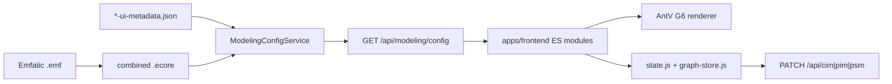
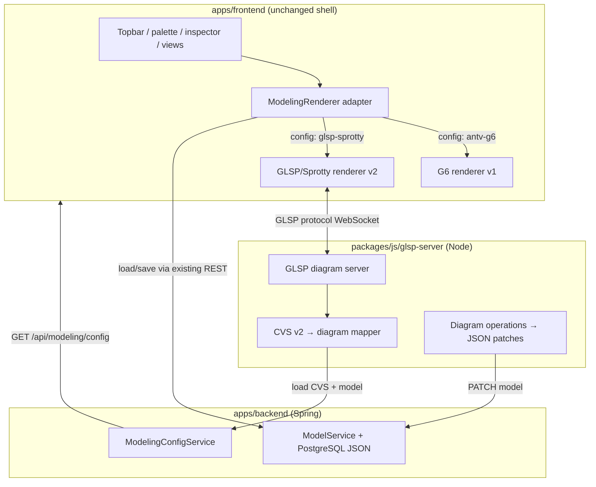

# GLSP/Sprotty Model Editor v2

## Goals

1. **Academic rigor**: Separate abstract syntax (Ecore/Emfatic) from **concrete visual syntax** via a validated, Ecore-derived CVS specification — not ad-hoc frontend config.
2. **Production engineering**: Use [Eclipse GLSP](https://eclipse.dev/glsp/) (diagram protocol + server) and [Eclipse Sprotty](https://sprotty.org/) (SVG rendering) for the web editor.
3. **UI/UX preservation**: Keep the existing Modless IDE shell ([`apps/frontend/index.html`](apps/frontend/index.html), [`css/variables.css`](apps/frontend/css/variables.css)) — only replace the canvas renderer; match cards, shapes, colors, icons, dark/light theme.
4. **Coexistence**: Keep AntV G6 (v1) fully functional; switch via config.
5. **Phased delivery**: CIM first (your choice), then PIM, then PSM.
6. Provide ability for model complexity management for very large visual model graphs.
7. Cover the proper views over the metamodels

---

## Current State (baseline)



- Visual notation today: [`cim-ui-metadata.json`](packages/java/platform-modeling/src/main/resources/modeling/cim-ui-metadata.json) (+ PIM/PSM) merged with Ecore in [`ModelingConfigService.java`](packages/java/platform-modeling/src/main/java/io/mehdieidi/modless/platform/modeling/config/ModelingConfigService.java).
- Renderer boot: `window.modlessFrontendBoot.renderer = "antv-g6"` in [`index.html`](apps/frontend/index.html); hard-wired in [`canvas.js`](apps/frontend/js/canvas.js) `initializeModelingRenderer()`.
- Models: JSON (primary) + optional XMI sidecar; diagram layout in `diagram.elements` / `diagram.relationships` + view graph in [`graph-store.js`](apps/frontend/js/graph-store.js).

---

## Target Architecture



**Key principle**: Spring remains the **source of truth** for models and metamodel-derived config. The Node GLSP sidecar owns diagram-session logic (layout, edit operations, GLSP actions) and translates to the same JSON patch semantics the G6 editor uses today.

---

## Part 1 — Formal Concrete Visual Syntax (CVS v2)

### Academic framing

| Layer                  | Artifact                                      | Role                                         |
| ---------------------- | --------------------------------------------- | -------------------------------------------- |
| Abstract syntax        | `mde/metamodels/*/*.emf` → `*-combined.ecore` | Concepts, attributes, refs, containments     |
| Concrete visual syntax | **CVS v2 spec** (new)                         | Maps each Ecore construct → visual primitive |
| Diagram instance       | JSON model `diagram` + `graph`                | Layout + semantic overlay                    |
| Editor                 | GLSP server + Sprotty client                  | Enforces CVS during editing                  |

### New artifacts

| File                                                                                               | Purpose                                                                          |
| -------------------------------------------------------------------------------------------------- | -------------------------------------------------------------------------------- |
| [`docs/internal/mde/concrete-visual-syntax-v2.md`](docs/internal/mde/concrete-visual-syntax-v2.md) | Thesis-defensible specification (notation primitives, mapping rules, viewpoints) |
| [`mde/notation/cvs-v2.schema.json`](mde/notation/cvs-v2.schema.json)                               | JSON Schema for CVS documents                                                    |
| [`mde/notation/cim.cvs.json`](mde/notation/cim.cvs.json)                                           | CIM CVS (migrated from `cim-ui-metadata.json`)                                   |
| [`mde/notation/pim.cvs.json`](mde/notation/pim.cvs.json)                                           | PIM CVS (phase 2)                                                                |
| [`mde/notation/psm.cvs.json`](mde/notation/psm.cvs.json)                                           | PSM CVS (phase 3)                                                                |

### CVS v2 structure (extends current ui-metadata, adds formal mapping)

```json
{
  "cvsVersion": 2,
  "metamodelRef": { "level": "cim", "ecore": "mde/metamodels/cim/cim-combined.ecore", "nsUri": "https://modless.org/cim/1.0" },
  "primitives": { "command-lozenge": { "sprottyShape": "hexagon", "geometry": "..." } },
  "elementMappings": [
    { "match": { "eClass": "cimbehavior.Command" }, "visualRole": "node", "primitive": "command-lozenge", "card": { "tag": "CMD", "lineFields": ["businessName"] } }
  ],
  "referenceMappings": [ { "eReference": "supportsGoals", "edgeKind": "SUPPORTS", "directed": true } ],
  "relationshipMappings": [ { "eClass": "cimdomain.DomainRelationship", "visualRole": "relationship" } ],
  "viewpoints": [ ... ],
  "canvasPolicy": { ... }
}
```

### Backend integration

- Extend [`ModelingConfigService`](packages/java/platform-modeling/src/main/java/io/mehdieidi/modless/platform/modeling/config/ModelingConfigService.java):
  - Load CVS v2 files from `mde/notation/`.
  - **Validate** CVS against Ecore (every concrete EClass has `visualRole`; every `EAttribute`/`EReference` exposed; creatable types in viewpoints).
  - Merge CVS into existing config response (backward-compatible: v1 ui-metadata fields still present for G6).
  - Add `diagramEditor.renderer` to [`platform-config.json`](packages/java/platform-modeling/src/main/resources/modeling/platform-config.json):

```json
"diagramEditor": {
  "renderer": "glsp-sprotty",
  "glspServerUrl": "ws://127.0.0.1:8081",
  "allowedRenderers": ["antv-g6", "glsp-sprotty"]
}
```

- Extend [`ModelingConfigServiceTest`](packages/java/platform-modeling/src/test/java/io/mehdieidi/modless/platform/modeling/config/ModelingConfigServiceTest.java) with CVS completeness checks.

**Migration strategy**: Generate initial `cim.cvs.json` from existing `cim-ui-metadata.json` (script in `tools/notation-migrate/`), then hand-refine. Keep `*-ui-metadata.json` as v1 fallback until G6 deprecation.

---

## Part 2 — Node.js GLSP Sidecar Server

### New package: `packages/js/glsp-server/`

| Module                                  | Responsibility                                            |
| --------------------------------------- | --------------------------------------------------------- |
| `src/main.ts`                           | WebSocket server, session lifecycle                       |
| `src/diagram/modless-diagram-module.ts` | GLSP DI bindings                                          |
| `src/model/json-model-source.ts`        | Load model JSON from Spring `GET /api/{level}/{id}`       |
| `src/model/cvs-loader.ts`               | Fetch/parse CVS from `GET /api/modeling/config`           |
| `src/mapping/cvs-to-sprotty.ts`         | CVS + semantic graph → Sprotty `SGraph`                   |
| `src/operations/`                       | Create/delete/move/connect → JSON patch ops               |
| `src/actions/`                          | GLSP actions: create node, reconnect edge, open container |

**Dependencies** (pinned to current GLSP release): `@eclipse-glsp/server`, `@eclipse-glsp/protocol`, `@eclipse-glsp/layout-elk` (reuse existing ELK layout concept).

**Edit flow**:

1. Client opens diagram → GLSP `RequestModelAction` → sidecar loads JSON + CVS.
2. User creates edge → GLSP operation validates against CVS `referenceMappings` / `relationshipRules`.
3. Sidecar applies patch to in-memory model → forwards `PATCH` to Spring (same revision semantics as [`model-patch.js`](apps/frontend/js/model-patch.js)).
4. Frontend `state`/`graph-store` refresh from saved model (shared path with G6).

**Auth**: Forward `X-Auth-Token` from frontend WebSocket init to sidecar → sidecar passes to Spring REST.

**Port**: `8081` (configurable via `MODLESS_GLSP_PORT`).

---

## Part 3 — GLSP/Sprotty Client (v2 Renderer)

### New package: `packages/js/glsp-client/`

Built with **Vite** → bundled output to [`apps/frontend/vendor/glsp/`](apps/frontend/vendor/glsp/) (introduces first frontend bundler; scoped to GLSP only).

| Module                            | Responsibility                                            |
| --------------------------------- | --------------------------------------------------------- |
| `src/modless-diagram-module.ts`   | Sprotty DI, bind custom views                             |
| `src/views/modless-node-view.tsx` | Card nodes matching G6 `ModlessNode`                      |
| `src/views/modless-edge-view.tsx` | Semantic edges, markers, dash patterns                    |
| `src/views/shapes/`               | Hexagon, diamond, lozenge, trapezoid SVG                  |
| `src/theme/modless-sprotty.css`   | Maps `--accent`, `--node-bg`, etc. from existing CSS vars |
| `src/bridge/modless-renderer.ts`  | Implements renderer adapter API                           |

### Renderer adapter (decouple canvas from G6)

Introduce [`apps/frontend/js/graph-editor/renderer-adapter.js`](apps/frontend/js/graph-editor/renderer-adapter.js):

```javascript
export function createRenderer(kind) {
  if (kind === "glsp-sprotty") return new GlspRenderer();
  return new G6Renderer(); // extracted from current canvas.js/g6-editor.js
}
```

Refactor [`canvas.js`](apps/frontend/js/canvas.js):

- `initializeModelingRenderer()` reads `state.modelingConfig.config.diagramEditor.renderer`.
- Replace ~50 `ensureG6Canvas()` call sites with `ensureCanvas()` delegating to active renderer.
- Keep G6 code in `graph-editor/g6-*` untouched.

### UI/UX parity checklist (CIM phase)

| G6 feature                                  | Sprotty v2 approach                                                                                              |
| ------------------------------------------- | ---------------------------------------------------------------------------------------------------------------- |
| Concept cards with tag + line fields        | Custom `ModlessNodeView` reading CVS `card`                                                                      |
| Semantic shapes (lozenge, hexagon, diamond) | SVG path views per `primitives.*.sprottyShape`                                                                   |
| Package/type colors + icons                 | CSS + reuse [`assets/icons/`](apps/frontend/assets/icons/)                                                       |
| Status badges                               | Sprotty child labels from `badgeRules`                                                                           |
| Semantic edges + markers                    | Custom edge view + arrow markers                                                                                 |
| Dark/light theme                            | Read `html.light` class; Sprotty CSS uses same CSS variables                                                     |
| Zoom LOD / semantic zoom                    | Sprotty `Viewport` + CVS `canvasPolicy` thresholds                                                               |
| Palette drag-create                         | Existing palette → GLSP `CreateNodeOperation`                                                                    |
| Connection handles                          | Sprotty anchor points + GLSP reconnect tools                                                                     |
| Inline label edit                           | HTML overlay (same pattern as [`g6-overlays.js`](apps/frontend/js/graph-editor/g6-overlays.js))                  |
| Bounded context boxes                       | Phase 1b (CIM): overlay layer on Sprotty viewport                                                                |
| View workbench / focus                      | Reuse [`view-materializer.js`](apps/frontend/js/view-materializer.js); GLSP renders materialized `state.diagram` |
| Validation highlighting                     | Phase 1b: decorate nodes/edges from validation results                                                           |
| Impact analysis overlay                     | Phase 2 (defer for PIM)                                                                                          |

**Canvas host**: Add `#glspEditorHost` beside `#g6EditorHost` in [`index.html`](apps/frontend/index.html); show one based on active renderer. Add [`css/glsp-canvas.css`](apps/frontend/css/glsp-canvas.css) mirroring [`.g6-editor-host`](apps/frontend/css/canvas.css) rules.

---

## Part 4 — Build & Deployment

### Root `package.json` workspaces

```json
"workspaces": ["packages/js/glsp-client", "packages/js/glsp-server"]
```

Scripts: `npm run build:glsp`, `npm run dev:glsp`.

### Docker ([`deploy/compose.yaml`](deploy/compose.yaml))

Add `glsp-server` service:

- Build from `packages/js/glsp-server/Dockerfile`
- Port `8081`
- Env: `MODLESS_BACKEND_URL=http://backend:8080`
- Frontend env: `MODLESS_GLSP_WS_URL=ws://localhost:8081`

### Dev workflow

```bash
# Terminal 1: Spring backend (existing)
mvn -pl apps/backend -am spring-boot:run

# Terminal 2: GLSP sidecar
npm run dev -w packages/js/glsp-server

# Terminal 3: Frontend (existing) + GLSP client watch
npm run build:glsp -- --watch
python -m http.server 8082 --directory apps/frontend
```

---

## Part 5 — Phased Implementation

### Phase 1 — CIM (this implementation)

1. CVS v2 schema + `cim.cvs.json` + docs
2. `ModelingConfigService` CVS loading + validation tests
3. `platform-config.json` renderer switch
4. GLSP sidecar skeleton + JSON model load
5. GLSP client with CIM node/edge views (theme-matched)
6. Renderer adapter + config switch
7. CIM operations: create/delete node, move, create semantic edge, edit via inspector (existing attr panel unchanged)
8. View materialization integration (render active view only)
9. Save/patch via existing REST

**CIM exit criteria**: All CIM `node`/`container`/`relationship` types render correctly; palette + connections work; models round-trip JSON; switch `diagramEditor.renderer` between `antv-g6` and `glsp-sprotty` without data loss.

### Phase 2 — PIM

- `pim.cvs.json` migration
- PIM-specific edge kinds, service containers, workflow notation
- ELK auto-layout via GLSP layout integration

### Phase 3 — PSM

- `psm.cvs.json` (largest metamodel ~40+ enums, AWS resource cards)
- Integration shortcut edges
- Impact analysis overlay

---

## Part 6 — Documentation (thesis-ready)

| Document                                                                                                  | Content                                                          |
| --------------------------------------------------------------------------------------------------------- | ---------------------------------------------------------------- |
| [`docs/internal/mde/concrete-visual-syntax-v2.md`](docs/internal/mde/concrete-visual-syntax-v2.md)        | CVS formalism, mapping rules, coverage proof                     |
| [`docs/adr/000X-glsp-sprotty-editor.md`](docs/adr/)                                                       | ADR: why GLSP/Sprotty, sidecar vs embedded, renderer coexistence |
| Update [`docs/public-docs/docs/architecture/frontend.md`](docs/public-docs/docs/architecture/frontend.md) | Dual-renderer architecture                                       |
| Update [`concrete-visual-syntax-coverage.md`](docs/internal/mde/concrete-visual-syntax-coverage.md)       | Reference CVS v2                                                 |

---

## Risk Mitigation

| Risk                      | Mitigation                                                                   |
| ------------------------- | ---------------------------------------------------------------------------- |
| GLSP requires bundler     | Scope npm build to `packages/js/glsp-client` only; static shell unchanged    |
| Feature parity gap        | Renderer switch lets users fall back to G6; phased rollout                   |
| Two sources of edit logic | GLSP sidecar reuses CVS rules from same `ModelingConfigService` output as G6 |
| WebSocket auth            | Token pass-through; sidecar is not public without backend token              |
| Large PSM metamodel       | Defer to phase 3; CIM proves architecture                                    |

---

## File Change Summary

**New**:

- `mde/notation/cvs-v2.schema.json`, `cim.cvs.json`
- `packages/js/glsp-server/**`
- `packages/js/glsp-client/**`
- `apps/frontend/js/graph-editor/renderer-adapter.js`, `glsp-renderer.js`
- `apps/frontend/css/glsp-canvas.css`
- `tools/notation-migrate/` (ui-metadata → CVS converter)
- `docs/internal/mde/concrete-visual-syntax-v2.md`, ADR

**Modified**:

- [`platform-config.json`](packages/java/platform-modeling/src/main/resources/modeling/platform-config.json) — `diagramEditor` block
- [`ModelingConfigService.java`](packages/java/platform-modeling/src/main/java/io/mehdieidi/modless/platform/modeling/config/ModelingConfigService.java) — CVS merge
- [`canvas.js`](apps/frontend/js/canvas.js) — renderer abstraction
- [`index.html`](apps/frontend/index.html) — GLSP host + conditional script load
- [`deploy/compose.yaml`](deploy/compose.yaml) — glsp-server service
- Root [`package.json`](package.json) — workspaces + build scripts

**Untouched (v1 preserved)**:

- `apps/frontend/js/graph-editor/g6-*.js`
- `*-ui-metadata.json` (kept for G6 until deprecation)
