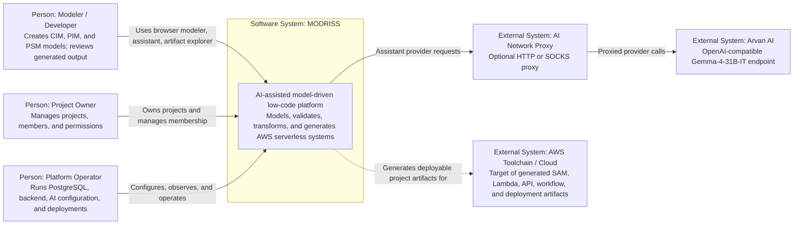
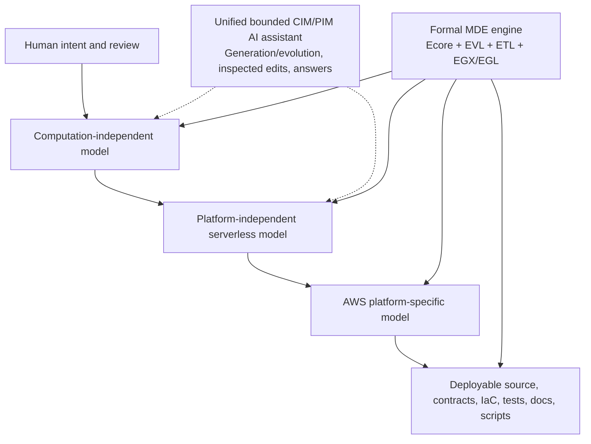

# C4 Level 1: System Context

```mermaid
flowchart LR
    developer["Person: Modeler / Developer<br/>Creates CIM, PIM, and PSM models; reviews generated output"]
    owner["Person: Project Owner<br/>Manages projects, members, and permissions"]
    operator["Person: Platform Operator<br/>Runs PostgreSQL, backend, AI configuration, and deployments"]

    subgraph modriss["Software System: MODRISS"]
        system["AI-assisted model-driven low-code platform<br/>Models, validates, transforms, and generates AWS serverless systems"]
    end

    llm["External System: Arvan AI<br/>OpenAI-compatible Gemma-4-31B-IT endpoint"]
    proxy["External System: AI Network Proxy<br/>Optional HTTP or SOCKS proxy"]
    aws["External System: AWS Toolchain / Cloud<br/>Target of generated SAM, Lambda, API, workflow, and deployment artifacts"]

    developer -->|"Uses browser modeler, assistant, artifact explorer"| system
    owner -->|"Owns projects and manages membership"| system
    operator -->|"Configures, observes, and operates"| system
    system -->|"Assistant provider requests"| proxy
    proxy -->|"Proxied provider calls"| llm
    system -.->|"Generates deployable project artifacts for"| aws
```

## Responsibility Boundary

```mermaid
flowchart TB
    intent["Human intent and review"]
    cim["Computation-independent model"]
    pim["Platform-independent serverless model"]
    psm["AWS platform-specific model"]
    artifacts["Deployable source, contracts, IaC, tests, docs, scripts"]
    assistant["Unified bounded CIM/PIM AI assistant<br/>Generation/evolution, inspected edits, answers"]
    formal["Formal MDE engine<br/>Ecore + EVL + ETL + EGX/EGL"]

    intent --> cim --> pim --> psm --> artifacts
    assistant -.-> cim
    assistant -.-> pim
    formal --> cim
    formal --> pim
    formal --> psm
    formal --> artifacts
```
