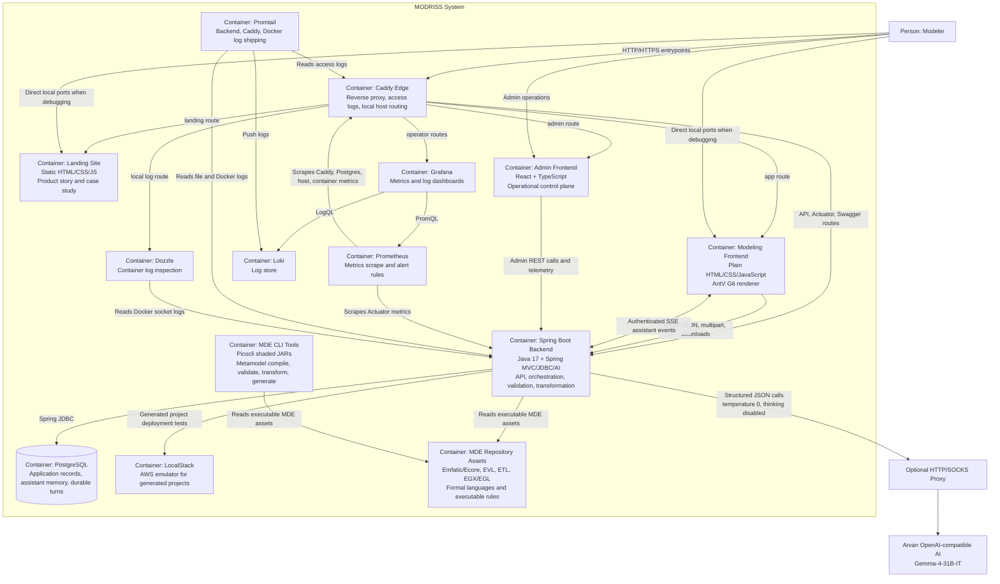

# C4 Level 2: Containers



## Container Protocols

```mermaid
flowchart LR
    browser["Browser frontend"]
    mvc["Spring MVC controllers"]
    sse["SSE emitter hub"]
    services["Application and assistant services"]
    jdbc["JDBC / PlatformStore adapter"]
    db[("PostgreSQL")]
    files["MDE files and temporary workspaces"]
    epsilon["Epsilon and EMF runtimes"]

    browser -->|"REST: JSON, multipart, ZIP/text downloads"| mvc
    browser <--|"SSE /api/chatbot/turns/{turnId}/events"| sse
    mvc --> services
    services --> jdbc --> db
    services --> epsilon
    epsilon --> files
```
