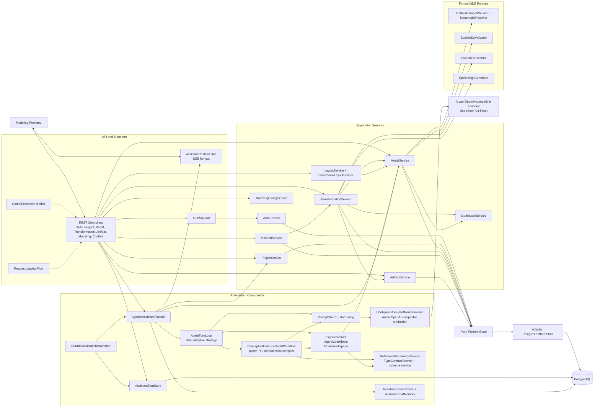

# C4 Level 3: Backend Components

```mermaid
flowchart LR
    client["Modeling Frontend"]

    subgraph api["API and Transport"]
        controllers["REST Controllers<br/>Auth, Project, Model, Transformation, Artifact, Modeling, Chatbot"]
        authSupport["AuthSupport"]
        realtime["AssistantRealtimeHub<br/>SSE fan-out"]
        errors["GlobalExceptionHandler"]
        logging["RequestLoggingFilter"]
    end

    subgraph application["Application Services"]
        auth["AuthService"]
        projects["ProjectService"]
        models["ModelService"]
        transformations["TransformationService"]
        jobs["MdeJobService"]
        artifacts["ArtifactService"]
        layouts["LayoutService + StoredViewLayoutService"]
        config["ModelingConfigService"]
        lock["ModelLockService"]
    end

    subgraph assistant["AI Assistant Components"]
        facade["AgenticAssistantFacade"]
        worker["DurableAssistantTurnWorker"]
        turnStore["AssistantTurnStore"]
        provider["ConfiguredAssistantModelProvider<br/>Arvan OpenAI-compatible production"]
        guard["PromptGuard + Hardening"]
        router["AgentTurnLoop<br/>strict adaptive strategy"]
        conceptual["ConceptualInstanceModelWorkflow<br/>paper IR + deterministic compiler"]
        tools["Inspect/contract AgentModelTools<br/>ModelWorkspace"]
        schema["MetamodelKnowledgeService<br/>TypeContractService + schema service"]
        memory["AssistantSessionStore + AssistantChatMemory"]
    end

    subgraph mde["Formal MDE Runtime"]
        xmi["XmiModelImportService + MetamodelResolver"]
        evl["EpsilonEvlValidator"]
        etl["EpsilonEtlExecutor"]
        egx["EpsilonEgxGenerator"]
    end

    store["Port: PlatformStore"]
    postgres["Adapter: PostgresPlatformStore"]
    db[("PostgreSQL")]
    ai["Arvan OpenAI-compatible endpoint<br/>DeepSeek-V4-Flash"]

    client --> controllers
    client <--> realtime
    controllers --> authSupport --> auth
    controllers --> projects
    controllers --> models
    controllers --> transformations
    controllers --> jobs
    controllers --> artifacts
    controllers --> layouts
    controllers --> config
    controllers --> facade
    controllers --> turnStore
    errors -.-> controllers
    logging -.-> controllers

    transformations --> models
    transformations --> artifacts
    transformations --> lock
    jobs --> transformations
    layouts --> models
    models --> lock
    models --> xmi
    models --> evl
    transformations --> etl
    transformations --> egx

    worker --> turnStore
    worker --> facade
    facade --> router
    router --> conceptual
    router --> tools
    router --> guard --> provider --> ai
    conceptual --> guard
    conceptual --> schema
    conceptual --> tools
    tools --> schema
    tools --> models
    facade --> memory
    facade --> models
    facade --> projects
    facade --> realtime

    auth --> store
    projects --> store
    models --> store
    transformations --> store
    jobs --> store
    artifacts --> store
    store --> postgres --> db
    turnStore --> db
    memory --> db
```
