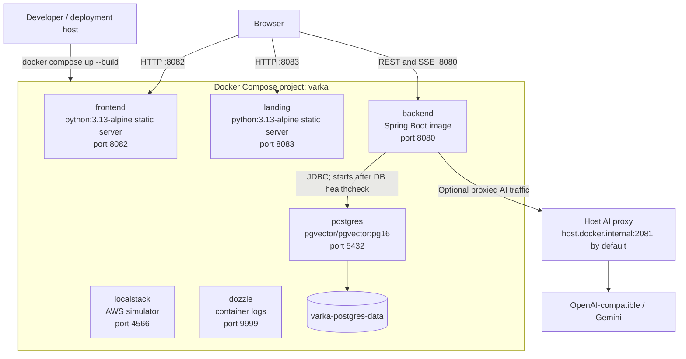
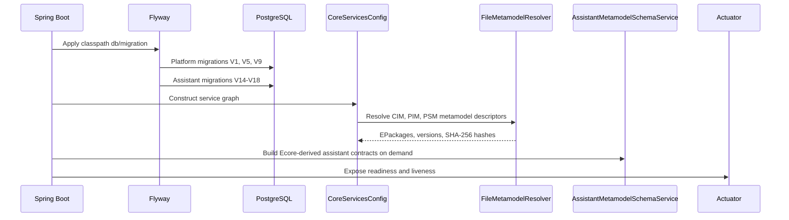

# Deployment and Runtime Architecture

## Docker Compose Deployment

```mermaid
flowchart TB
    host["Developer / deployment host"]
    browser["Browser"]

    subgraph compose["Docker Compose project: varka"]
        frontend["frontend<br/>python:3.13-alpine static server<br/>port 8082"]
        landing["landing<br/>python:3.13-alpine static server<br/>port 8083"]
        backend["backend<br/>Spring Boot image<br/>port 8080"]
        postgres["postgres<br/>pgvector/pgvector:pg16<br/>port 5432"]
        localstack["localstack<br/>AWS simulator<br/>port 4566"]
        dozzle["dozzle<br/>container logs<br/>port 9999"]
        volume[("varka-postgres-data")]
    end

    proxy["Host AI proxy<br/>host.docker.internal:2081 by default"]
    provider["OpenAI-compatible / Gemini"]

    host -->|"docker compose up --build"| compose
    browser -->|"HTTP :8082"| frontend
    browser -->|"HTTP :8083"| landing
    browser -->|"REST and SSE :8080"| backend
    backend -->|"JDBC; starts after DB healthcheck"| postgres
    postgres --> volume
    backend -->|"Optional proxied AI traffic"| proxy --> provider
```

## Backend Startup

```mermaid
sequenceDiagram
    participant Boot as Spring Boot
    participant Flyway
    participant DB as PostgreSQL
    participant Core as CoreServicesConfig
    participant Meta as FileMetamodelResolver
    participant Contracts as AssistantMetamodelSchemaService
    participant Health as Actuator

    Boot->>Flyway: Apply classpath db/migration
    Flyway->>DB: Platform migrations V1, V5, V9
    Flyway->>DB: Assistant migrations V14-V18
    Boot->>Core: Construct service graph
    Core->>Meta: Resolve CIM, PIM, PSM metamodel descriptors
    Meta-->>Core: EPackages, versions, SHA-256 hashes
    Boot->>Contracts: Build Ecore-derived assistant contracts on demand
    Boot->>Health: Expose readiness and liveness
```
