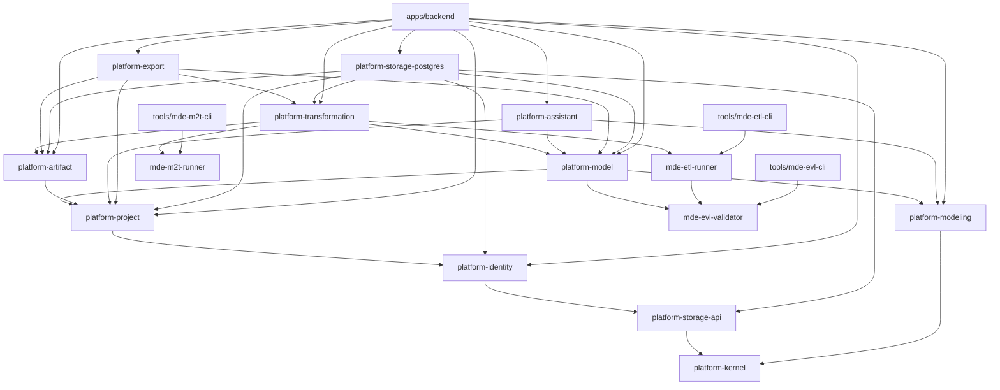
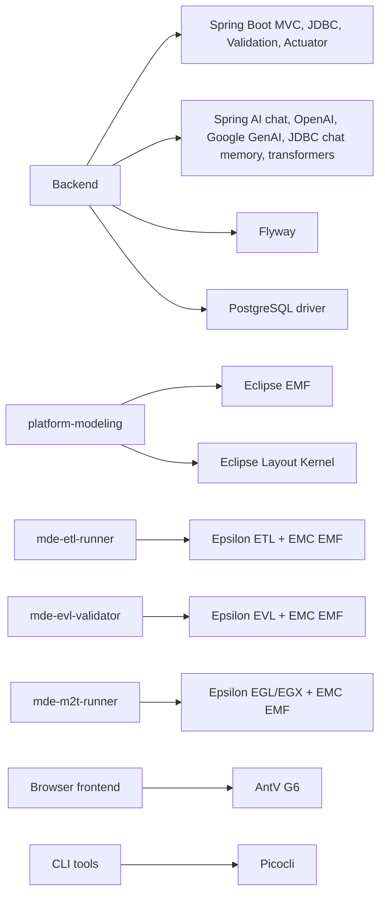
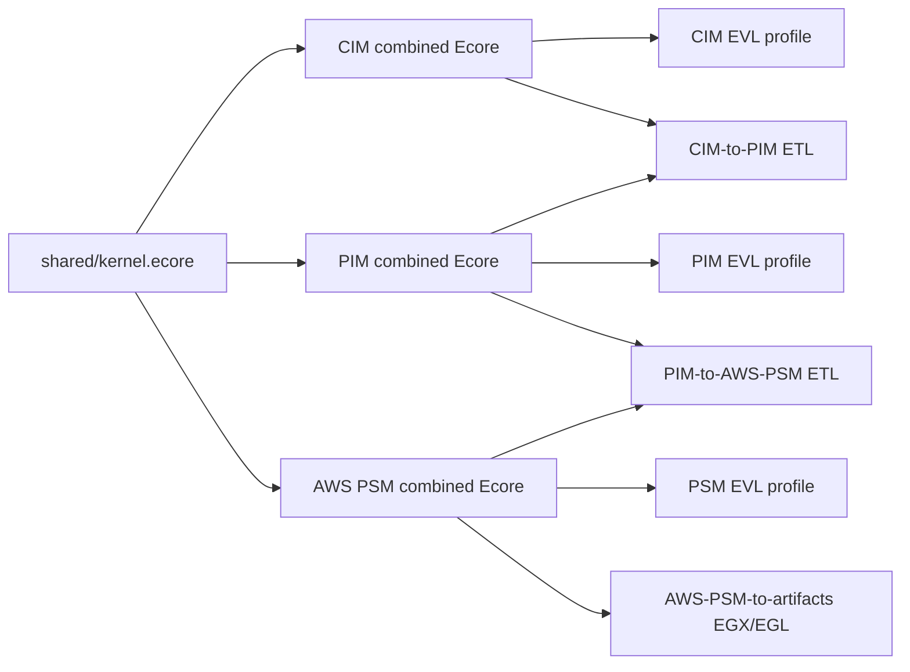

# Dependency Architecture

## Maven Module Dependencies

```mermaid
flowchart TB
    backend["apps/backend"]
    kernel["platform-kernel"]
    storageApi["platform-storage-api"]
    identity["platform-identity"]
    project["platform-project"]
    modeling["platform-modeling"]
    model["platform-model"]
    artifact["platform-artifact"]
    transform["platform-transformation"]
    assistant["platform-assistant"]
    export["platform-export"]
    storage["platform-storage-postgres"]
    etl["mde-etl-runner"]
    evl["mde-evl-validator"]
    m2t["mde-m2t-runner"]
    etlcli["tools/mde-etl-cli"]
    evlcli["tools/mde-evl-cli"]
    m2tcli["tools/mde-m2t-cli"]

    storageApi --> kernel
    identity --> storageApi
    project --> identity
    modeling --> kernel
    model --> project
    model --> modeling
    model --> evl
    artifact --> project
    transform --> model
    transform --> artifact
    transform --> etl
    transform --> m2t
    assistant --> project
    assistant --> model
    assistant --> modeling
    export --> project
    export --> model
    export --> artifact
    export --> transform

    storage --> storageApi
    storage --> identity
    storage --> project
    storage --> model
    storage --> artifact
    storage --> transform

    backend --> storage
    backend --> identity
    backend --> project
    backend --> model
    backend --> modeling
    backend --> artifact
    backend --> transform
    backend --> assistant
    backend --> export

    etl --> evl
    etlcli --> etl
    evlcli --> evl
    m2tcli --> m2t
```

## External Library Dependencies

```mermaid
flowchart LR
    backend["Backend"] --> spring["Spring Boot MVC, JDBC, Validation, Actuator"]
    backend --> springai["Spring AI chat, OpenAI, Google GenAI, JDBC chat memory, transformers"]
    backend --> flyway["Flyway"]
    backend --> pg["PostgreSQL driver"]

    modeling["platform-modeling"] --> emf["Eclipse EMF"]
    modeling --> elk["Eclipse Layout Kernel"]
    etl["mde-etl-runner"] --> epsilonEtl["Epsilon ETL + EMC EMF"]
    evl["mde-evl-validator"] --> epsilonEvl["Epsilon EVL + EMC EMF"]
    m2t["mde-m2t-runner"] --> epsilonEgl["Epsilon EGL/EGX + EMC EMF"]
    frontend["Browser frontend"] --> g6["AntV G6"]
    tools["CLI tools"] --> picocli["Picocli"]
```

## MDE Asset Dependencies

```mermaid
flowchart LR
    kernel["shared/kernel.ecore"]
    cim["CIM combined Ecore"]
    pim["PIM combined Ecore"]
    psm["AWS PSM combined Ecore"]
    cimEvl["CIM EVL profile"]
    pimEvl["PIM EVL profile"]
    psmEvl["PSM EVL profile"]
    cimPim["CIM-to-PIM ETL"]
    pimPsm["PIM-to-AWS-PSM ETL"]
    psmArt["AWS-PSM-to-artifacts EGX/EGL"]

    kernel --> cim
    kernel --> pim
    kernel --> psm
    cim --> cimEvl
    pim --> pimEvl
    psm --> psmEvl
    cim --> cimPim
    pim --> cimPim
    pim --> pimPsm
    psm --> pimPsm
    psm --> psmArt
```
