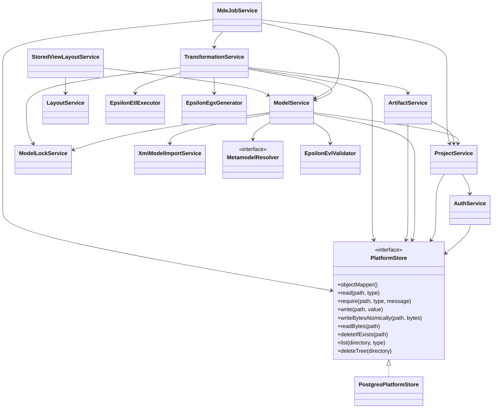
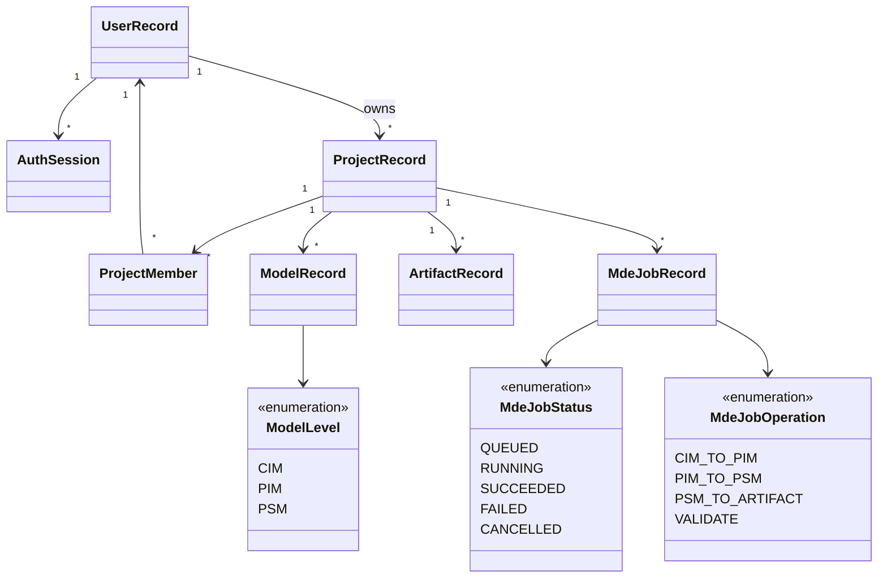
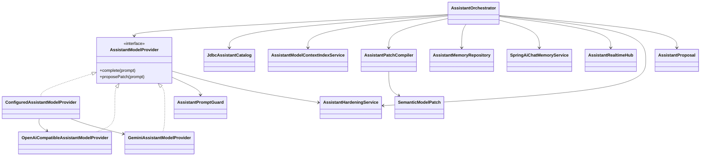

# Core Class Relations

Feature libraries under `packages/java/` own the classes below. Package roots:
`platform.identity.*`, `platform.project.*`, `platform.model.*`, `platform.modeling.*`,
`platform.artifact.*`, `platform.transformation.*`, `platform.storage.*`.

## Application Services and Persistence

## Domain Records

## Assistant Classes

