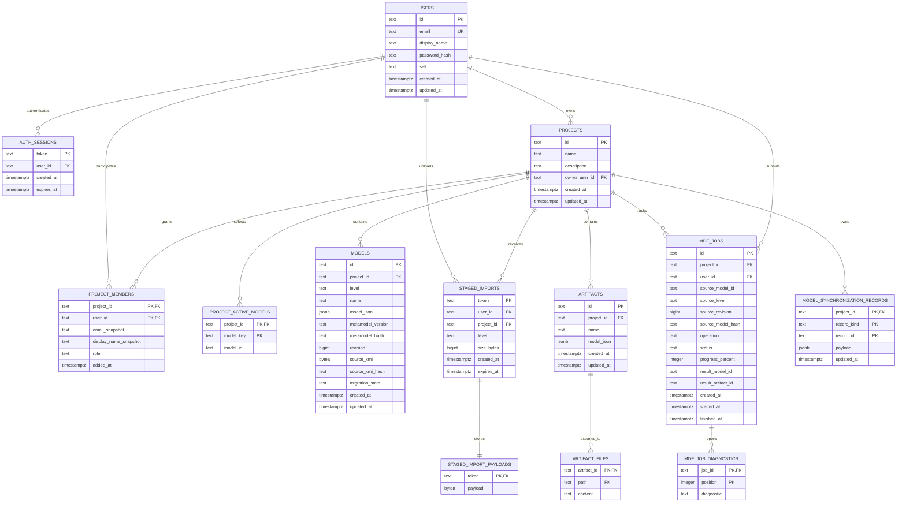
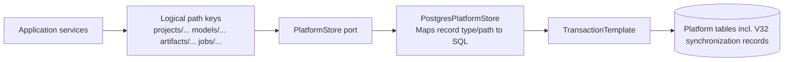

# Platform Storage ER Diagram

This is the complete platform schema from Flyway migrations V1, V5, V9, and V32 (with later
platform migrations adding unrelated operational tables/columns).

## Logical PlatformStore Mapping

