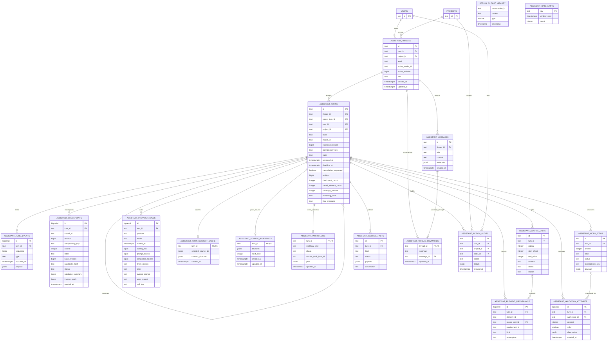

# Assistant Storage ER Diagram

This is the durable assistant schema from `V14__assistant_baseline.sql` through
`V29__idempotent_assistant_provider_call_audit.sql`.

`assistant_workflows.plan` currently persists conceptual obligation ledgers, selected types,
stable-ID blueprints, slice size, token/call counters, truncation diagnostics, and successful
obligation-review verdicts. `assistant_work_items.payload` holds private generated slice objects
until the final atomic checkpoint. `assistant_provider_calls(turn_id, call_key)` is unique when a
call key is present, preventing duplicate audit rows during retry/resume.

`SPRING_AI_CHAT_MEMORY` and `ASSISTANT_RATE_LIMITS` have logical keys but intentionally no foreign
keys to the application tables.
