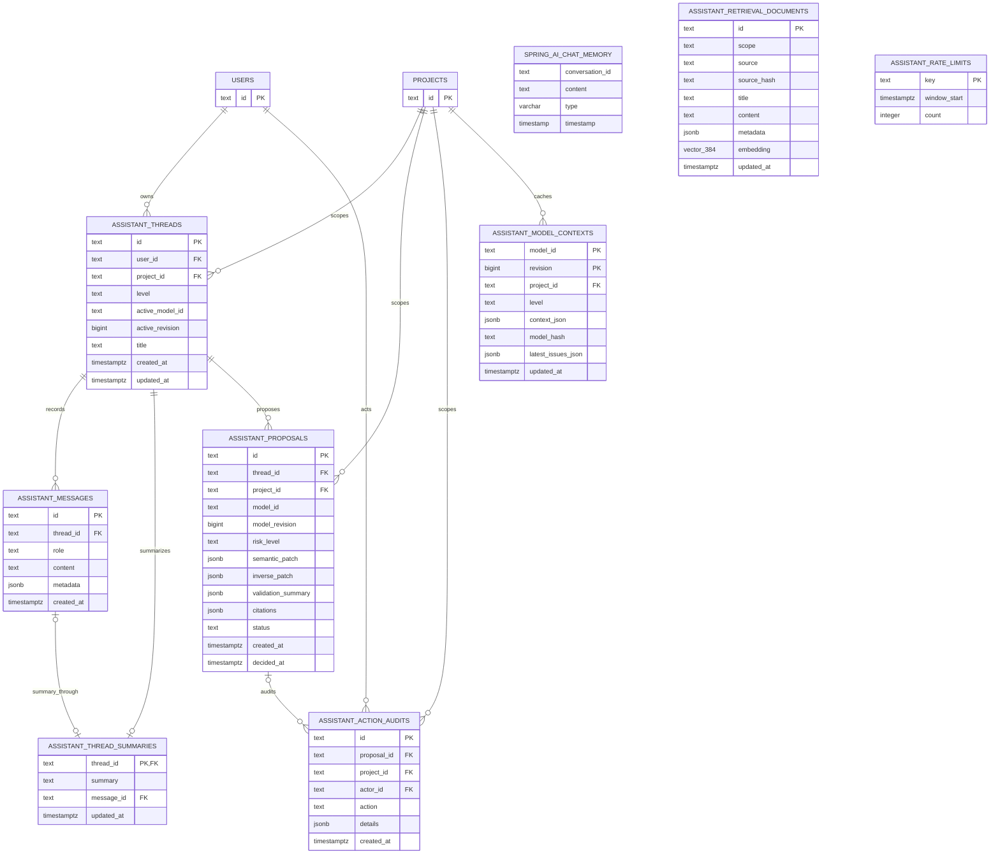

# Assistant Storage ER Diagram

This is the complete assistant schema from Flyway migration V2.

`SPRING_AI_CHAT_MEMORY`, `ASSISTANT_RETRIEVAL_DOCUMENTS`, and `ASSISTANT_RATE_LIMITS` have logical
keys but intentionally no foreign keys to the application tables.
