# Auth and Project API Sequences

All protected routes first resolve `X-Auth-Token` through `AuthSupport` or `AuthService`.

## POST `/api/auth/register`

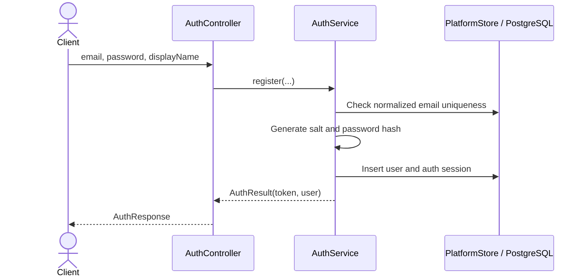

## POST `/api/auth/login`

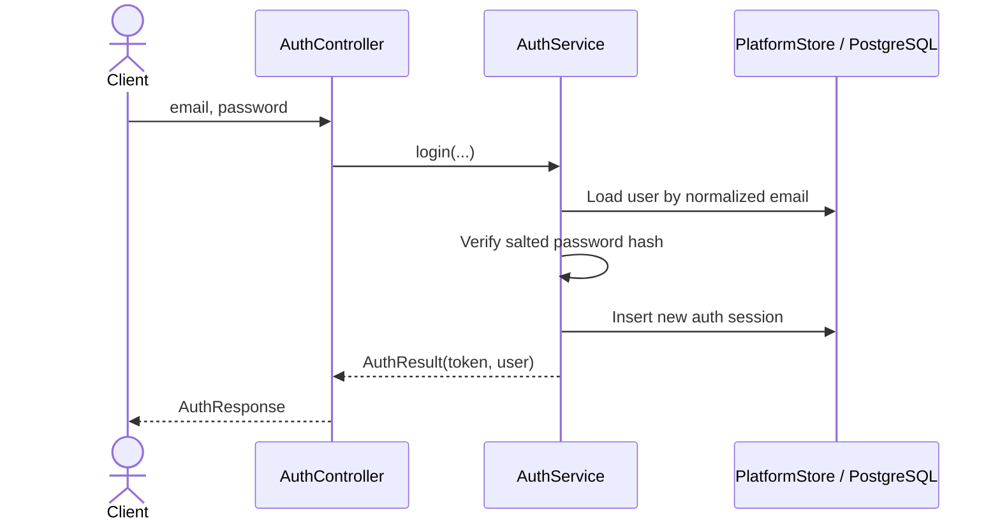

## GET `/api/auth/me`

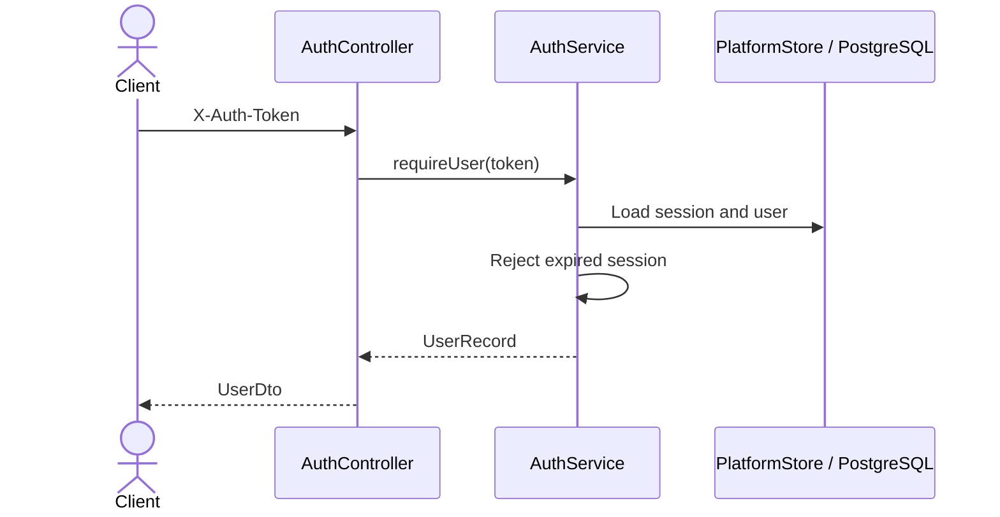

## PUT `/api/auth/me`

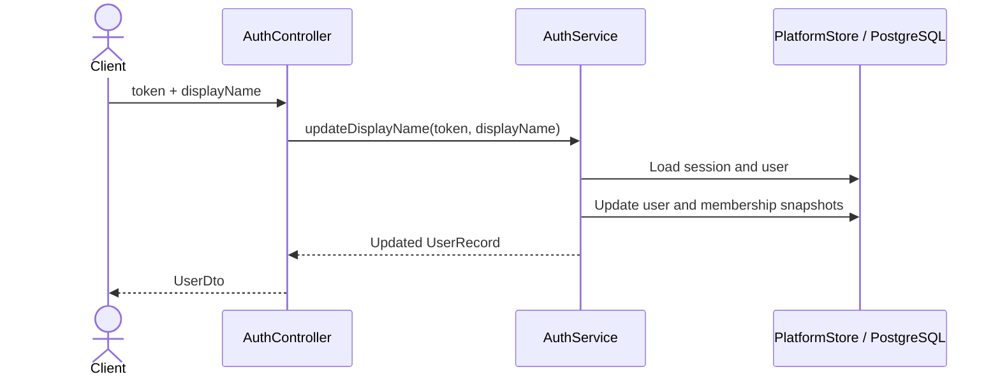

## POST `/api/auth/logout`

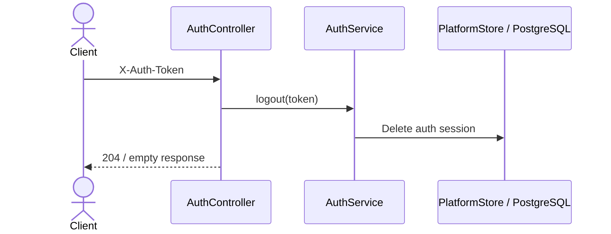

## GET `/api/projects`

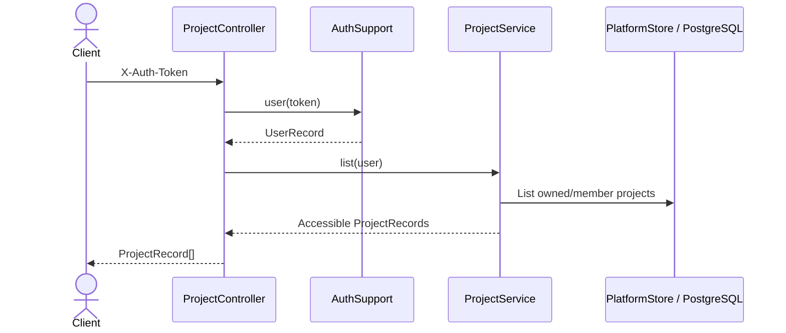

## POST `/api/projects`

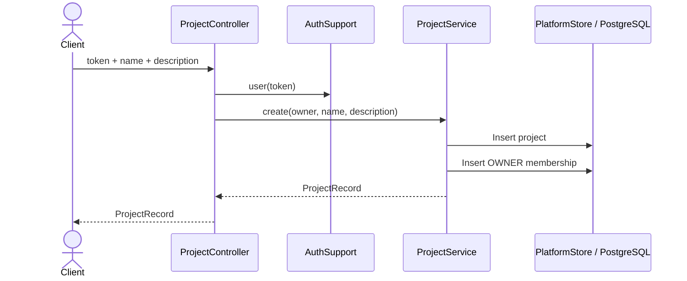

## GET `/api/projects/{id}`

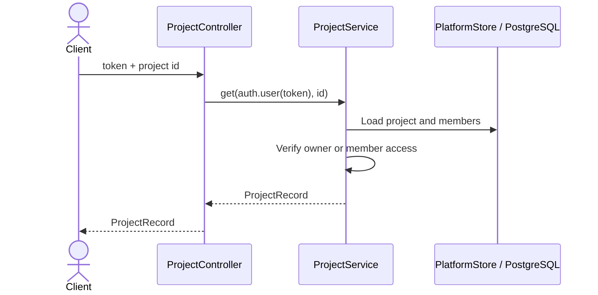

## GET `/api/projects/{id}/download`

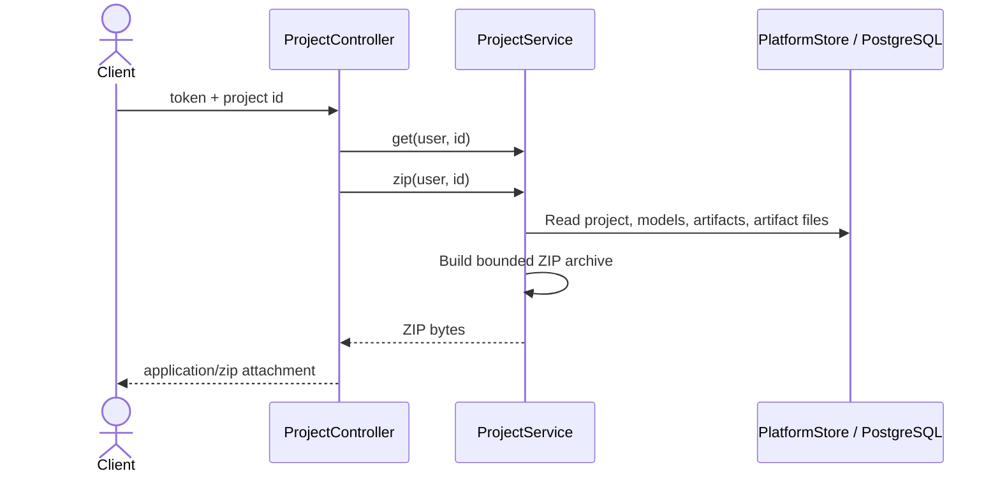

## PUT `/api/projects/{id}`

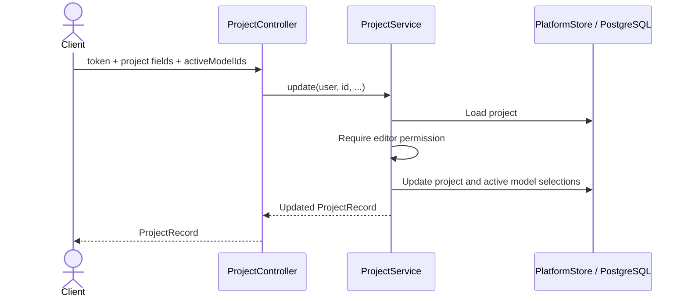

## DELETE `/api/projects/{id}`

```mermaid
sequenceDiagram
    actor Client
    participant C as ProjectController
    participant P as ProjectService
    participant DB as PlatformStore / PostgreSQL
    Client->>C: token + project id
    C->>P: delete(user, id)
    P->>DB: Load project
    P->>P: Require owner
    P->>DB: Delete project; cascades dependent rows
    C-->>Client: Empty response
```

## GET `/api/projects/{id}/members`

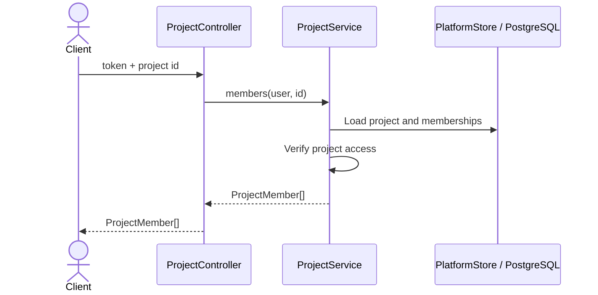

## POST `/api/projects/{id}/invite`

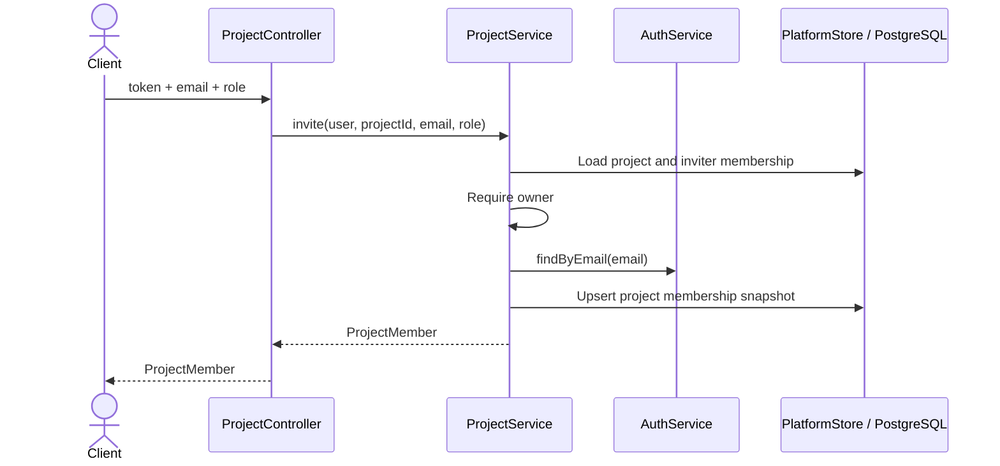

## DELETE `/api/projects/{id}/members/{userId}`

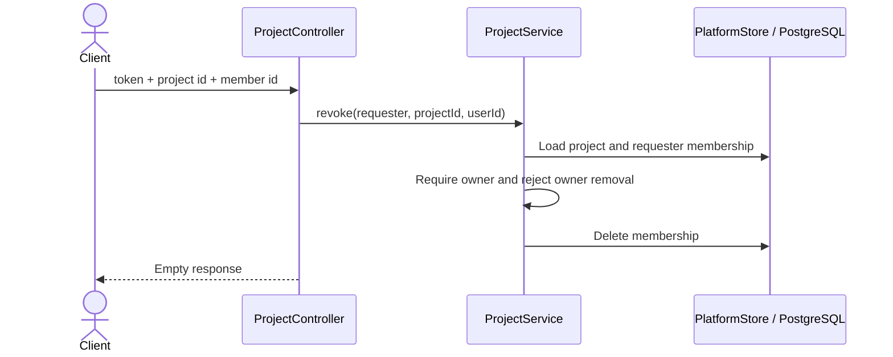
