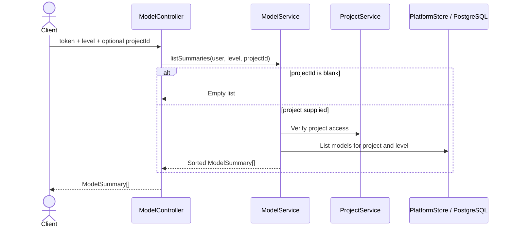
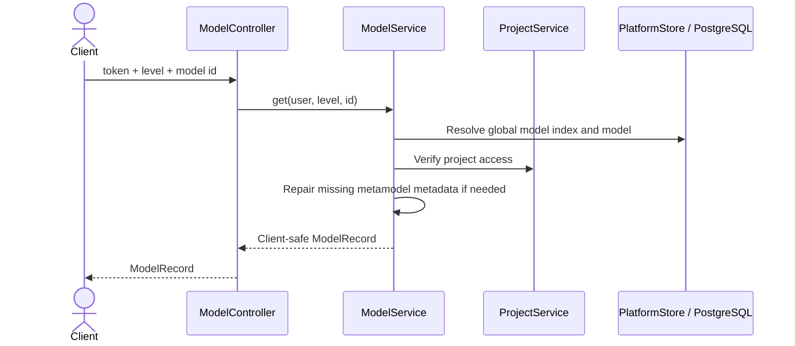
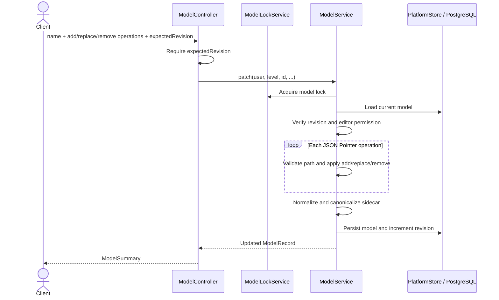
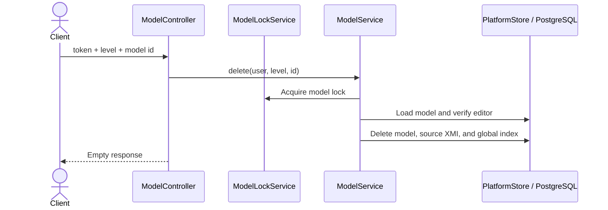
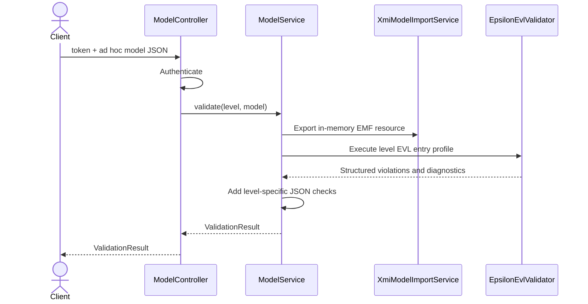
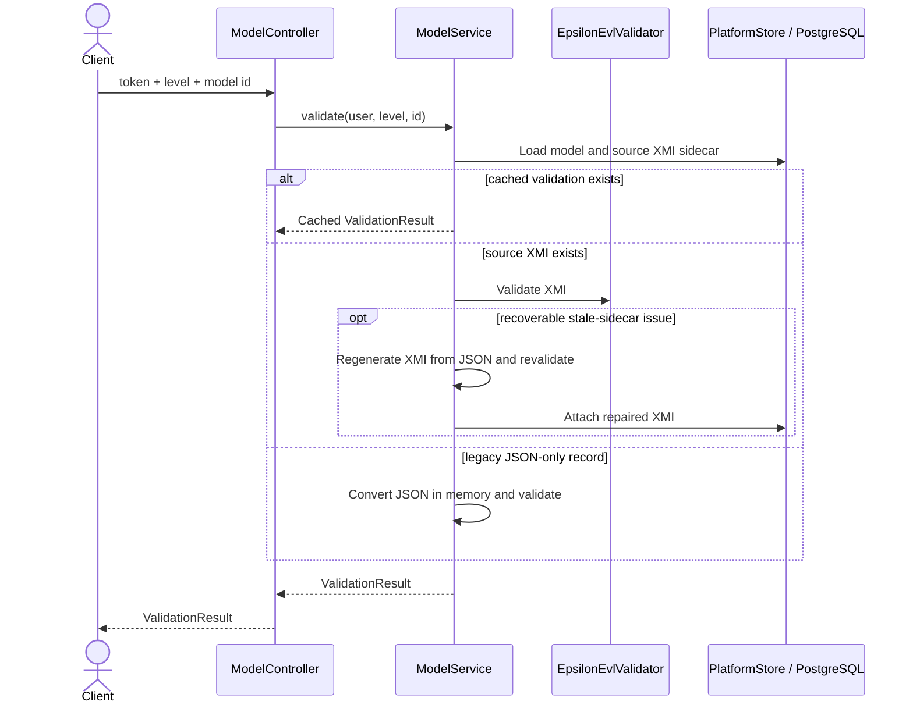
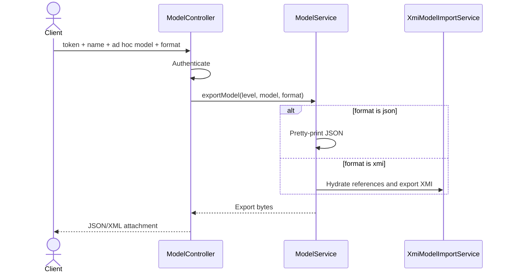
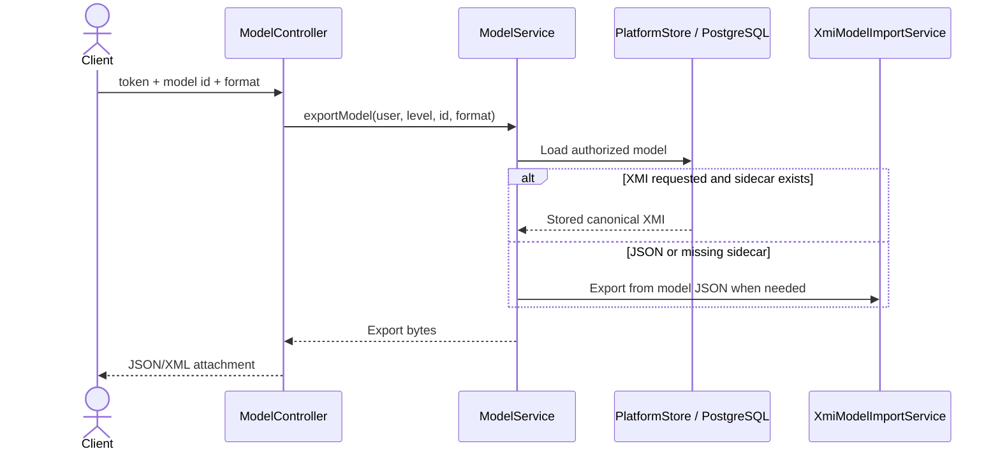
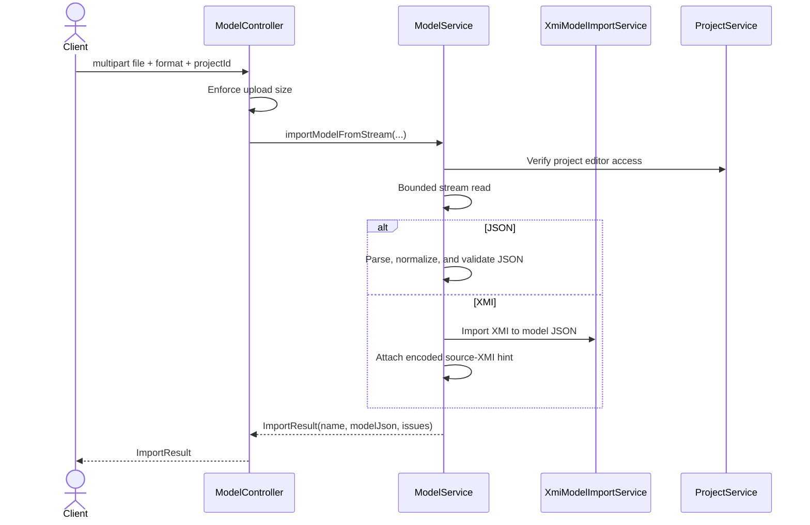

# Model API Sequences

Each `{level}` route applies independently to `cim`, `pim`, and `psm`.

## GET `/api/{level}`



## POST `/api/{level}`

```mermaid
sequenceDiagram
    actor Client
    participant C as ModelController
    participant M as ModelService
    participant Meta as MetamodelResolver
    participant XMI as XmiModelImportService
    participant DB as PlatformStore / PostgreSQL
    Client->>C: token + projectId + name + model
    C->>M: create(user, level, ...)
    M->>M: Verify editor; normalize model
    M->>XMI: Produce canonical XMI sidecar
    M->>Meta: Resolve version and metamodel hash
    M->>DB: Persist model, XMI, and global index
    M-->>C: ModelRecord revision 1
    C-->>Client: ModelSummary
```

## GET `/api/{level}/{id}`



## PUT `/api/{level}/{id}`

```mermaid
sequenceDiagram
    actor Client
    participant C as ModelController
    participant Lock as ModelLockService
    participant M as ModelService
    participant XMI as XmiModelImportService
    participant DB as PlatformStore / PostgreSQL
    Client->>C: replacement model + expectedRevision
    C->>C: Require expectedRevision
    C->>M: update(user, level, id, ...)
    M->>Lock: Acquire model lock
    M->>DB: Load current model
    M->>M: Check revision and editor permission
    M->>XMI: Resolve/canonicalize source XMI
    M->>DB: Persist model, sidecar, index; increment revision
    M-->>C: Updated ModelRecord
    C-->>Client: ModelSummary
```

## PATCH `/api/{level}/{id}`



## DELETE `/api/{level}/{id}`



## POST `/api/{level}/validate`



## POST `/api/{level}/{id}/validate`



## POST `/api/{level}/export`



## POST `/api/{level}/{id}/export`



## POST `/api/{level}/import`


