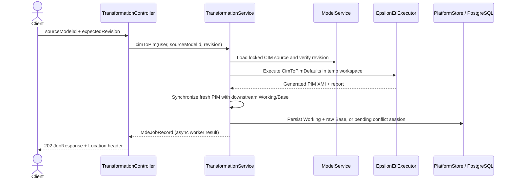
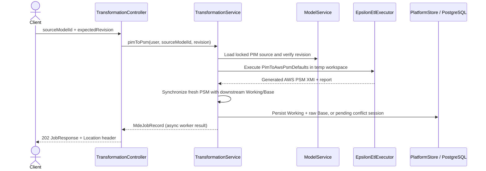
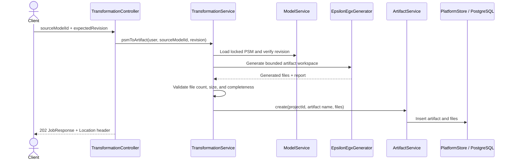
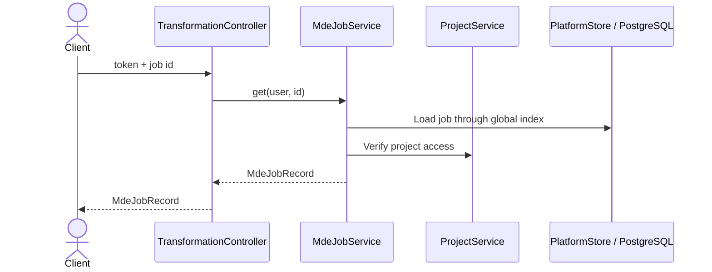
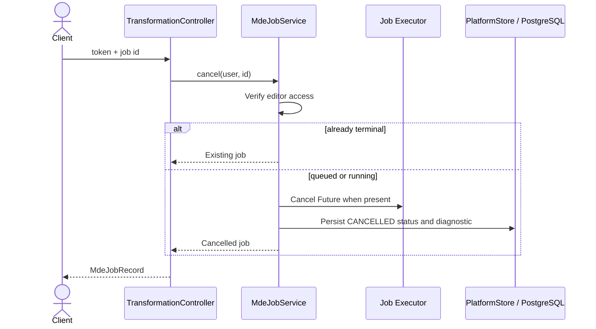
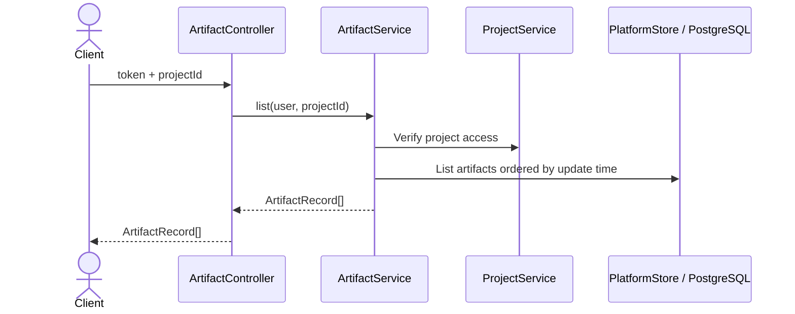
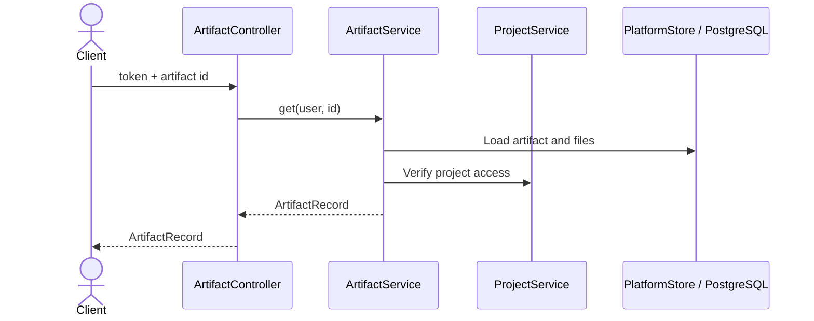
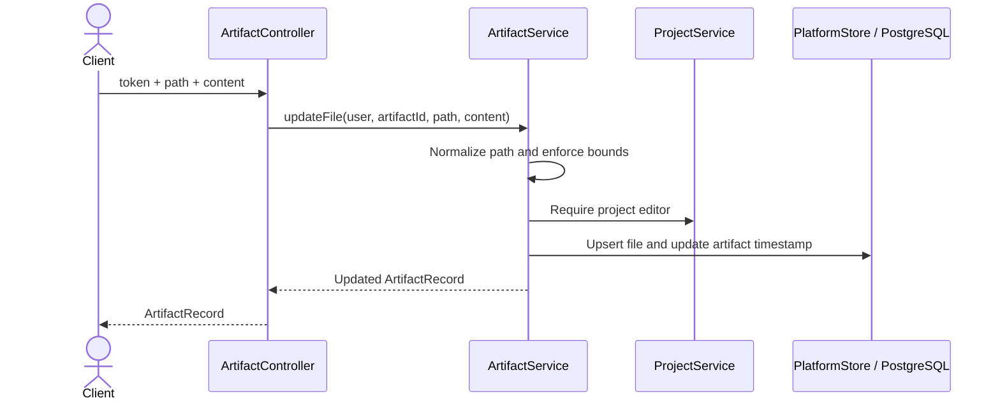
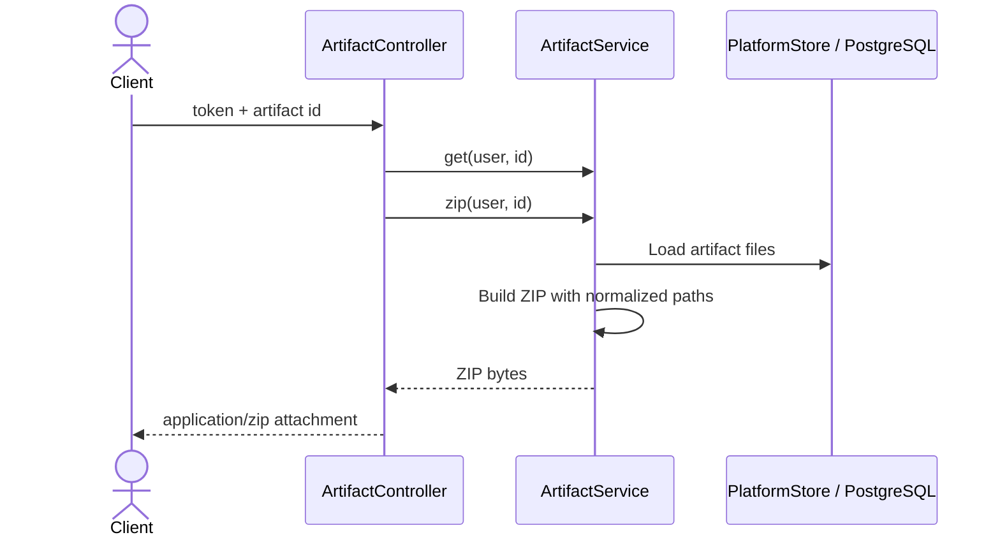
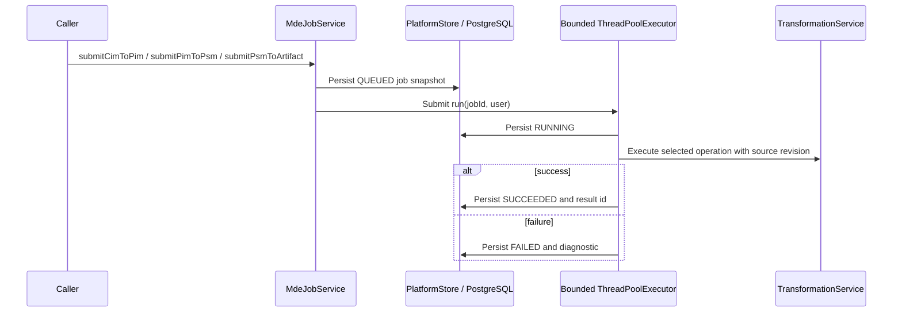

# Transformation, Job, and Artifact API Sequences

## POST `/api/transformations/cim-to-pim`



## POST `/api/transformations/pim-to-psm`



## POST `/api/transformations/psm-to-artifact`



## GET `/api/transformations/jobs/{id}`



## POST `/api/transformations/jobs/{id}/cancel`



## GET `/api/artifact?projectId=...`



## GET `/api/artifact/{id}`



## GET `/api/artifact/{id}/file`

```mermaid
sequenceDiagram
    actor Client
    participant C as ArtifactController
    participant A as ArtifactService
    participant DB as PlatformStore / PostgreSQL
    Client->>C: token + artifact id + path
    C->>A: readFile(user, artifactId, path)
    A->>A: Normalize path; reject absolute/traversal
    A->>DB: Load authorized artifact file
    A-->>C: Text content
    C-->>Client: text/plain
```

## PUT `/api/artifact/{id}/files`



## GET `/api/artifact/{id}/download`



## Internal Queued Job Submission

This is a major implemented service flow, although no controller currently invokes the submit
methods.


