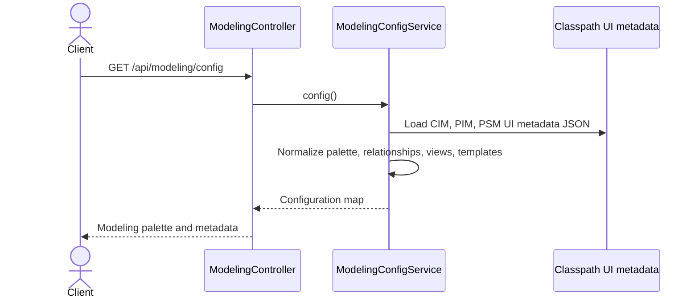
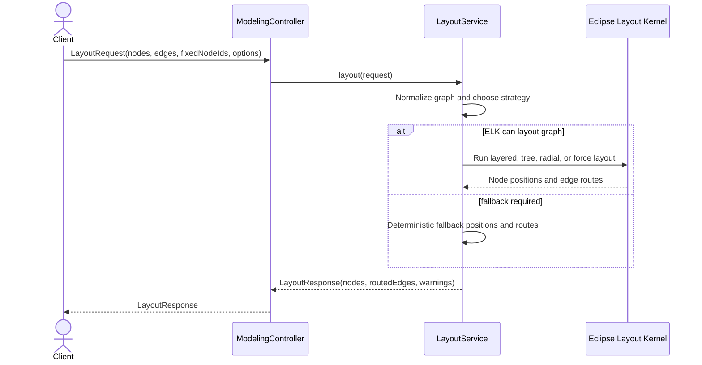
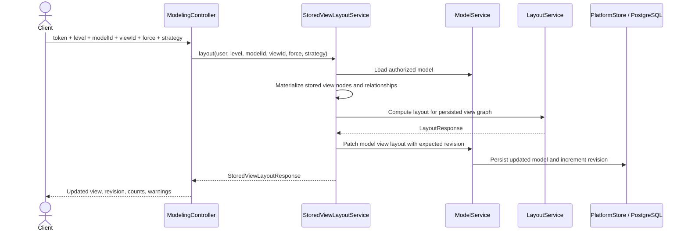
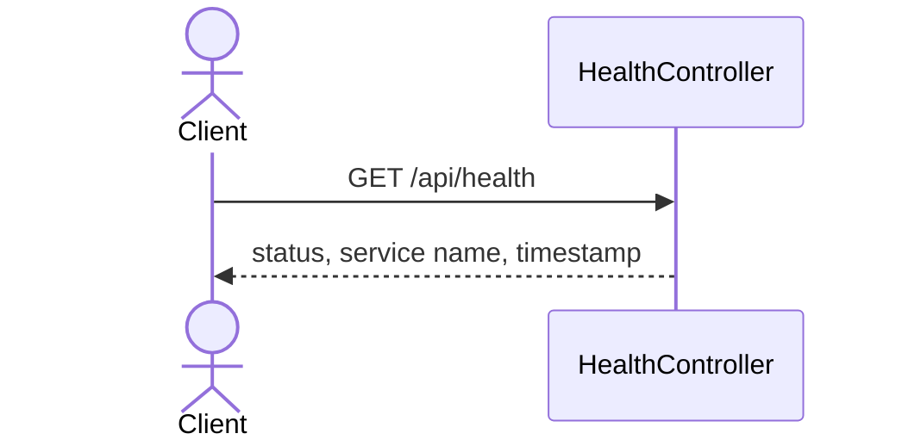
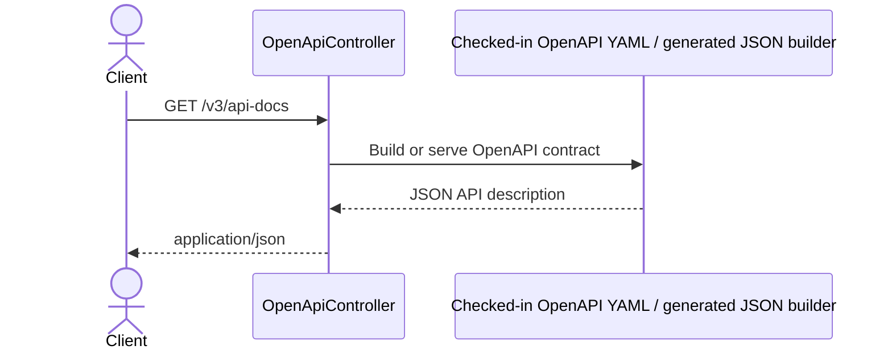
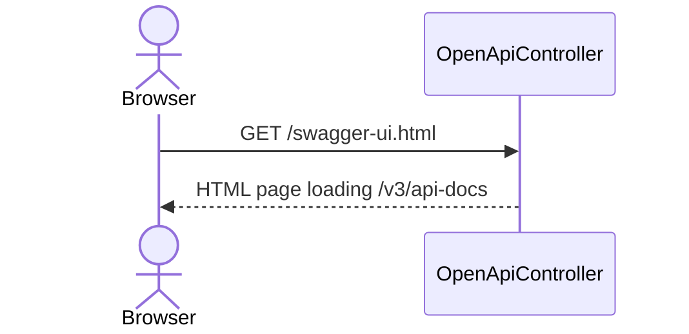
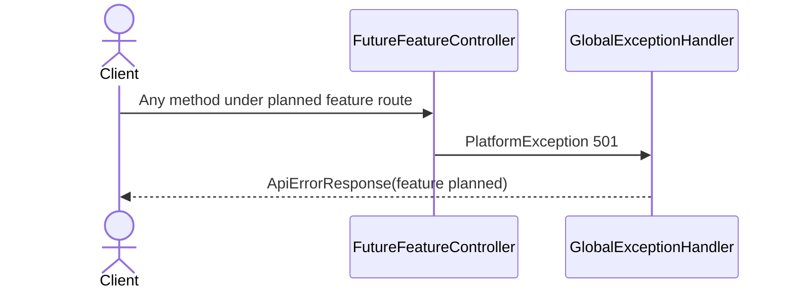
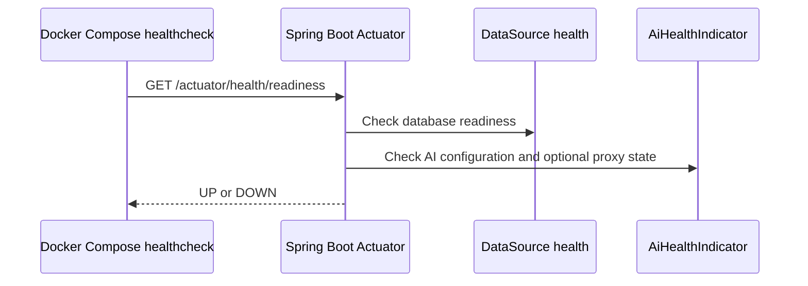

# Modeling and System API Sequences

## GET `/api/modeling/config`

## POST `/api/layout`

## POST `/api/{level}/{modelId}/views/{viewId}/layout`

## GET `/api/health`

## GET `/v3/api-docs`

## GET `/swagger-ui.html`

## `/api/github/**`, `/api/impact/**`, `/api/admin/**`

## Actuator Readiness Used by Compose

