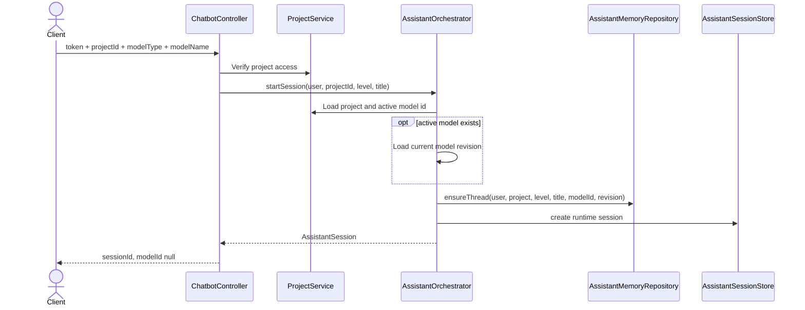
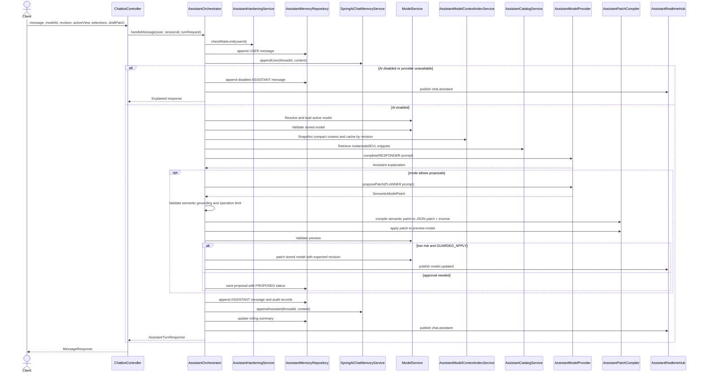
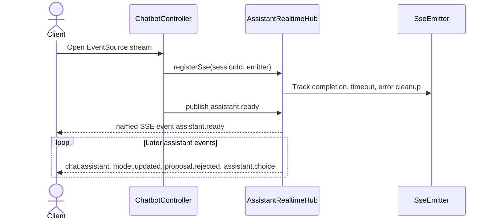
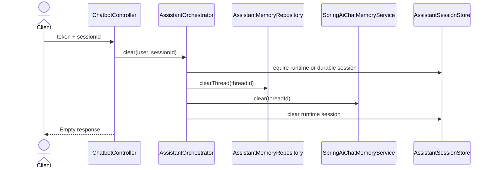
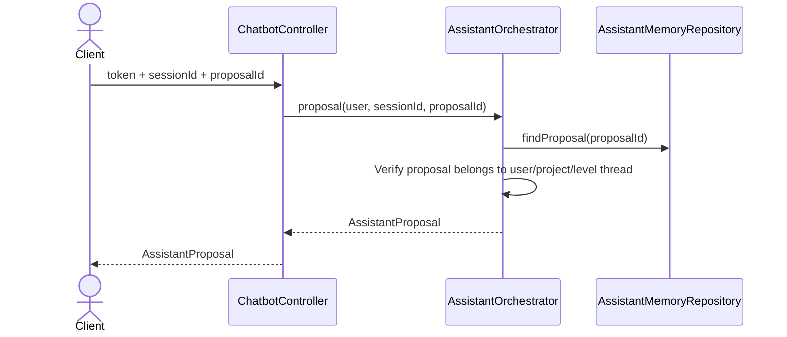
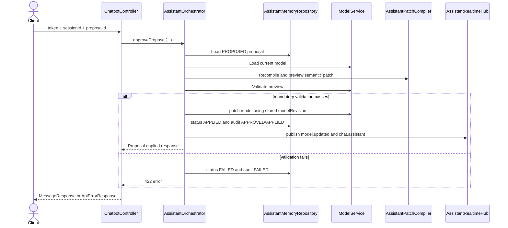
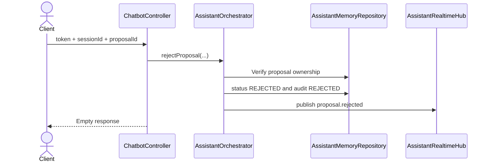
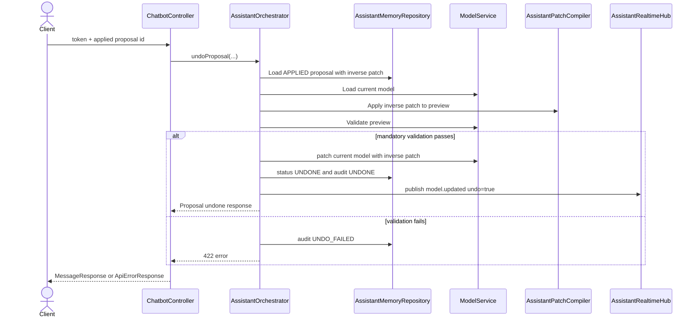
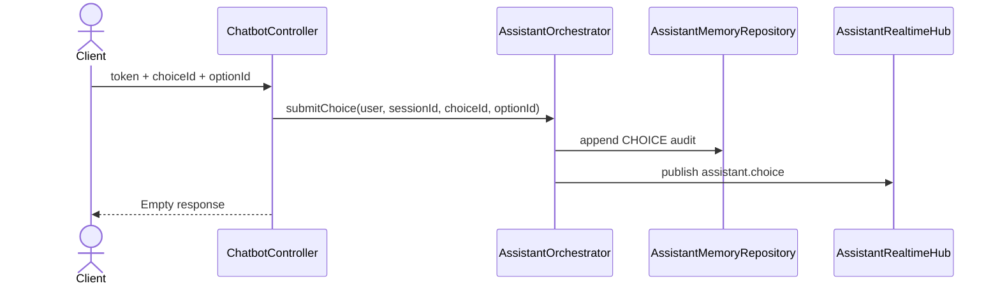

# Assistant API, SSE, and WebSocket Sequences

## POST `/api/chatbot/sessions`



## POST `/api/chatbot/sessions/{sessionId}/messages`



## GET `/api/chatbot/sessions/{sessionId}/events`



## WebSocket `/ws/chatbot/sessions/{sessionId}`

```mermaid
sequenceDiagram
    actor Client
    participant Config as ChatbotWebSocketConfig
    participant H as ChatbotWebSocketHandler
    participant RT as AssistantRealtimeHub
    Client->>Config: Upgrade request /ws/chatbot/sessions/{id}
    Config->>H: Route accepted origin
    H->>RT: registerWebSocket(sessionId, WebSocketSession)
    H->>RT: publish assistant.ready
    RT-->>Client: JSON AssistantRealtimeEvent
    Client->>H: Optional text message
    H-->>Client: ignored; receive-only transport
    Client-->>H: Close
    H->>RT: unregisterWebSocket(sessionId)
```

## DELETE `/api/chatbot/sessions/{sessionId}`



## GET `/api/chatbot/sessions/{sessionId}/proposals/{proposalId}`



## POST `/api/chatbot/sessions/{sessionId}/proposals/{proposalId}/approve`



## POST `/api/chatbot/sessions/{sessionId}/proposals/{proposalId}/reject`



## POST `/api/chatbot/sessions/{sessionId}/proposals/{proposalId}/undo`



## POST `/api/chatbot/sessions/{sessionId}/choices`


