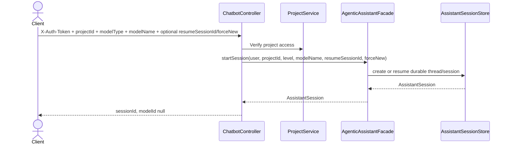
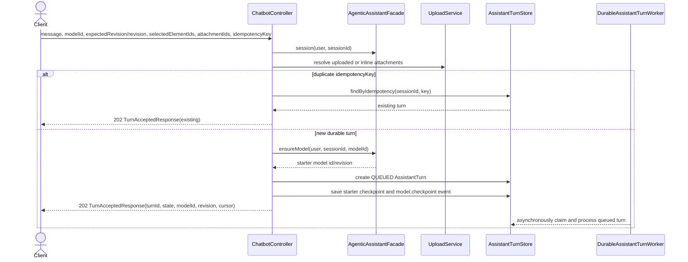
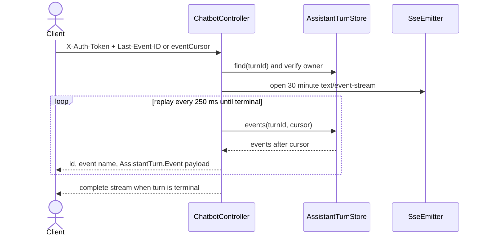
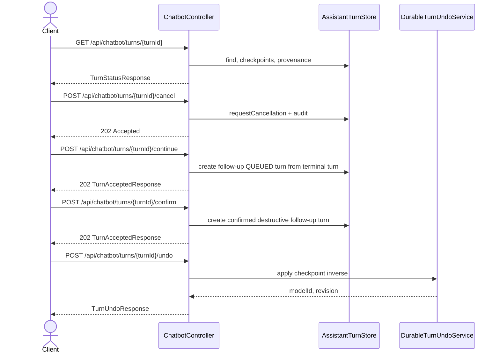
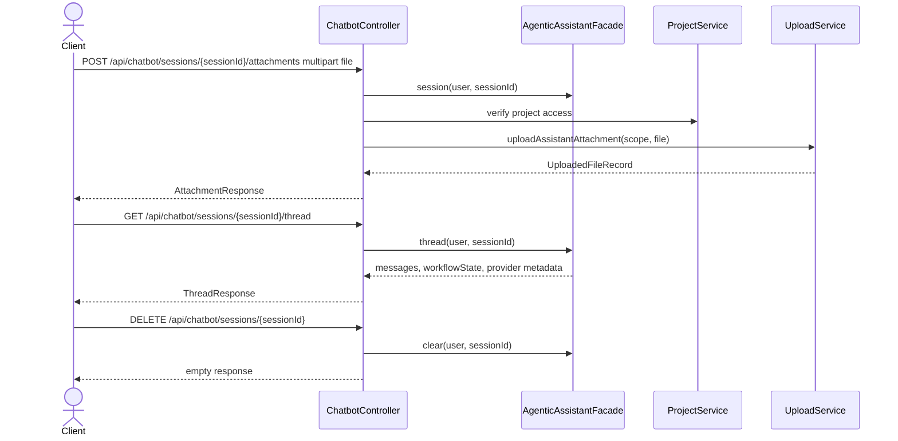

# Assistant API and Durable SSE Sequences

## POST `/api/chatbot/sessions`

## POST `/api/chatbot/sessions/{sessionId}/messages`

## GET `/api/chatbot/turns/{turnId}/events`

## Turn Control Endpoints

## Attachments, Thread, and Clear

