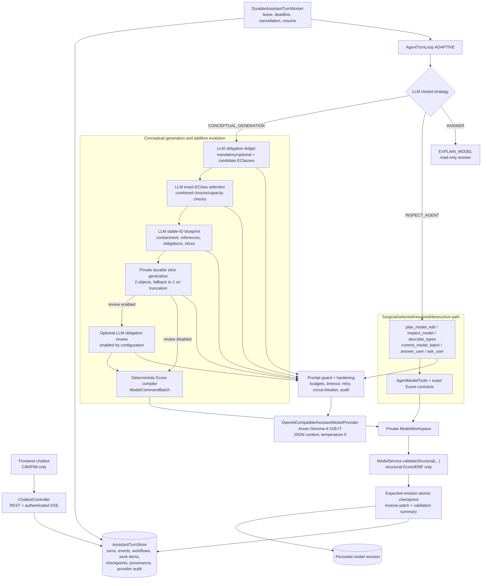

# Unified AI modeling assistant architecture

The product exposes one chatbot, not separate conceptual and agent assistants. Deterministic state
restricts legal strategies, but the LLM owns intent interpretation, obligation mapping, EClass
selection, objects, relationships, concrete subtype choice, and satisfaction review.

For an existing non-destructive model, the LLM may select either conceptual evolution or the
inspect/contract loop. Selected-element, resumed, and destructive work remains inspect-only, and
destructive mutations additionally require confirmation.

The blueprint schema is capped at 18 objects/types and effective capacity is lower when required
closure or provider-call reserves consume budget. Conceptual objects remain private until all
mandatory obligations are proven, deterministic compilation succeeds, and structural validation
passes.

Assistant paths never invoke EVL or full semantic validation. PSM assistant sessions are rejected;
PSM transformation and validation remain separate platform workflows.
