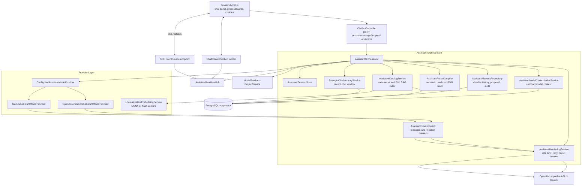
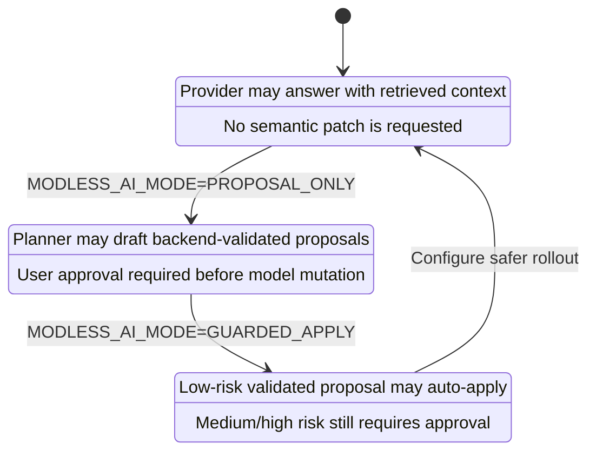
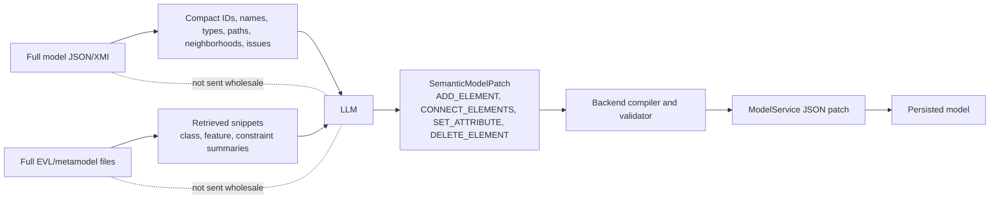

# AI Modeling Assistant Architecture

## Component Architecture

```mermaid
flowchart TB
    ui["Frontend chat.js<br/>chat panel, proposal cards, choices"]
    api["ChatbotController<br/>REST session/message/proposal endpoints"]
    ws["ChatbotWebSocketHandler"]
    sse["SSE EventSource endpoint"]
    hub["AssistantRealtimeHub"]

    subgraph orchestrated["Assistant Orchestration"]
        orch["AssistantOrchestrator"]
        sessions["AssistantSessionStore"]
        hard["AssistantHardeningService<br/>rate limit, retry, circuit breaker"]
        guard["AssistantPromptGuard<br/>redaction and injection markers"]
        context["AssistantModelContextIndexService<br/>compact model context"]
        catalog["AssistantCatalogService<br/>metamodel and EVL RAG index"]
        compiler["AssistantPatchCompiler<br/>semantic patch to JSON patch"]
        memory["AssistantMemoryRepository<br/>durable history, proposal, audit"]
        chatMemory["SpringAiChatMemoryService<br/>recent chat window"]
    end

    subgraph provider["Provider Layer"]
        configured["ConfiguredAssistantModelProvider"]
        openai["OpenAiCompatibleAssistantModelProvider"]
        gemini["GeminiAssistantModelProvider"]
        embedding["LocalAssistantEmbeddingService<br/>ONNX or hash vectors"]
    end

    models["ModelService + ProjectService"]
    db[("PostgreSQL + pgvector")]
    ai["OpenAI-compatible API or Gemini"]

    ui --> api --> orch
    ui <--> ws --> hub
    ui <-->|SSE fallback| sse --> hub
    orch --> hub
    orch --> sessions
    orch --> hard
    orch --> context --> db
    orch --> catalog --> embedding
    catalog --> db
    orch --> compiler
    orch --> memory --> db
    orch --> chatMemory --> db
    orch --> models
    orch --> configured
    configured --> openai --> guard --> hard --> ai
    configured --> gemini --> guard --> hard --> ai
```

## Assistant Modes

```mermaid
stateDiagram-v2
    [*] --> EXPLAIN_ONLY
    EXPLAIN_ONLY: Provider may answer with retrieved context
    EXPLAIN_ONLY: No semantic patch is requested
    PROPOSAL_ONLY: Planner may draft backend-validated proposals
    PROPOSAL_ONLY: User approval required before model mutation
    GUARDED_APPLY: Low-risk validated proposal may auto-apply
    GUARDED_APPLY: Medium/high risk still requires approval

    EXPLAIN_ONLY --> PROPOSAL_ONLY: MODLESS_AI_MODE=PROPOSAL_ONLY
    PROPOSAL_ONLY --> GUARDED_APPLY: MODLESS_AI_MODE=GUARDED_APPLY
    GUARDED_APPLY --> EXPLAIN_ONLY: Configure safer rollout
```

## Safety Boundary

```mermaid
flowchart LR
    fullModel["Full model JSON/XMI"]
    evlFiles["Full EVL/metamodel files"]
    compact["Compact IDs, names, types, paths, neighborhoods, issues"]
    snippets["Retrieved snippets<br/>class, feature, constraint summaries"]
    llm["LLM"]
    semantic["SemanticModelPatch<br/>ADD_ELEMENT, CONNECT_ELEMENTS, SET_ATTRIBUTE, DELETE_ELEMENT"]
    compiler["Backend compiler and validator"]
    jsonPatch["ModelService JSON patch"]
    storage["Persisted model"]

    fullModel --> compact
    evlFiles --> snippets
    compact --> llm
    snippets --> llm
    llm --> semantic
    semantic --> compiler
    compiler --> jsonPatch
    jsonPatch --> storage
    fullModel -. "not sent wholesale" .- llm
    evlFiles -. "not sent wholesale" .- llm
```
