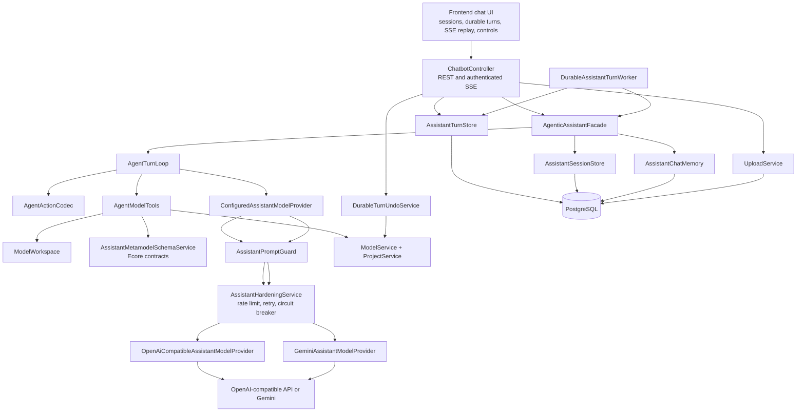
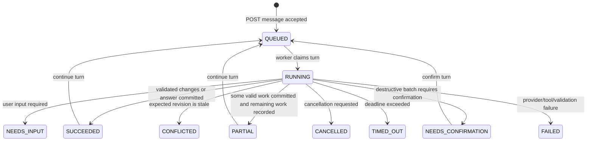
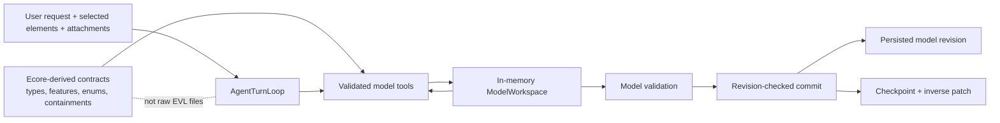

# AI Modeling Assistant Architecture

## Component Architecture

```mermaid
flowchart TB
    ui["Frontend chat UI<br/>sessions, durable turns, SSE replay, controls"]
    api["ChatbotController<br/>REST and authenticated SSE"]
    worker["DurableAssistantTurnWorker"]
    facade["AgenticAssistantFacade"]
    loop["AgentTurnLoop"]
    codec["AgentActionCodec"]
    tools["AgentModelTools"]
    workspace["ModelWorkspace"]
    schema["AssistantMetamodelSchemaService<br/>Ecore contracts"]
    hard["AssistantHardeningService<br/>rate limit, retry, circuit breaker"]
    prompts["AssistantPromptGuard"]
    provider["ConfiguredAssistantModelProvider"]
    openai["OpenAiCompatibleAssistantModelProvider"]
    gemini["GeminiAssistantModelProvider"]
    models["ModelService + ProjectService"]
    turns["AssistantTurnStore"]
    sessions["AssistantSessionStore"]
    memory["AssistantChatMemory"]
    uploads["UploadService"]
    undo["DurableTurnUndoService"]
    db[("PostgreSQL")]
    ai["OpenAI-compatible API or Gemini"]

    ui --> api
    api --> facade
    api --> turns
    api --> uploads
    api --> undo
    worker --> turns
    worker --> facade
    facade --> sessions
    facade --> memory
    facade --> loop
    loop --> codec
    loop --> tools --> workspace
    tools --> schema
    tools --> models
    loop --> provider
    provider --> prompts --> hard --> openai --> ai
    provider --> prompts --> hard --> gemini --> ai
    turns --> db
    sessions --> db
    memory --> db
    uploads --> db
    undo --> models
```

## Assistant Workflow

```mermaid
stateDiagram-v2
    [*] --> QUEUED: POST message accepted
    QUEUED --> RUNNING: worker claims turn
    RUNNING --> SUCCEEDED: validated changes or answer committed
    RUNNING --> PARTIAL: some valid work committed and remaining work recorded
    RUNNING --> NEEDS_INPUT: user input required
    RUNNING --> NEEDS_CONFIRMATION: destructive batch requires confirmation
    RUNNING --> CONFLICTED: expected revision is stale
    RUNNING --> CANCELLED: cancellation requested
    RUNNING --> TIMED_OUT: deadline exceeded
    RUNNING --> FAILED: provider/tool/validation failure
    SUCCEEDED --> QUEUED: continue turn
    PARTIAL --> QUEUED: continue turn
    NEEDS_CONFIRMATION --> QUEUED: confirm turn
```

## Safety Boundary

```mermaid
flowchart LR
    user["User request + selected elements + attachments"]
    contracts["Ecore-derived contracts<br/>types, features, enums, containments"]
    workspace["In-memory ModelWorkspace"]
    agent["AgentTurnLoop"]
    tools["Validated model tools"]
    validate["Model validation"]
    commit["Revision-checked commit"]
    checkpoint["Checkpoint + inverse patch"]
    storage["Persisted model revision"]

    user --> agent
    contracts --> tools
    workspace --> tools
    agent --> tools
    tools --> workspace
    workspace --> validate
    validate --> commit --> storage
    commit --> checkpoint
    contracts -. "not raw EVL files" .- agent
```
