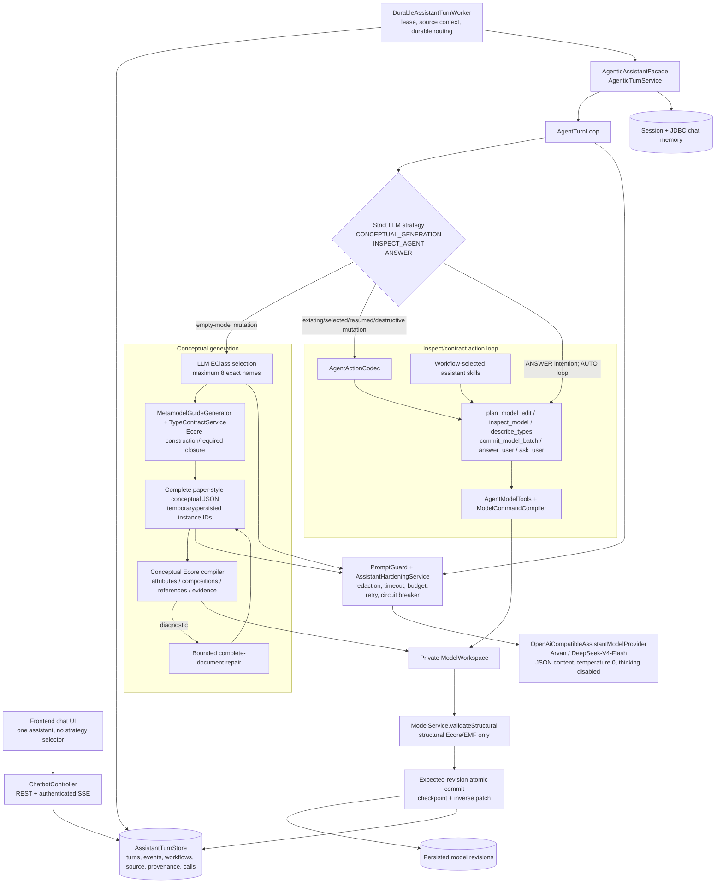
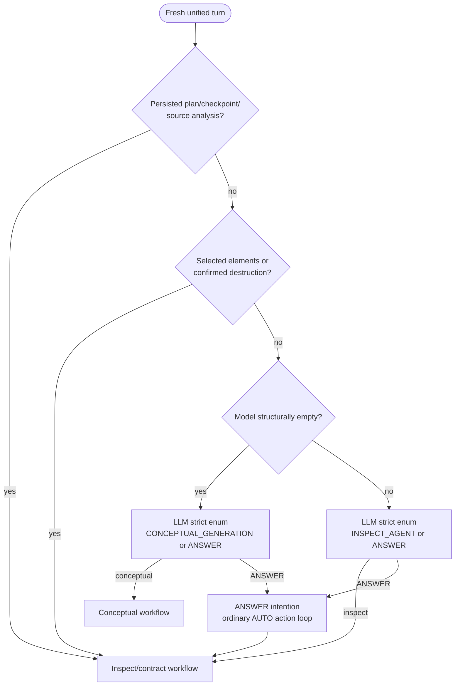
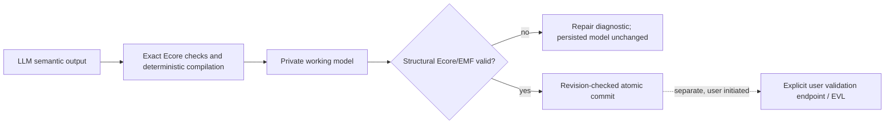

# Unified AI modeling assistant architecture

## Components and shared durable boundary

The same provider adapter and durable lifecycle serve every strategy. Conceptual generation is not
a separate chatbot or provider. The production router restricts conceptual mutation to fresh empty
models; existing-model, selected-element, resumed, and destructive mutations use the agent path.

## Strategy decision

No request keyword or fixture phrase participates in routing.

`ANSWER` is not yet an enforced read-only branch. It enters the ordinary AUTO action loop, whose
prompt should select `answer_user` but whose mutation actions remain available.

## Validation boundary

EVL, stored semantic validation, and full `ModelService.validate(...)` are outside assistant
generation, repair, apply, and commit.
