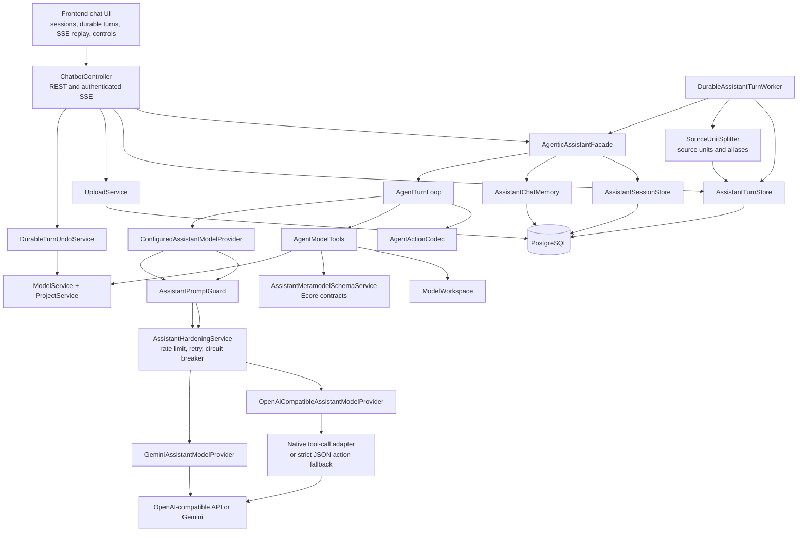
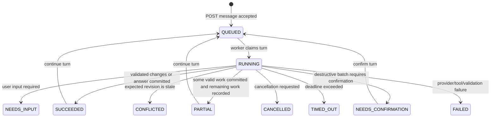
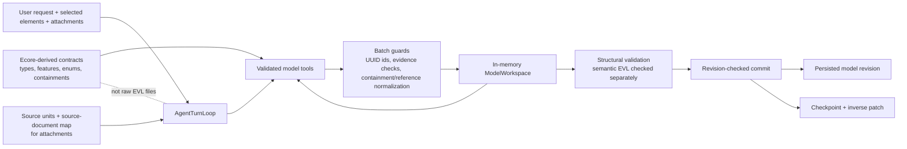

# AI Modeling Assistant Architecture

## Component Architecture

## Assistant Workflow

## Safety Boundary

Current live status: the source-backed one-story workflow reaches `SUCCEEDED` with 100% coverage and
a saved checkpoint, but semantic validation can still report `CIMModelHasSemanticCore` on the live
persisted model. The next fix is in the JSON/XMI persistence/validation path, not the HTTP turn
lifecycle.
