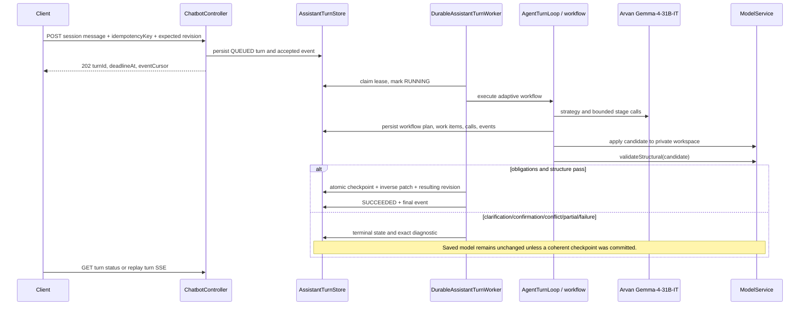
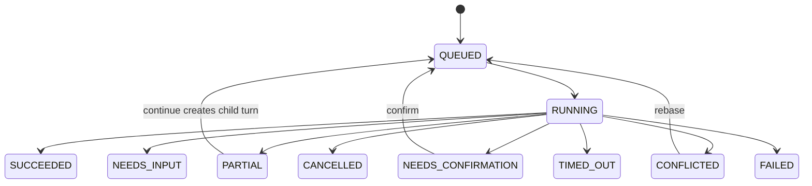

# AI assistant durable turn and checkpoint lifecycle

## Turn flow

## States and controls

Controls are cancellation, continuation, destructive confirmation, rebase, turn undo, checkpoint
rollback, and feedback. New durable turns do not use an approve/reject proposal stage. Legacy
proposal detail/undo endpoints remain for compatibility with already-applied proposal records.

Every checkpoint is revision-checked and stores an inverse patch. Undo and rollback create a new
revision; they do not rewrite history.
