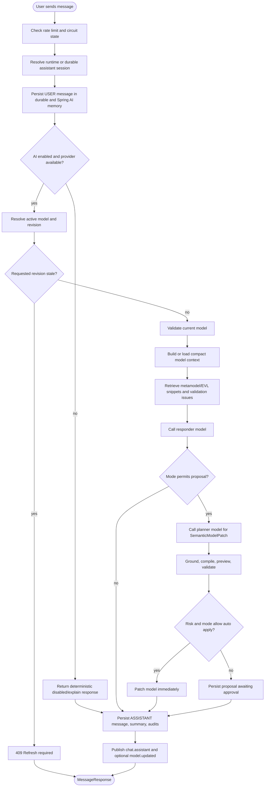
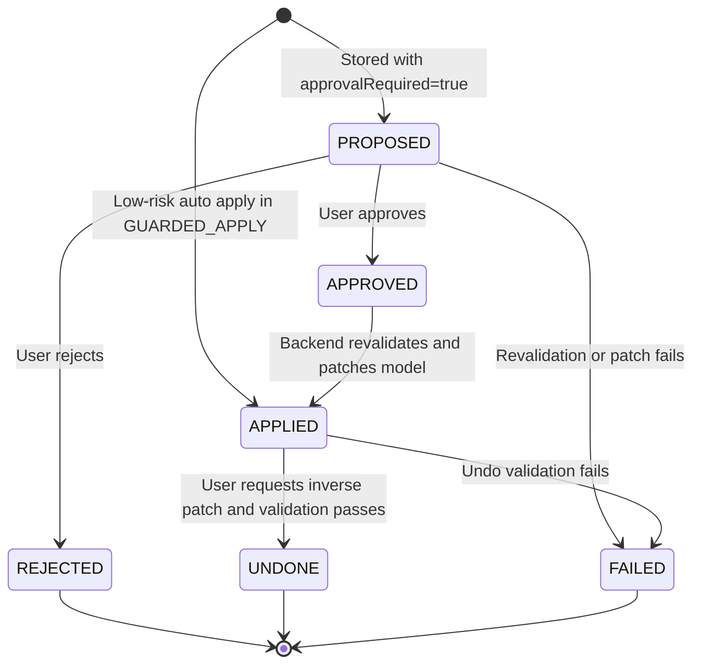
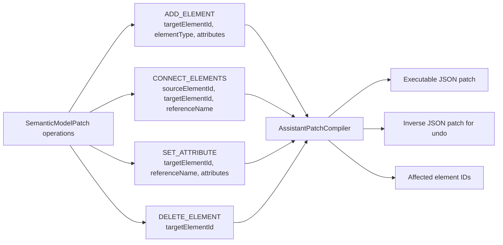
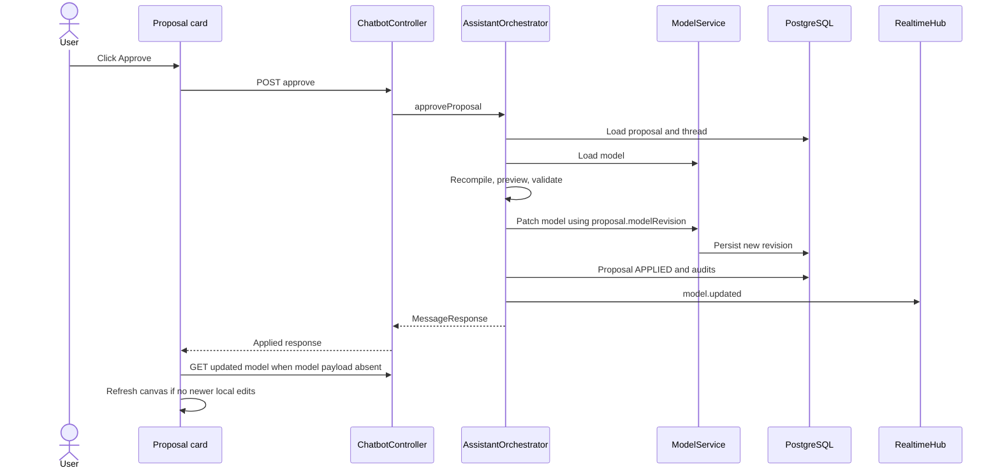

# AI Assistant Turn and Proposal Lifecycle

## Turn Flow

```mermaid
flowchart TD
    start([User sends message])
    rate["Check rate limit and circuit state"]
    session["Resolve runtime or durable assistant session"]
    saveUser["Persist USER message in durable and Spring AI memory"]
    enabled{"AI enabled and provider available?"}
    disabled["Return deterministic disabled/explain response"]
    load["Resolve active model and revision"]
    conflict{"Requested revision stale?"}
    validate["Validate current model"]
    snapshot["Build or load compact model context"]
    retrieve["Retrieve metamodel/EVL snippets and validation issues"]
    respond["Call responder model"]
    proposalMode{"Mode permits proposal?"}
    plan["Call planner model for SemanticModelPatch"]
    compile["Ground, compile, preview, validate"]
    risk{"Risk and mode allow auto apply?"}
    auto["Patch model immediately"]
    propose["Persist proposal awaiting approval"]
    final["Persist ASSISTANT message, summary, audits"]
    publish["Publish chat.assistant and optional model.updated"]
    done([MessageResponse])

    start --> rate --> session --> saveUser --> enabled
    enabled -- no --> disabled --> final
    enabled -- yes --> load --> conflict
    conflict -- yes --> stale["409 Refresh required"] --> done
    conflict -- no --> validate --> snapshot --> retrieve --> respond --> proposalMode
    proposalMode -- no --> final
    proposalMode -- yes --> plan --> compile --> risk
    risk -- yes --> auto --> final
    risk -- no --> propose --> final
    final --> publish --> done
```

## Proposal State Machine

```mermaid
stateDiagram-v2
    [*] --> PROPOSED: Stored with approvalRequired=true
    [*] --> APPLIED: Low-risk auto apply in GUARDED_APPLY
    PROPOSED --> APPROVED: User approves
    APPROVED --> APPLIED: Backend revalidates and patches model
    PROPOSED --> REJECTED: User rejects
    PROPOSED --> FAILED: Revalidation or patch fails
    APPLIED --> UNDONE: User requests inverse patch and validation passes
    APPLIED --> FAILED: Undo validation fails
    REJECTED --> [*]
    UNDONE --> [*]
    FAILED --> [*]
```

## Semantic Patch Compilation

```mermaid
flowchart LR
    sem["SemanticModelPatch operations"]
    add["ADD_ELEMENT<br/>targetElementId, elementType, attributes"]
    connect["CONNECT_ELEMENTS<br/>sourceElementId, targetElementId, referenceName"]
    set["SET_ATTRIBUTE<br/>targetElementId, referenceName, attributes"]
    delete["DELETE_ELEMENT<br/>targetElementId"]
    compiler["AssistantPatchCompiler"]
    patch["Executable JSON patch"]
    inverse["Inverse JSON patch for undo"]
    affected["Affected element IDs"]

    sem --> add --> compiler
    sem --> connect --> compiler
    sem --> set --> compiler
    sem --> delete --> compiler
    compiler --> patch
    compiler --> inverse
    compiler --> affected
```

## Approval Sequence

```mermaid
sequenceDiagram
    actor User
    participant UI as Proposal card
    participant API as ChatbotController
    participant O as AssistantOrchestrator
    participant M as ModelService
    participant DB as PostgreSQL
    participant RT as RealtimeHub

    User->>UI: Click Approve
    UI->>API: POST approve
    API->>O: approveProposal
    O->>DB: Load proposal and thread
    O->>M: Load model
    O->>O: Recompile, preview, validate
    O->>M: Patch model using proposal.modelRevision
    M->>DB: Persist new revision
    O->>DB: Proposal APPLIED and audits
    O->>RT: model.updated
    O-->>API: MessageResponse
    API-->>UI: Applied response
    UI->>API: GET updated model when model payload absent
    UI->>UI: Refresh canvas if no newer local edits
```
