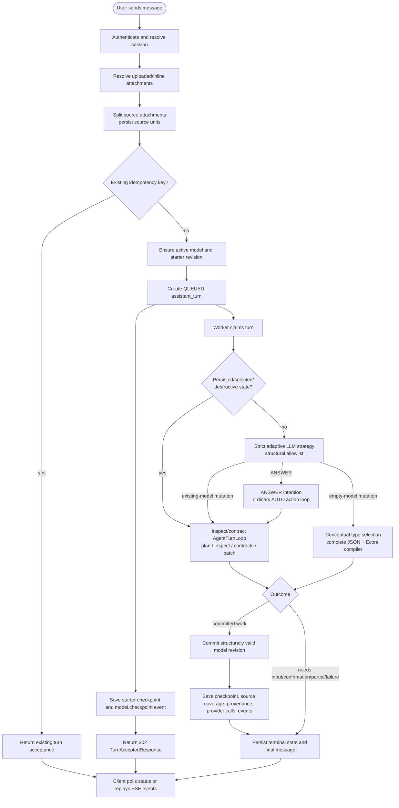
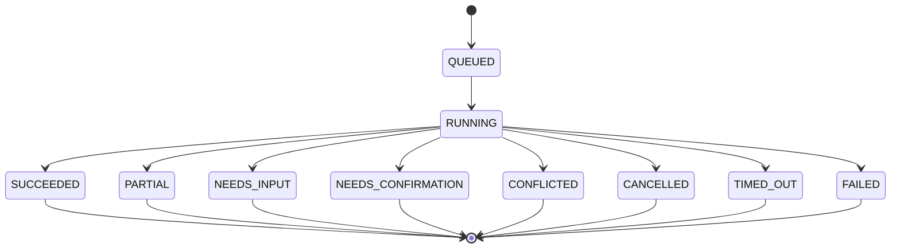
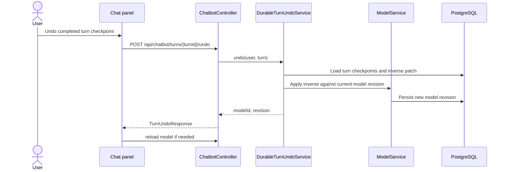
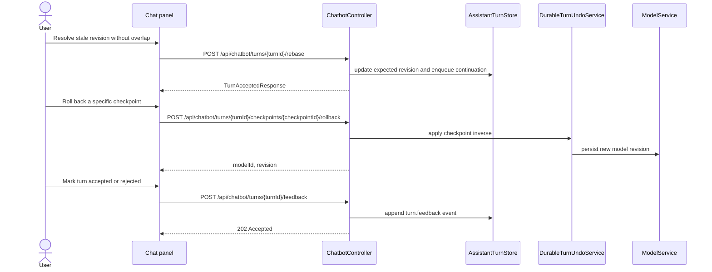

# AI Assistant Durable Turn and Checkpoint Lifecycle

## Turn Flow

```mermaid
flowchart TD
    start([User sends message])
    auth["Authenticate and resolve session"]
    attach["Resolve uploaded/inline attachments"]
    source["Split source attachments<br/>persist source units"]
    idem{"Existing idempotency key?"}
    existing["Return existing turn acceptance"]
    ensure["Ensure active model and starter revision"]
    create["Create QUEUED assistant_turn"]
    checkpoint["Save starter checkpoint and model.checkpoint event"]
    accepted["Return 202 TurnAcceptedResponse"]
    claim["Worker claims turn"]
    durableRoute{"Persisted/selected/<br/>destructive state?"}
    adaptive["Strict adaptive LLM strategy<br/>structural allowlist"]
    conceptual["Conceptual type selection<br/>complete JSON + Ecore compiler"]
    agent["Inspect/contract AgentTurnLoop<br/>plan / inspect / contracts / batch"]
    answer["ANSWER intention<br/>ordinary AUTO action loop"]
    state{"Outcome"}
    commit["Commit structurally valid model revision"]
    saveCheckpoint["Save checkpoint, source coverage, provenance, provider calls, events"]
    terminal["Persist terminal state and final message"]
    controls["Client polls status or replays SSE events"]

    start --> auth --> attach --> source --> idem
    idem -- yes --> existing --> controls
    idem -- no --> ensure --> create --> checkpoint --> accepted --> controls
    create --> claim --> durableRoute
    durableRoute -- yes --> agent --> state
    durableRoute -- no --> adaptive
    adaptive -- empty-model mutation --> conceptual --> state
    adaptive -- existing-model mutation --> agent
    adaptive -- ANSWER --> answer --> agent
    state -- committed work --> commit --> saveCheckpoint --> terminal
    state -- needs input/confirmation/partial/failure --> terminal
    terminal --> controls
```

## Durable Turn States

```mermaid
stateDiagram-v2
    [*] --> QUEUED
    QUEUED --> RUNNING
    RUNNING --> SUCCEEDED
    RUNNING --> PARTIAL
    RUNNING --> NEEDS_INPUT
    RUNNING --> NEEDS_CONFIRMATION
    RUNNING --> CONFLICTED
    RUNNING --> CANCELLED
    RUNNING --> TIMED_OUT
    RUNNING --> FAILED
    SUCCEEDED --> [*]
    PARTIAL --> [*]
    NEEDS_INPUT --> [*]
    NEEDS_CONFIRMATION --> [*]
    CONFLICTED --> [*]
    CANCELLED --> [*]
    TIMED_OUT --> [*]
    FAILED --> [*]
```

## Checkpoint Undo

```mermaid
sequenceDiagram
    actor User
    participant UI as Chat panel
    participant API as ChatbotController
    participant Undo as DurableTurnUndoService
    participant M as ModelService
    participant DB as PostgreSQL

    User->>UI: Undo completed turn checkpoint
    UI->>API: POST /api/chatbot/turns/{turnId}/undo
    API->>Undo: undo(user, turn)
    Undo->>DB: Load turn checkpoints and inverse patch
    Undo->>M: Apply inverse against current model revision
    M->>DB: Persist new model revision
    Undo-->>API: modelId, revision
    API-->>UI: TurnUndoResponse
    UI->>API: reload model if needed
```

## Rebase, Rollback, and Feedback

```mermaid
sequenceDiagram
    actor User
    participant UI as Chat panel
    participant API as ChatbotController
    participant Turns as AssistantTurnStore
    participant Undo as DurableTurnUndoService
    participant M as ModelService

    User->>UI: Resolve stale revision without overlap
    UI->>API: POST /api/chatbot/turns/{turnId}/rebase
    API->>Turns: update expected revision and enqueue continuation
    API-->>UI: TurnAcceptedResponse

    User->>UI: Roll back a specific checkpoint
    UI->>API: POST /api/chatbot/turns/{turnId}/checkpoints/{checkpointId}/rollback
    API->>Undo: apply checkpoint inverse
    Undo->>M: persist new model revision
    API-->>UI: modelId, revision

    User->>UI: Mark turn accepted or rejected
    UI->>API: POST /api/chatbot/turns/{turnId}/feedback
    API->>Turns: append turn.feedback event
    API-->>UI: 202 Accepted
```
