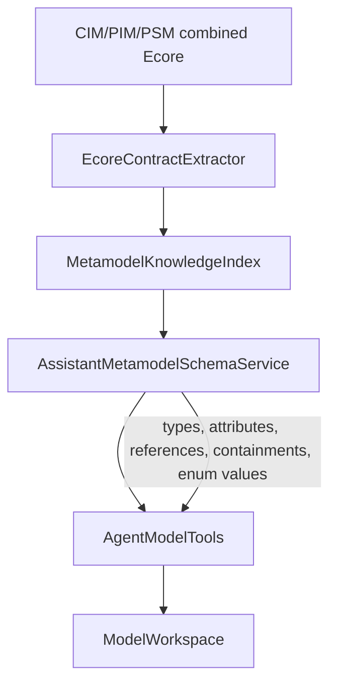
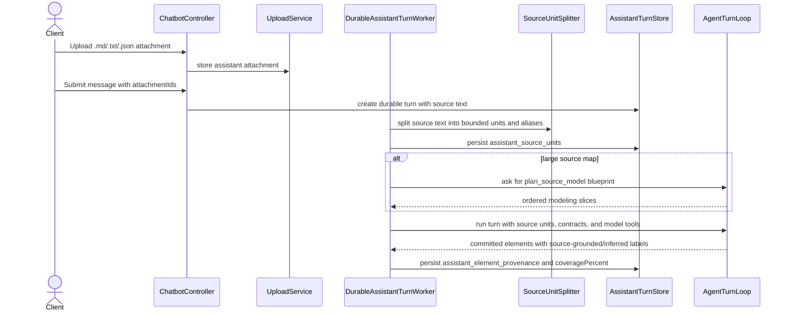
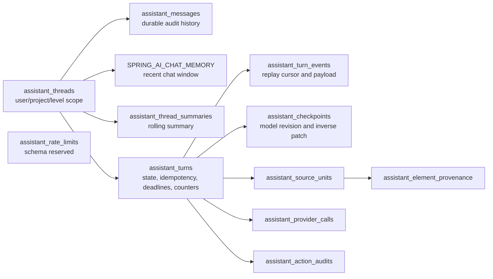

# AI Assistant Contracts, Source Units, and Durable Memory

## Metamodel Contract Use

## Source-Backed Turn Provenance

## Durable Memory Layout

Source coverage is a provenance/accounting signal. It says whether tracked source units were
modeled, inferred, or intentionally left as remaining work. Semantic EVL validation is still checked
through the model validation endpoints after a checkpoint.
