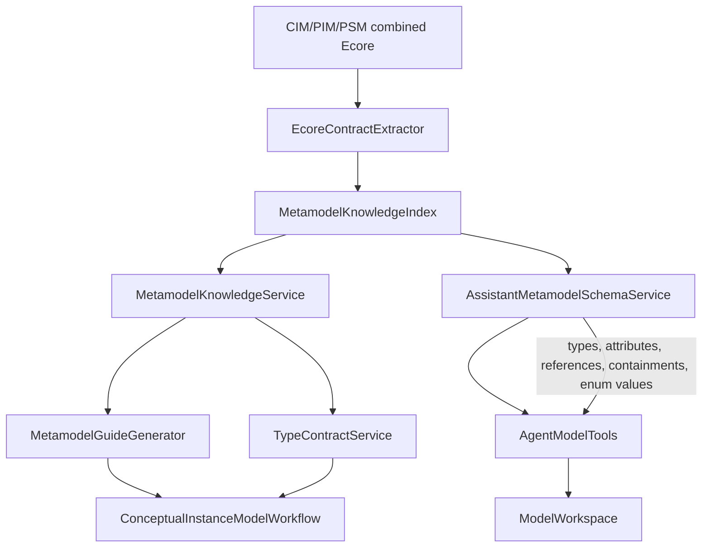
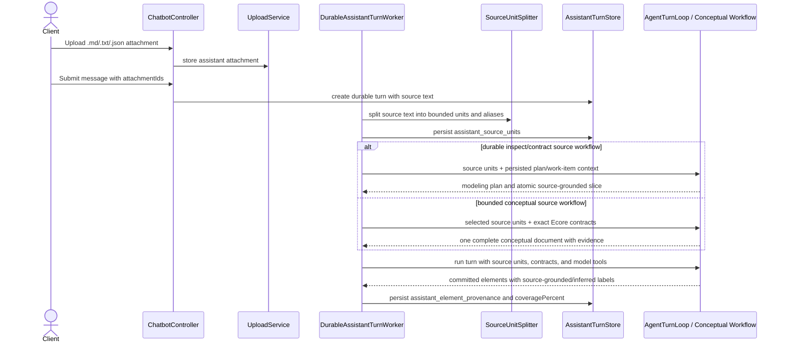
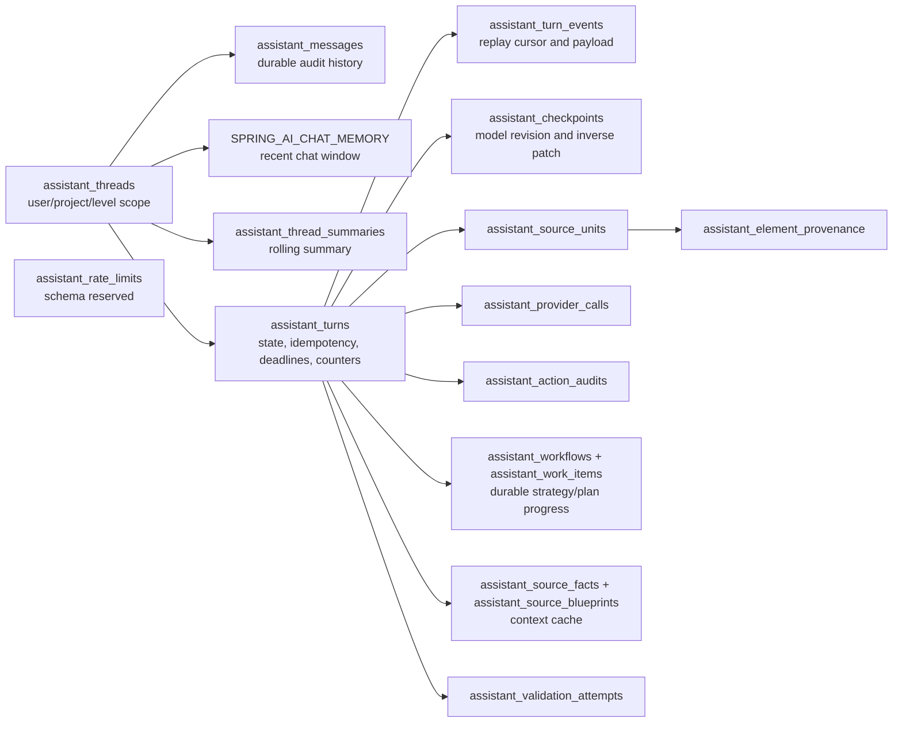

# AI Assistant Contracts, Source Units, and Durable Memory

## Metamodel Contract Use

## Source-Backed Turn Provenance

## Durable Memory Layout

Source coverage is a provenance/accounting signal. It says whether tracked source units were
modeled, inferred, or intentionally left as remaining work. Assistant checkpoints do not execute EVL
or require semantic EVL validity; model validation endpoints remain available for explicit
post-checkpoint review.

The inspect/contract path can persist source plans and work items across continuations. The current
conceptual path is bounded to one complete response and does not yet persist a cross-response
instance ledger.
