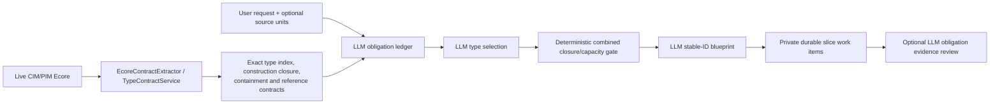
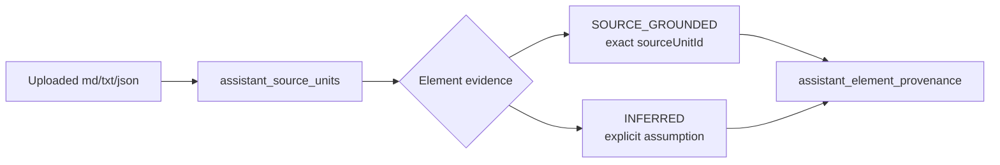

# AI assistant contracts, obligations, source units, and durable memory

## Exact metamodel and semantic planning

There is no business-semantic keyword mapper. The LLM owns the obligation text and candidate exact
EClasses. Deterministic code verifies that candidates exist and are creatable, that mandatory
obligations survive selection and blueprint allocation. When optional LLM review is enabled, it
also verifies that cited objects and relationship triples exist.

Lexical/embedding retrieval may help the inspect/contract action loop select relevant metamodel
contracts. It is not a semantic fallback generator and does not replace exact live Ecore closure.

## Source provenance

Source coverage is accounting, not EVL validity. When configured, obligation coverage adds a
separate LLM judgment whose identifiers and evidence are deterministically checked. It is disabled
in the currently validated Gemma profile.

## Durable memory

The runtime persists thread messages/summaries, turns/events, provider prompts and usage,
obligation/type/blueprint workflow state, private work-item payloads, source context and provenance,
validation attempts, checkpoints, and inverse patches. This allows lease recovery to resume
completed stages without exposing private partial objects or reinterpreting a persisted ledger.

Assistant generation and commit use only `ModelService.validateStructural(...)`. EVL remains a
separate explicit validation workflow.
