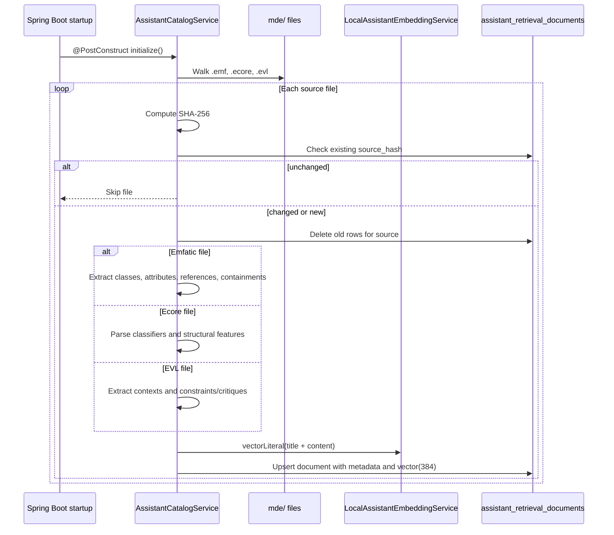
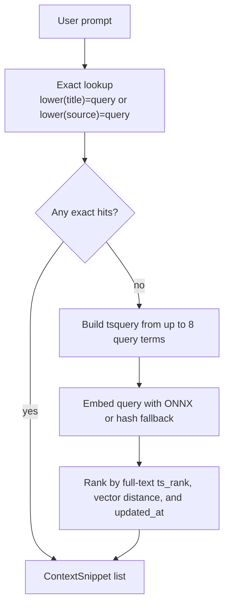
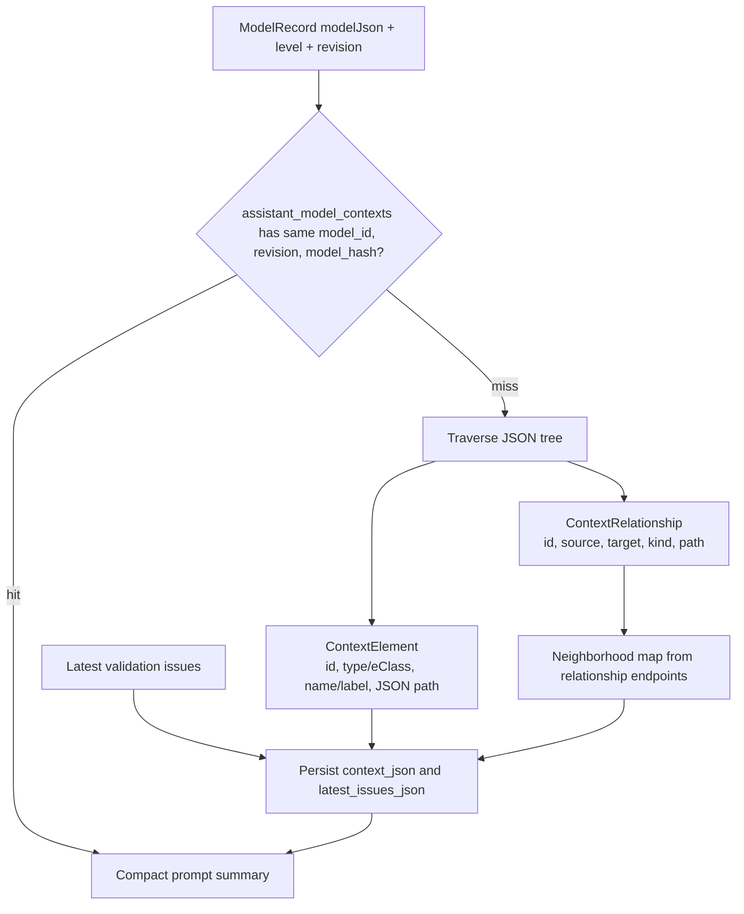
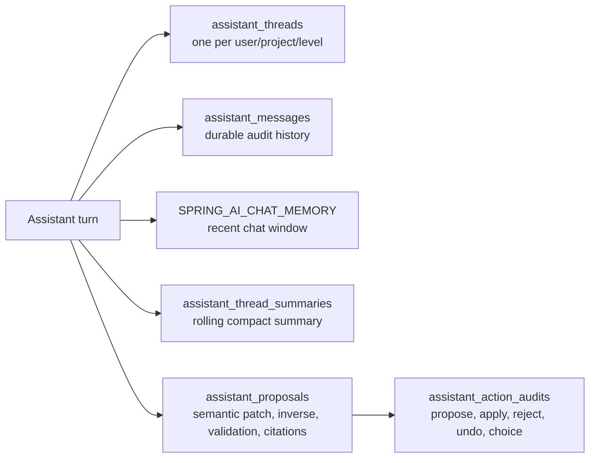

# AI Assistant RAG and Memory

## Catalog Indexing

```mermaid
sequenceDiagram
    participant Boot as Spring Boot startup
    participant Cat as AssistantCatalogService
    participant FS as mde/ files
    participant Emb as LocalAssistantEmbeddingService
    participant DB as assistant_retrieval_documents

    Boot->>Cat: @PostConstruct initialize()
    Cat->>FS: Walk .emf, .ecore, .evl
    loop Each source file
        Cat->>Cat: Compute SHA-256
        Cat->>DB: Check existing source_hash
        alt unchanged
            Cat-->>Boot: Skip file
        else changed or new
            Cat->>DB: Delete old rows for source
            alt Emfatic file
                Cat->>Cat: Extract classes, attributes, references, containments
            else Ecore file
                Cat->>Cat: Parse classifiers and structural features
            else EVL file
                Cat->>Cat: Extract contexts and constraints/critiques
            end
            Cat->>Emb: vectorLiteral(title + content)
            Cat->>DB: Upsert document with metadata and vector(384)
        end
    end
```

## Retrieval Query

```mermaid
flowchart TD
    query["User prompt"]
    exact["Exact lookup<br/>lower(title)=query or lower(source)=query"]
    exactHit{"Any exact hits?"}
    fuzzy["Build tsquery from up to 8 query terms"]
    embed["Embed query with ONNX or hash fallback"]
    rank["Rank by full-text ts_rank, vector distance, and updated_at"]
    snippets["ContextSnippet list"]

    query --> exact --> exactHit
    exactHit -- yes --> snippets
    exactHit -- no --> fuzzy --> embed --> rank --> snippets
```

## Model Context Snapshot

```mermaid
flowchart TB
    model["ModelRecord modelJson + level + revision"]
    cache{"assistant_model_contexts has same model_id, revision, model_hash?"}
    collect["Traverse JSON tree"]
    elements["ContextElement<br/>id, type/eClass, name/label, JSON path"]
    rels["ContextRelationship<br/>id, source, target, kind, path"]
    neighborhoods["Neighborhood map from relationship endpoints"]
    issues["Latest validation issues"]
    persist["Persist context_json and latest_issues_json"]
    prompt["Compact prompt summary"]

    model --> cache
    cache -- hit --> prompt
    cache -- miss --> collect
    collect --> elements
    collect --> rels
    rels --> neighborhoods
    issues --> persist
    elements --> persist
    neighborhoods --> persist
    persist --> prompt
```

## Durable Memory Layout

```mermaid
flowchart LR
    turn["Assistant turn"]
    thread["assistant_threads<br/>one per user/project/level"]
    messages["assistant_messages<br/>durable audit history"]
    spring["SPRING_AI_CHAT_MEMORY<br/>recent chat window"]
    summaries["assistant_thread_summaries<br/>rolling compact summary"]
    proposals["assistant_proposals<br/>semantic patch, inverse, validation, citations"]
    audits["assistant_action_audits<br/>propose, apply, reject, undo, choice"]

    turn --> thread
    turn --> messages
    turn --> spring
    turn --> summaries
    turn --> proposals
    proposals --> audits
```
