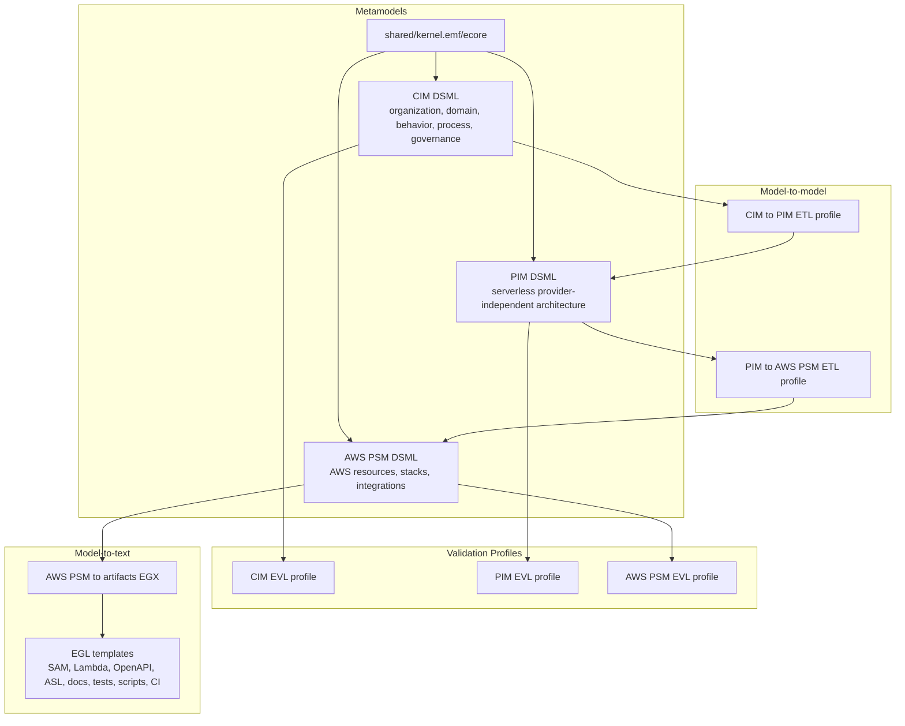
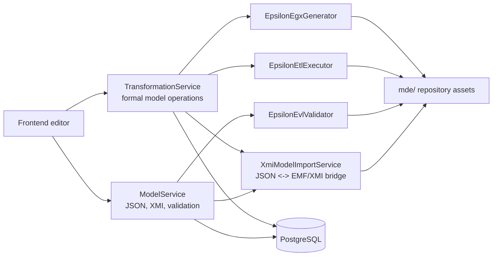
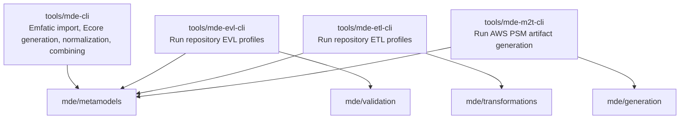

# Model-Driven Engineering Architecture

## Formal Asset Architecture

```mermaid
flowchart TB
    subgraph meta["Metamodels"]
        kernel["shared/kernel.emf/ecore"]
        cim["CIM DSML<br/>organization, domain, behavior, process, governance"]
        pim["PIM DSML<br/>serverless provider-independent architecture"]
        psm["AWS PSM DSML<br/>AWS resources, stacks, integrations"]
    end

    subgraph validate["Validation Profiles"]
        cimV["CIM EVL profile"]
        pimV["PIM EVL profile"]
        psmV["AWS PSM EVL profile"]
    end

    subgraph transform["Model-to-model"]
        c2p["CIM to PIM ETL profile"]
        p2a["PIM to AWS PSM ETL profile"]
    end

    subgraph generate["Model-to-text"]
        egx["AWS PSM to artifacts EGX"]
        egl["EGL templates<br/>SAM, Lambda, OpenAPI, ASL, docs, tests, scripts, CI"]
    end

    kernel --> cim
    kernel --> pim
    kernel --> psm
    cim --> cimV
    pim --> pimV
    psm --> psmV
    cim --> c2p --> pim
    pim --> p2a --> psm
    psm --> egx --> egl
```

## Runtime Services

```mermaid
flowchart LR
    frontend["Frontend editor"]
    modelService["ModelService<br/>JSON, XMI, validation"]
    transformService["TransformationService<br/>formal model operations"]
    xmi["XmiModelImportService<br/>JSON <-> EMF/XMI bridge"]
    evl["EpsilonEvlValidator"]
    etl["EpsilonEtlExecutor"]
    egx["EpsilonEgxGenerator"]
    assets["mde/ repository assets"]
    storage[("PostgreSQL")]

    frontend --> modelService
    frontend --> transformService
    modelService --> xmi
    modelService --> evl
    transformService --> xmi
    transformService --> etl
    transformService --> egx
    xmi --> assets
    evl --> assets
    etl --> assets
    egx --> assets
    modelService --> storage
    transformService --> storage
```

## CLI Tools

```mermaid
flowchart TB
    mdecli["tools/mde-cli<br/>Emfatic import, Ecore generation, normalization, combining"]
    evlcli["tools/mde-evl-cli<br/>Run repository EVL profiles"]
    etlcli["tools/mde-etl-cli<br/>Run repository ETL profiles"]
    m2tcli["tools/mde-m2t-cli<br/>Run AWS PSM artifact generation"]
    metamodels["mde/metamodels"]
    validations["mde/validation"]
    transformations["mde/transformations"]
    generation["mde/generation"]

    mdecli --> metamodels
    evlcli --> validations
    evlcli --> metamodels
    etlcli --> transformations
    etlcli --> metamodels
    m2tcli --> generation
    m2tcli --> metamodels
```
