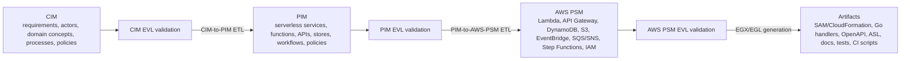
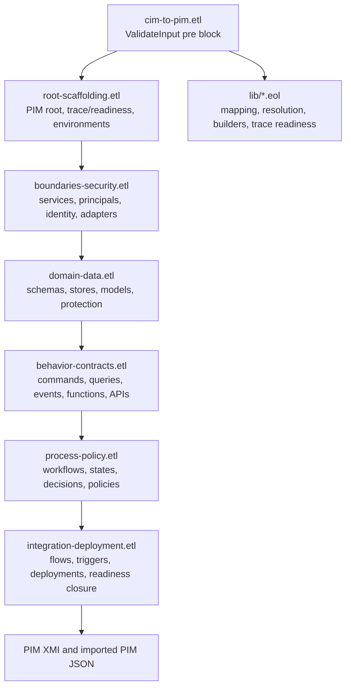
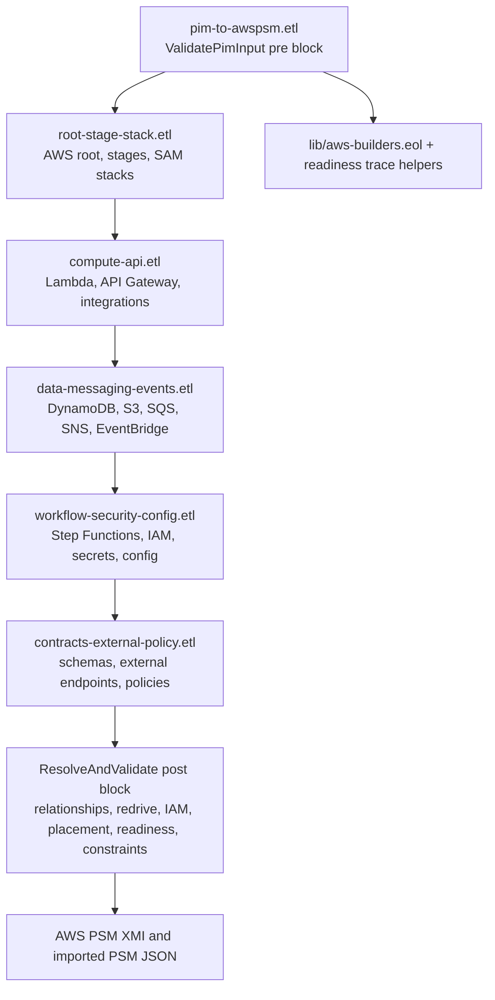
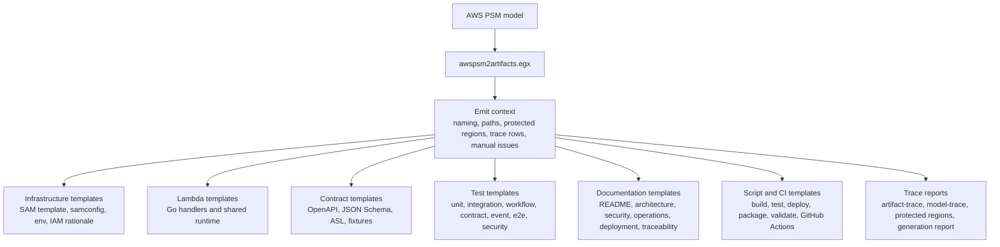

# MDE End-to-End Pipeline

## User-Level Pipeline

```mermaid
flowchart LR
    cim["CIM<br/>requirements, actors, domain concepts, processes, policies"]
    validateCim["CIM EVL validation"]
    pim["PIM<br/>serverless services, functions, APIs, stores, workflows, policies"]
    validatePim["PIM EVL validation"]
    psm["AWS PSM<br/>Lambda, API Gateway, DynamoDB, S3, EventBridge, SQS/SNS, Step Functions, IAM"]
    validatePsm["AWS PSM EVL validation"]
    artifacts["Artifacts<br/>SAM/CloudFormation, Go handlers, OpenAPI, ASL, docs, tests, CI scripts"]

    cim --> validateCim -->|"CIM-to-PIM ETL"| pim
    pim --> validatePim -->|"PIM-to-AWS-PSM ETL"| psm
    psm --> validatePsm -->|"EGX/EGL generation"| artifacts
```

## CIM to PIM Transformation Profile

```mermaid
flowchart TB
    entry["cim-to-pim.etl<br/>ValidateInput pre block"]
    root["root-scaffolding.etl<br/>PIM root, trace/readiness, environments"]
    boundary["boundaries-security.etl<br/>services, principals, identity, adapters"]
    data["domain-data.etl<br/>schemas, stores, models, protection"]
    behavior["behavior-contracts.etl<br/>commands, queries, events, functions, APIs"]
    process["process-policy.etl<br/>workflows, states, decisions, policies"]
    integration["integration-deployment.etl<br/>flows, triggers, deployments, readiness closure"]
    libs["lib/*.eol<br/>mapping, resolution, builders, trace readiness"]
    output["PIM XMI and imported PIM JSON"]

    entry --> libs
    entry --> root --> boundary --> data --> behavior --> process --> integration --> output
```

## PIM to AWS PSM Transformation Profile

```mermaid
flowchart TB
    entry["pim-to-awspsm.etl<br/>ValidatePimInput pre block"]
    root["root-stage-stack.etl<br/>AWS root, stages, SAM stacks"]
    compute["compute-api.etl<br/>Lambda, API Gateway, integrations"]
    data["data-messaging-events.etl<br/>DynamoDB, S3, SQS, SNS, EventBridge"]
    workflow["workflow-security-config.etl<br/>Step Functions, IAM, secrets, config"]
    contracts["contracts-external-policy.etl<br/>schemas, external endpoints, policies"]
    post["ResolveAndValidate post block<br/>relationships, redrive, IAM, placement, readiness, constraints"]
    libs["lib/aws-builders.eol + readiness trace helpers"]
    output["AWS PSM XMI and imported PSM JSON"]

    entry --> libs
    entry --> root --> compute --> data --> workflow --> contracts --> post --> output
```

## AWS PSM to Artifacts Generation

```mermaid
flowchart TB
    psm["AWS PSM model"]
    egx["awspsm2artifacts.egx"]
    ctx["Emit context<br/>naming, paths, protected regions, trace rows, manual issues"]
    infra["Infrastructure templates<br/>SAM template, samconfig, env, IAM rationale"]
    lambda["Lambda templates<br/>Go handlers and shared runtime"]
    contracts["Contract templates<br/>OpenAPI, JSON Schema, ASL, fixtures"]
    tests["Test templates<br/>unit, integration, workflow, contract, event, e2e, security"]
    docs["Documentation templates<br/>README, architecture, security, operations, deployment, traceability"]
    scripts["Script and CI templates<br/>build, test, deploy, package, validate, GitHub Actions"]
    trace["Trace reports<br/>artifact-trace, model-trace, protected regions, generation report"]

    psm --> egx --> ctx
    ctx --> infra
    ctx --> lambda
    ctx --> contracts
    ctx --> tests
    ctx --> docs
    ctx --> scripts
    ctx --> trace
```
