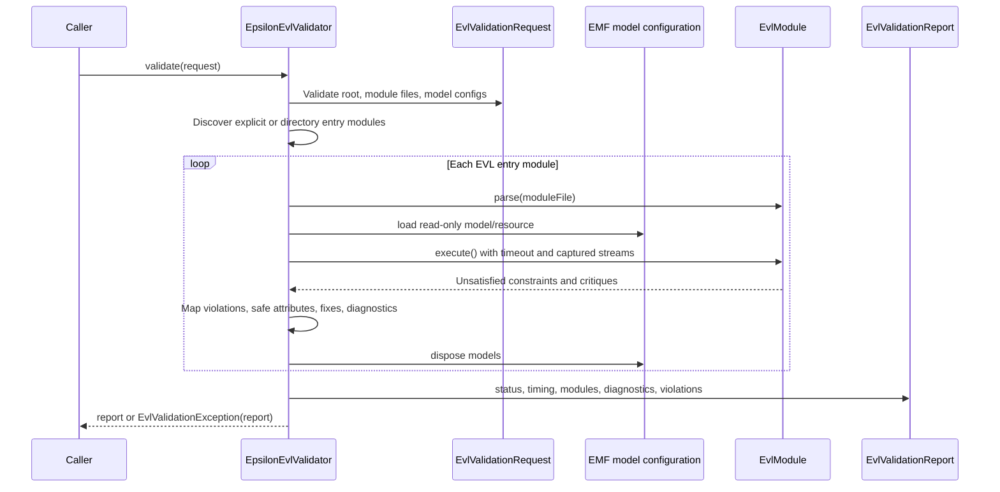
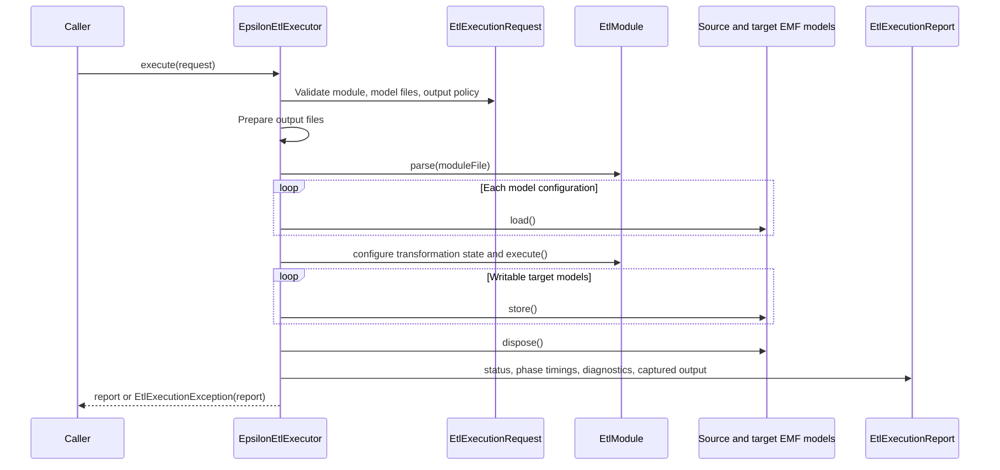
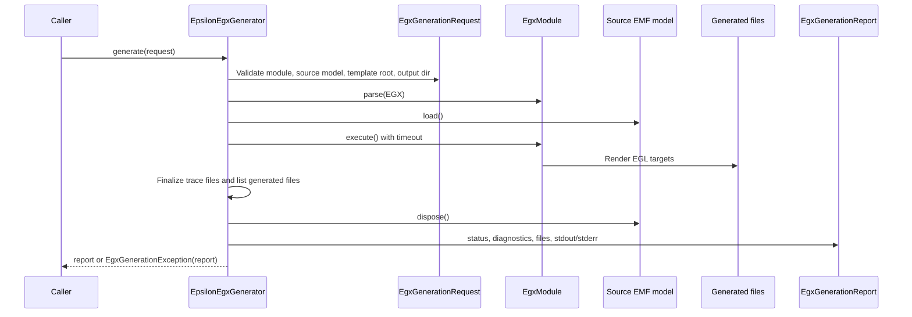
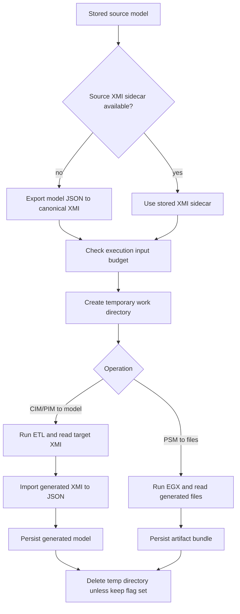

# EVL, ETL, and EGX Execution Internals

## EVL Validation Execution

```mermaid
sequenceDiagram
    participant Caller
    participant V as EpsilonEvlValidator
    participant Req as EvlValidationRequest
    participant EMF as EMF model configuration
    participant EVL as EvlModule
    participant Report as EvlValidationReport

    Caller->>V: validate(request)
    V->>Req: Validate root, module files, model configs
    V->>V: Discover explicit or directory entry modules
    loop Each EVL entry module
        V->>EVL: parse(moduleFile)
        V->>EMF: load read-only model/resource
        V->>EVL: execute() with timeout and captured streams
        EVL-->>V: Unsatisfied constraints and critiques
        V->>V: Map violations, safe attributes, fixes, diagnostics
        V->>EMF: dispose models
    end
    V->>Report: status, timing, modules, diagnostics, violations
    V-->>Caller: report or EvlValidationException(report)
```

## ETL Transformation Execution

```mermaid
sequenceDiagram
    participant Caller
    participant E as EpsilonEtlExecutor
    participant Req as EtlExecutionRequest
    participant Module as EtlModule
    participant Models as Source and target EMF models
    participant Report as EtlExecutionReport

    Caller->>E: execute(request)
    E->>Req: Validate module, model files, output policy
    E->>E: Prepare output files
    E->>Module: parse(moduleFile)
    loop Each model configuration
        E->>Models: load()
    end
    E->>Module: configure transformation state and execute()
    loop Writable target models
        E->>Models: store()
    end
    E->>Models: dispose()
    E->>Report: status, phase timings, diagnostics, captured output
    E-->>Caller: report or EtlExecutionException(report)
```

## EGX/EGL Generation Execution

```mermaid
sequenceDiagram
    participant Caller
    participant G as EpsilonEgxGenerator
    participant Req as EgxGenerationRequest
    participant Module as EgxModule
    participant Model as Source EMF model
    participant Output as Generated files
    participant Report as EgxGenerationReport

    Caller->>G: generate(request)
    G->>Req: Validate module, source model, template root, output dir
    G->>Module: parse(EGX)
    G->>Model: load()
    G->>Module: execute() with timeout
    Module->>Output: Render EGL targets
    G->>G: Finalize trace files and list generated files
    G->>Model: dispose()
    G->>Report: status, diagnostics, files, stdout/stderr
    G-->>Caller: report or EgxGenerationException(report)
```

## TransformationService Formal Operation

```mermaid
flowchart TD
    source["Stored source model"]
    xmiChoice{"Source XMI sidecar available?"}
    export["Export model JSON to canonical XMI"]
    sidecar["Use stored XMI sidecar"]
    budget["Check execution input budget"]
    temp["Create temporary work directory"]
    runner{"Operation"}
    etl["Run ETL and read target XMI"]
    egx["Run EGX and read generated files"]
    import["Import generated XMI to JSON"]
    persistModel["Persist generated model"]
    persistArtifact["Persist artifact bundle"]
    cleanup["Delete temp directory unless keep flag set"]

    source --> xmiChoice
    xmiChoice -- no --> export --> budget
    xmiChoice -- yes --> sidecar --> budget
    budget --> temp --> runner
    runner -- CIM/PIM to model --> etl --> import --> persistModel --> cleanup
    runner -- PSM to files --> egx --> persistArtifact --> cleanup
```
