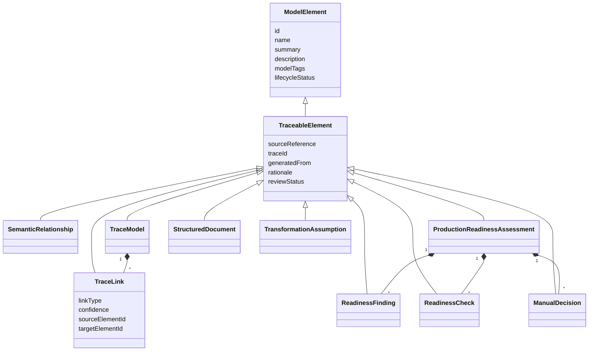
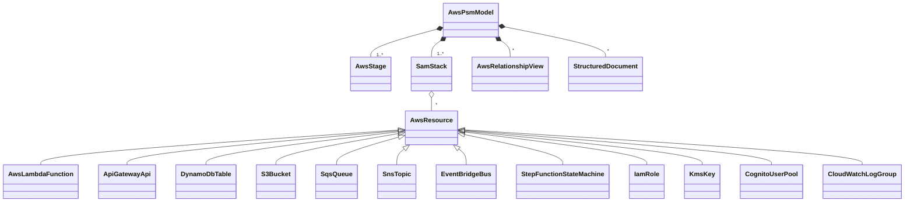
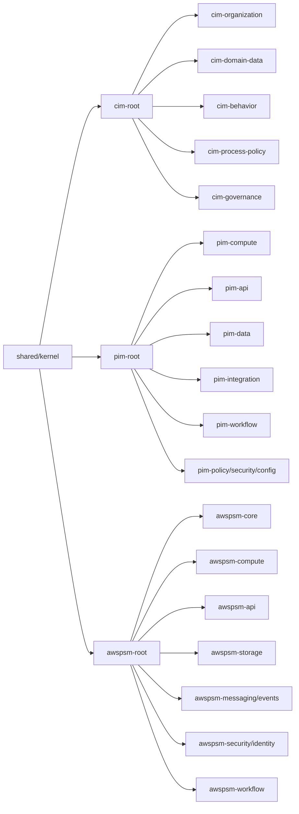

# Metamodel Relations

## Shared Kernel

```mermaid
classDiagram
    class ModelElement {
        id
        name
        summary
        description
        modelTags
        lifecycleStatus
    }
    class TraceableElement {
        sourceReference
        traceId
        generatedFrom
        rationale
        reviewStatus
    }
    class SemanticRelationship
    class TraceModel
    class TraceLink {
        linkType
        confidence
        sourceElementId
        targetElementId
    }
    class ProductionReadinessAssessment
    class ReadinessFinding
    class ReadinessCheck
    class ManualDecision
    class StructuredDocument
    class TransformationAssumption

    ModelElement <|-- TraceableElement
    TraceableElement <|-- SemanticRelationship
    TraceableElement <|-- TraceModel
    TraceableElement <|-- TraceLink
    TraceableElement <|-- ProductionReadinessAssessment
    TraceableElement <|-- ReadinessFinding
    TraceableElement <|-- ReadinessCheck
    TraceableElement <|-- ManualDecision
    TraceableElement <|-- StructuredDocument
    TraceableElement <|-- TransformationAssumption
    TraceModel "1" *-- "*" TraceLink
    ProductionReadinessAssessment "1" *-- "*" ReadinessFinding
    ProductionReadinessAssessment "1" *-- "*" ReadinessCheck
    ProductionReadinessAssessment "1" *-- "*" ManualDecision
```

## CIM Root Containment

```mermaid
classDiagram
    class CIMModel
    class Requirement
    class BusinessGoal
    class Actor
    class BusinessCapability
    class BoundedContextCandidate
    class DomainEntity
    class ValueObject
    class DomainRelationship
    class AggregateCandidate
    class Command
    class Query
    class BusinessEvent
    class BusinessProcess
    class Policy
    class DecisionTable
    class Risk
    class Assumption
    class TraceModel
    class ProductionReadinessAssessment

    CIMModel *-- "*" Requirement
    CIMModel *-- "*" BusinessGoal
    CIMModel *-- "*" Actor
    CIMModel *-- "*" BusinessCapability
    CIMModel *-- "*" BoundedContextCandidate
    CIMModel *-- "*" DomainEntity
    CIMModel *-- "*" ValueObject
    CIMModel *-- "*" DomainRelationship
    CIMModel *-- "*" AggregateCandidate
    CIMModel *-- "*" Command
    CIMModel *-- "*" Query
    CIMModel *-- "*" BusinessEvent
    CIMModel *-- "*" BusinessProcess
    CIMModel *-- "*" Policy
    CIMModel *-- "*" DecisionTable
    CIMModel *-- "*" Risk
    CIMModel *-- "*" Assumption
    CIMModel *-- "0..1" TraceModel
    CIMModel *-- "0..1" ProductionReadinessAssessment
```

## PIM Root Containment

```mermaid
classDiagram
    class PIMModel
    class ServerlessService
    class DeploymentUnit
    class Environment
    class Schema
    class Function
    class Api
    class EventType
    class EventChannel
    class DataStore
    class ObjectStore
    class Workflow
    class ExternalEndpoint
    class ExternalAdapter
    class IdentityProvider
    class Principal
    class ArchitecturePolicy
    class Flow
    class ConfigurationSet
    class Secret

    PIMModel *-- "*" ServerlessService
    PIMModel *-- "*" DeploymentUnit
    PIMModel *-- "*" Environment
    PIMModel *-- "*" Schema
    PIMModel *-- "*" Function
    PIMModel *-- "*" Api
    PIMModel *-- "*" EventType
    PIMModel *-- "*" EventChannel
    PIMModel *-- "*" DataStore
    PIMModel *-- "*" ObjectStore
    PIMModel *-- "*" Workflow
    PIMModel *-- "*" ExternalEndpoint
    PIMModel *-- "*" ExternalAdapter
    PIMModel *-- "*" IdentityProvider
    PIMModel *-- "*" Principal
    PIMModel *-- "*" ArchitecturePolicy
    PIMModel *-- "*" Flow
    PIMModel *-- "*" ConfigurationSet
    PIMModel *-- "*" Secret
```

## AWS PSM Root and Resource Families

```mermaid
classDiagram
    class AwsPsmModel
    class AwsResource
    class AwsStage
    class SamStack
    class AwsLambdaFunction
    class ApiGatewayApi
    class DynamoDbTable
    class S3Bucket
    class SqsQueue
    class SnsTopic
    class EventBridgeBus
    class StepFunctionStateMachine
    class IamRole
    class KmsKey
    class CognitoUserPool
    class CloudWatchLogGroup
    class AwsRelationshipView
    class StructuredDocument

    AwsPsmModel *-- "1..*" AwsStage
    AwsPsmModel *-- "1..*" SamStack
    AwsPsmModel *-- "*" AwsRelationshipView
    AwsPsmModel *-- "*" StructuredDocument
    AwsResource <|-- AwsLambdaFunction
    AwsResource <|-- ApiGatewayApi
    AwsResource <|-- DynamoDbTable
    AwsResource <|-- S3Bucket
    AwsResource <|-- SqsQueue
    AwsResource <|-- SnsTopic
    AwsResource <|-- EventBridgeBus
    AwsResource <|-- StepFunctionStateMachine
    AwsResource <|-- IamRole
    AwsResource <|-- KmsKey
    AwsResource <|-- CognitoUserPool
    AwsResource <|-- CloudWatchLogGroup
    SamStack o-- "*" AwsResource
```

## Package Import Relations

```mermaid
flowchart LR
    kernel["shared/kernel"]
    cimRoot["cim-root"]
    cimOrg["cim-organization"]
    cimDomain["cim-domain-data"]
    cimBehavior["cim-behavior"]
    cimProcess["cim-process-policy"]
    cimGov["cim-governance"]
    pimRoot["pim-root"]
    pimCompute["pim-compute"]
    pimApi["pim-api"]
    pimData["pim-data"]
    pimIntegration["pim-integration"]
    pimWorkflow["pim-workflow"]
    pimPolicy["pim-policy/security/config"]
    psmRoot["awspsm-root"]
    psmCore["awspsm-core"]
    psmCompute["awspsm-compute"]
    psmApi["awspsm-api"]
    psmStorage["awspsm-storage"]
    psmMessaging["awspsm-messaging/events"]
    psmSecurity["awspsm-security/identity"]
    psmWorkflow["awspsm-workflow"]

    kernel --> cimRoot
    kernel --> pimRoot
    kernel --> psmRoot
    cimRoot --> cimOrg
    cimRoot --> cimDomain
    cimRoot --> cimBehavior
    cimRoot --> cimProcess
    cimRoot --> cimGov
    pimRoot --> pimCompute
    pimRoot --> pimApi
    pimRoot --> pimData
    pimRoot --> pimIntegration
    pimRoot --> pimWorkflow
    pimRoot --> pimPolicy
    psmRoot --> psmCore
    psmRoot --> psmCompute
    psmRoot --> psmApi
    psmRoot --> psmStorage
    psmRoot --> psmMessaging
    psmRoot --> psmSecurity
    psmRoot --> psmWorkflow
```
