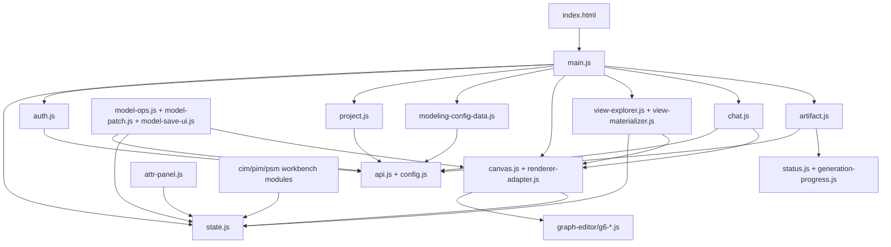
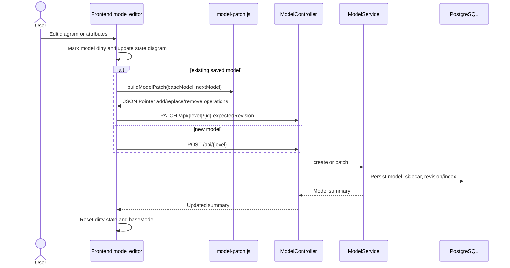
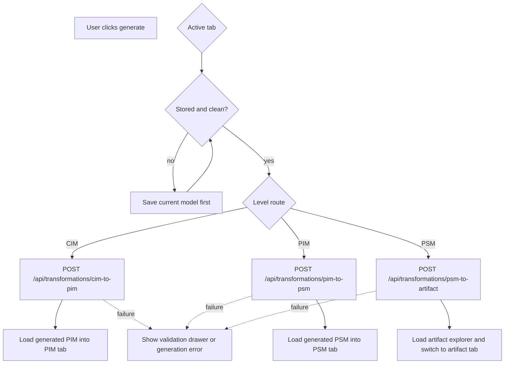
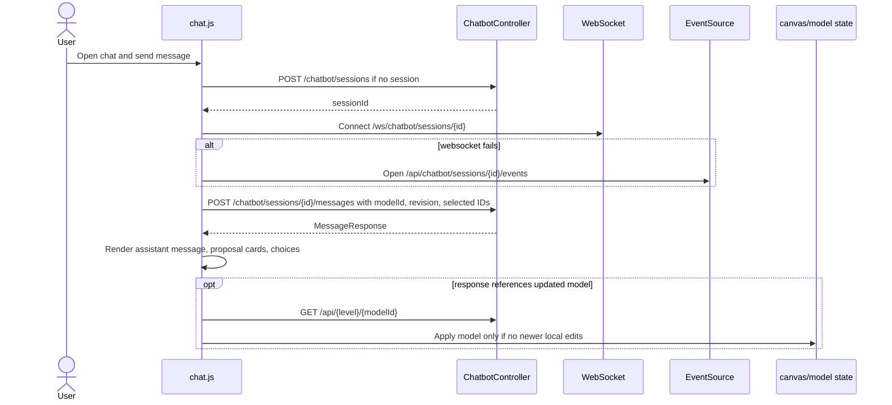
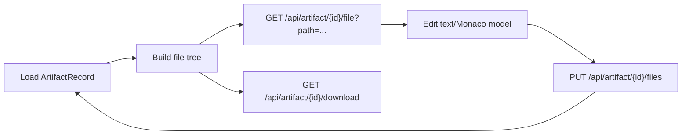

# Frontend Architecture and Flows

## Browser Module Architecture

```mermaid
flowchart TB
    html["index.html"]
    main["main.js"]
    state["state.js"]
    api["api.js + config.js"]
    auth["auth.js"]
    project["project.js"]
    modelOps["model-ops.js + model-patch.js + model-save-ui.js"]
    configData["modeling-config-data.js"]
    canvas["canvas.js + renderer-adapter.js"]
    g6["graph-editor/g6-*.js"]
    views["view-explorer.js + view-materializer.js"]
    attrs["attr-panel.js"]
    workbenches["cim/pim/psm workbench modules"]
    chat["chat.js"]
    artifact["artifact.js"]
    status["status.js + generation-progress.js"]

    html --> main
    main --> state
    main --> auth
    main --> project
    main --> configData
    main --> canvas
    canvas --> g6
    main --> views
    main --> chat
    main --> artifact
    auth --> api
    project --> api
    modelOps --> api
    configData --> api
    chat --> api
    artifact --> api
    canvas --> state
    attrs --> state
    views --> state
    workbenches --> state
    modelOps --> state
    modelOps --> canvas
    views --> canvas
    chat --> canvas
    artifact --> status
```

## Save and Patch Flow

```mermaid
sequenceDiagram
    actor User
    participant UI as Frontend model editor
    participant Patch as model-patch.js
    participant API as ModelController
    participant M as ModelService
    participant DB as PostgreSQL

    User->>UI: Edit diagram or attributes
    UI->>UI: Mark model dirty and update state.diagram
    alt existing saved model
        UI->>Patch: buildModelPatch(baseModel, nextModel)
        Patch-->>UI: JSON Pointer add/replace/remove operations
        UI->>API: PATCH /api/{level}/{id} expectedRevision
    else new model
        UI->>API: POST /api/{level}
    end
    API->>M: create or patch
    M->>DB: Persist model, sidecar, revision/index
    M-->>API: Model summary
    API-->>UI: Updated summary
    UI->>UI: Reset dirty state and baseModel
```

## Generation Button Flow

```mermaid
flowchart TD
    click["User clicks generate"]
    active{"Active tab"}
    save{"Stored and clean?"}
    saveModel["Save current model first"]
    cim["POST /api/transformations/cim-to-pim"]
    pim["POST /api/transformations/pim-to-psm"]
    psm["POST /api/transformations/psm-to-artifact"]
    loadPim["Load generated PIM into PIM tab"]
    loadPsm["Load generated PSM into PSM tab"]
    loadArtifact["Load artifact explorer and switch to artifact tab"]
    errors["Show validation drawer or generation error"]

    click --> active
    active --> save
    save -- no --> saveModel --> save
    save -- yes --> route{"Level route"}
    route -- CIM --> cim --> loadPim
    route -- PIM --> pim --> loadPsm
    route -- PSM --> psm --> loadArtifact
    cim -. failure .-> errors
    pim -. failure .-> errors
    psm -. failure .-> errors
```

## Chat Flow in the Browser

```mermaid
sequenceDiagram
    actor User
    participant UI as chat.js
    participant API as ChatbotController
    participant WS as WebSocket
    participant SSE as EventSource
    participant Canvas as canvas/model state

    User->>UI: Open chat and send message
    UI->>API: POST /chatbot/sessions if no session
    API-->>UI: sessionId
    UI->>WS: Connect /ws/chatbot/sessions/{id}
    alt websocket fails
        UI->>SSE: Open /api/chatbot/sessions/{id}/events
    end
    UI->>API: POST /chatbot/sessions/{id}/messages with modelId, revision, selected IDs
    API-->>UI: MessageResponse
    UI->>UI: Render assistant message, proposal cards, choices
    opt response references updated model
        UI->>API: GET /api/{level}/{modelId}
        UI->>Canvas: Apply model only if no newer local edits
    end
```

## Artifact Explorer Flow

```mermaid
flowchart LR
    load["Load ArtifactRecord"]
    tree["Build file tree"]
    open["GET /api/artifact/{id}/file?path=..."]
    edit["Edit text/Monaco model"]
    save["PUT /api/artifact/{id}/files"]
    download["GET /api/artifact/{id}/download"]

    load --> tree
    tree --> open --> edit --> save --> load
    tree --> download
```
