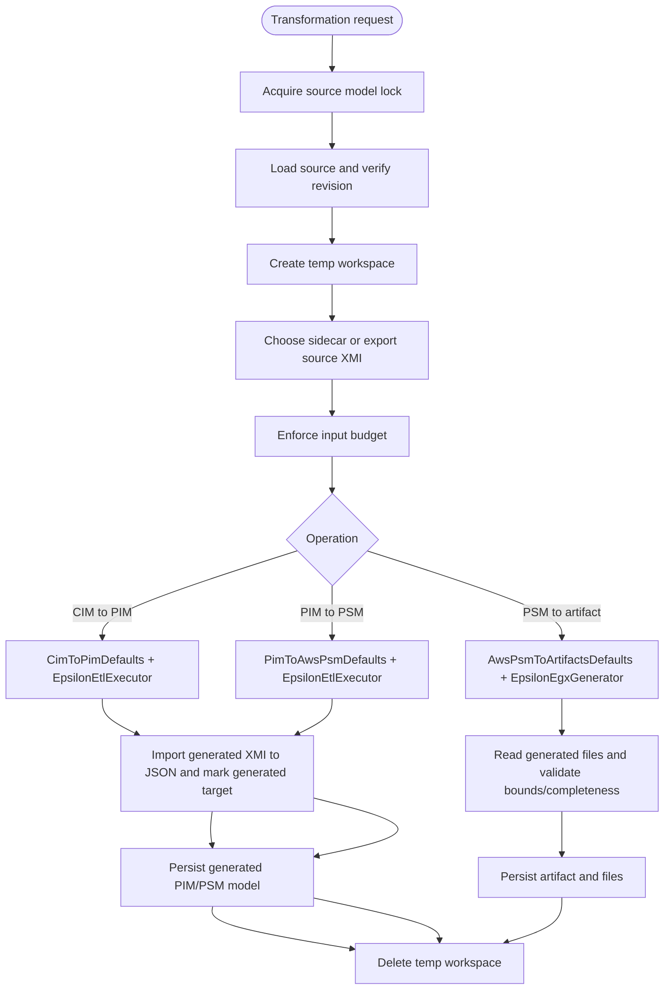
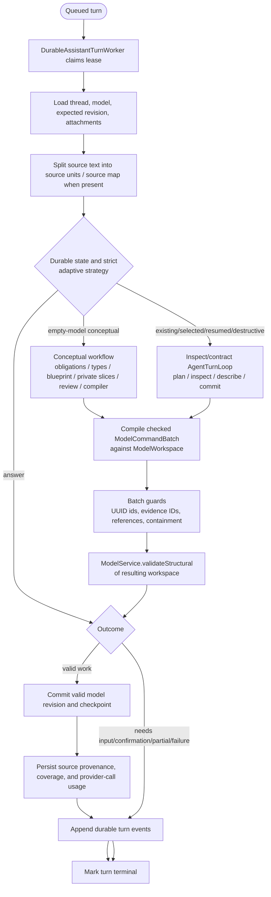
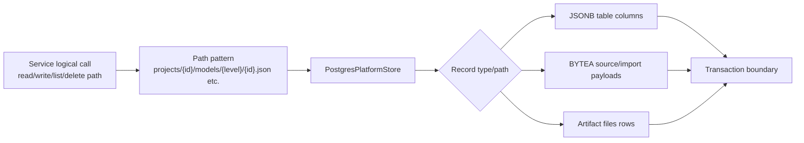

# Major Function and Algorithm Flows

## `ModelService.create`, `update`, and `patch`

## `ModelService.validate`

## `TransformationService.cimToPim`, `pimToPsm`, `psmToArtifact`

## `StoredViewLayoutService.layout`

## Assistant Durable Turn Processing

Both mutation branches use the same provider adapter, workspace, structural gate, revision commit,
checkpoint, provenance, audit, and event lifecycle. Routing never uses request keyword matching.

## `AssistantHardeningService.providerCall`

## `PostgresPlatformStore` Port Pattern

