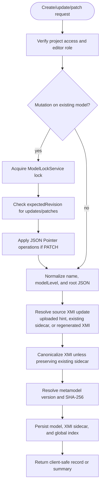
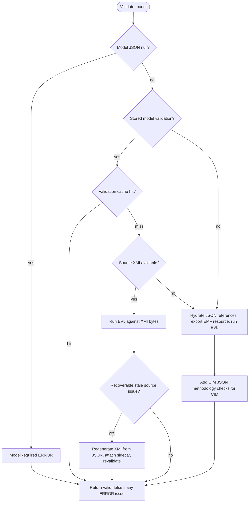
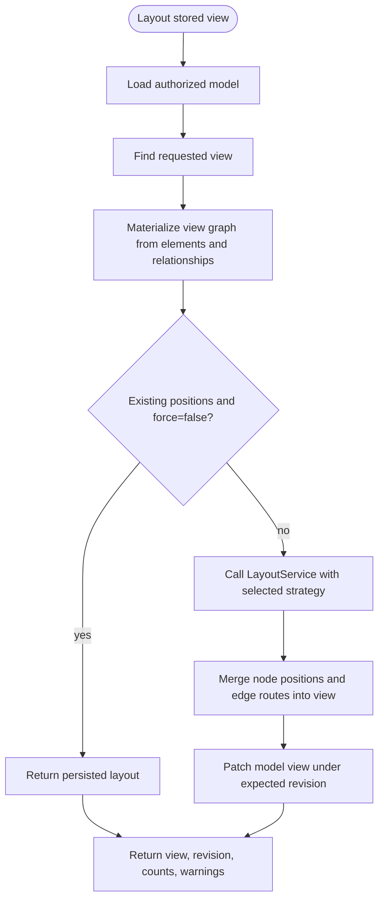
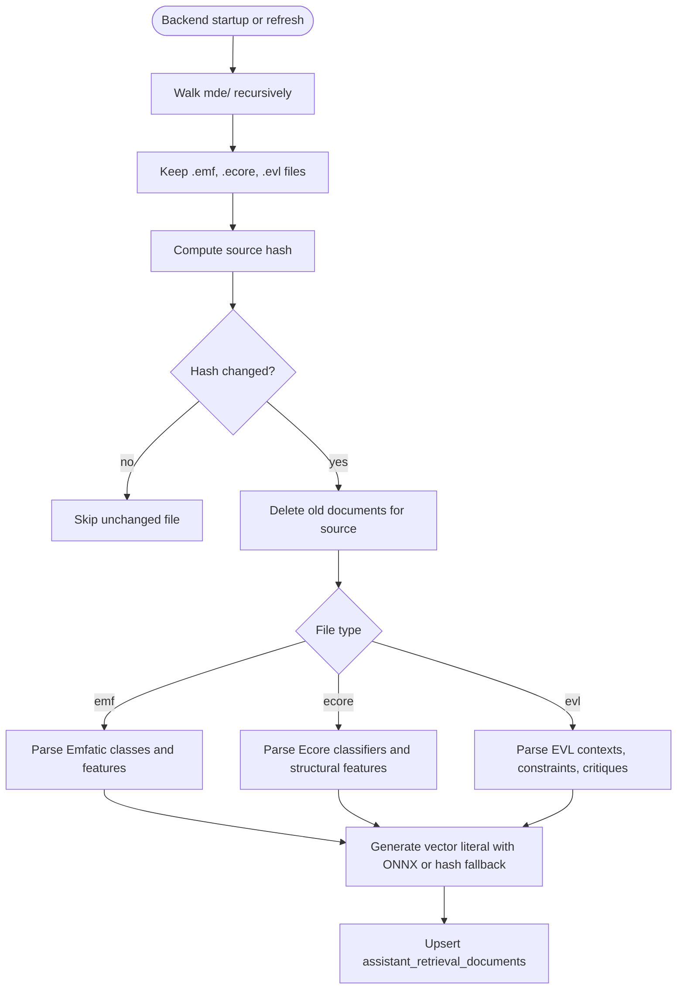
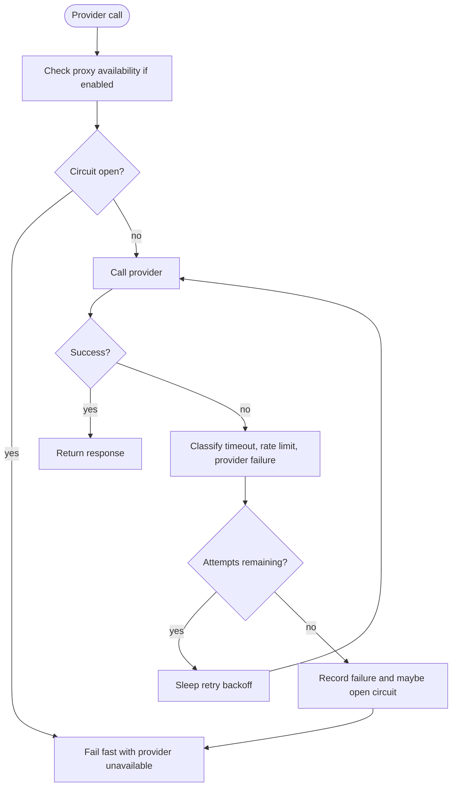
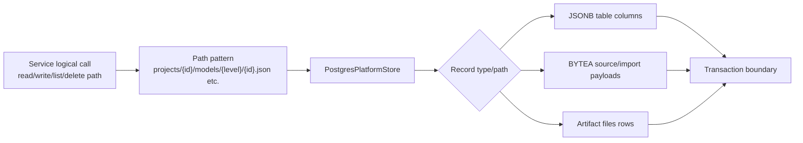

# Major Function and Algorithm Flows

## `ModelService.create`, `update`, and `patch`

## `ModelService.validate`

## `TransformationService.cimToPim`, `pimToPsm`, `psmToArtifact`

## `StoredViewLayoutService.layout`

## `AssistantCatalogService.refresh`

## `AssistantHardeningService.providerCall`

## `PostgresPlatformStore` Port Pattern

