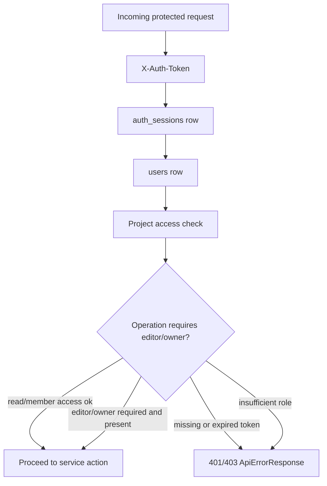
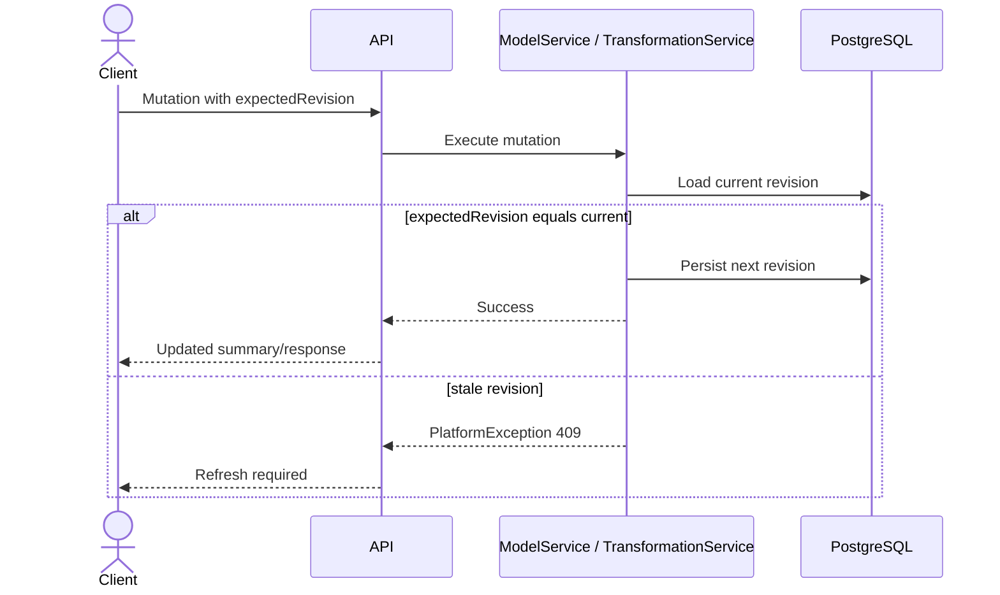
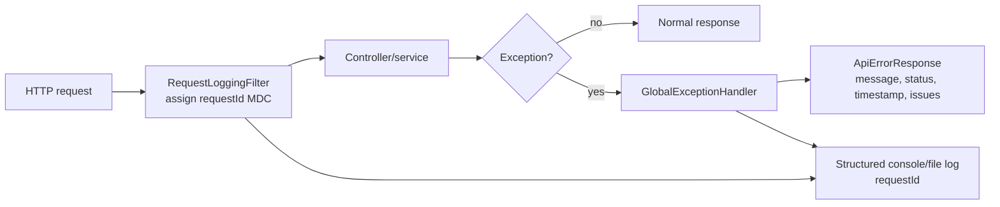
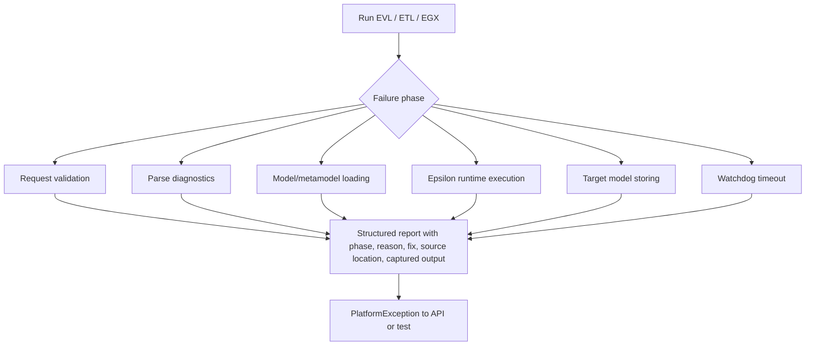
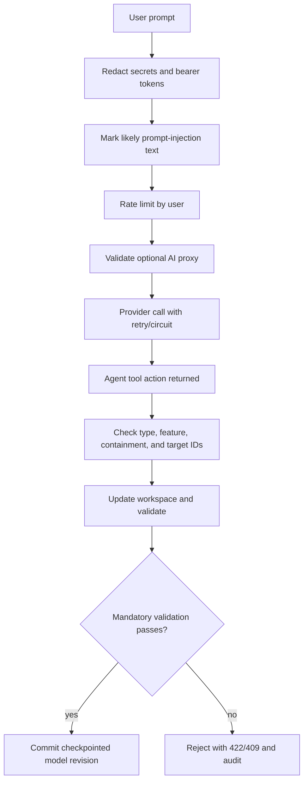
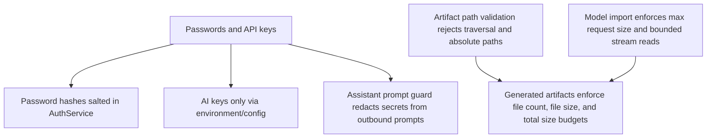
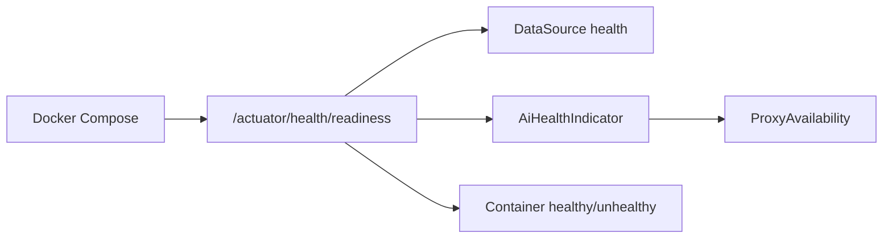
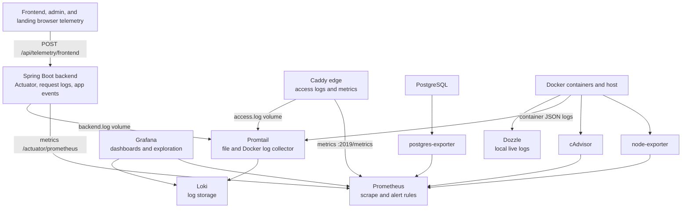

# Security, Observability, and Failure Flows

## Authentication and Authorization Boundary

## Optimistic Concurrency

## Request Logging and Error Response

## MDE Failure Handling

## Assistant Failure and Guardrails

## Data Protection Hotspots

## Runtime Health

## Observability Pipeline

