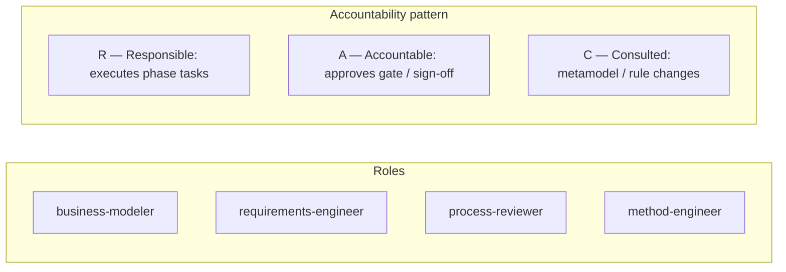
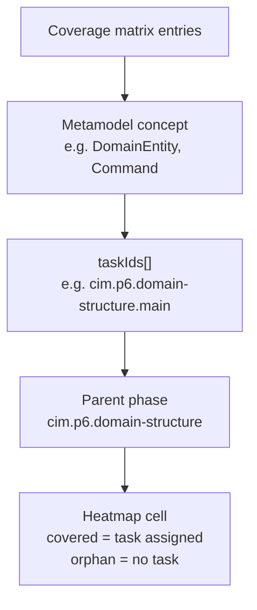
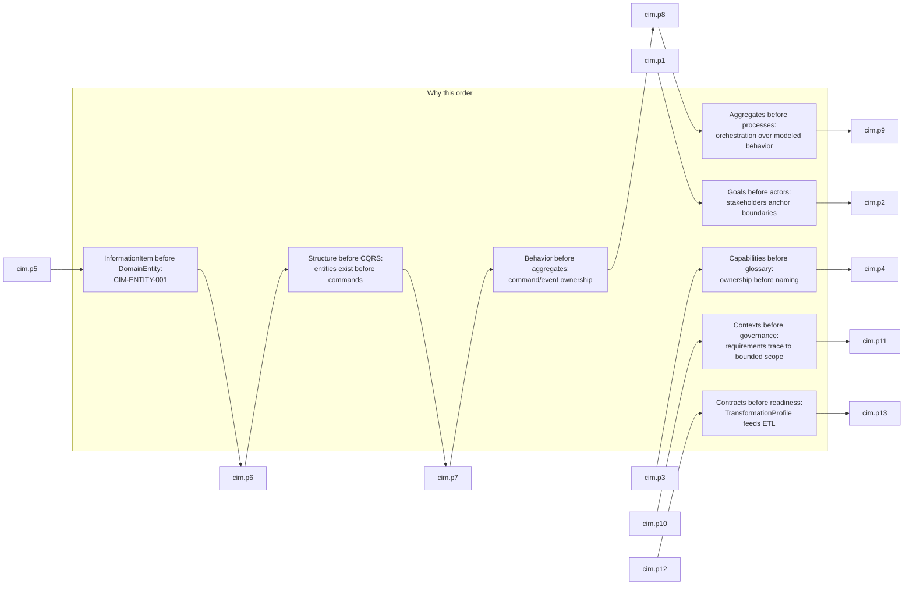

# CIM Modeling Methodology

Guided CIM modeling follows process `modless.cim.modeling` (`mde/methodology/process-definitions/cim.json`). Fourteen phases (`cim.p0`–`cim.p13`) move from model context through domain behavior to traceability and the CIM EVL gate (`cim.m1.evl-gate`).

## Phase Flow

Phases execute in dependency order: each phase's entry criteria reference the prior phase's exit criteria. Viewpoints shift from dashboard and requirements through domain and event-storming views to governance and traceability.

```mermaid
flowchart TB
    p0["cim.p0.model-context<br/>Model Context · dashboard · 30m"]
    p1["cim.p1.strategic-intent<br/>Strategic Intent · requirements · 1-2h"]
    p2["cim.p2.actors-boundaries<br/>Actors & Boundaries · actor · 1h"]
    p3["cim.p3.capability-landscape<br/>Capability Landscape · capability · 1-2h"]
    p4["cim.p4.ubiquitous-language<br/>Ubiquitous Language · capability · 1h"]
    p5["cim.p5.information-taxonomy<br/>Information Taxonomy · domain · 1-2h"]
    p6["cim.p6.domain-structure<br/>Domain Structure · domain · 2-4h"]
    p7["cim.p7.behavior-surface<br/>Behavior Surface · eventstorming · 2-4h"]
    p8["cim.p8.aggregate-boundaries<br/>Aggregate Boundaries · aggregate · 1-2h"]
    p9["cim.p9.process-decisions<br/>Process & Decisions · process · 2-3h"]
    p10["cim.p10.bounded-context-synthesis<br/>Bounded Context Synthesis · capability · 1-2h"]
    p11["cim.p11.requirements-governance<br/>Requirements & Governance · governance · 2-3h"]
    p12["cim.p12.transformation-contracts<br/>Transformation Contracts · traceability · 1h"]
    p13["cim.p13.traceability-readiness<br/>Traceability & Readiness · traceability · 1-2h"]
    gate["cim.m1.evl-gate<br/>CIM EVL validation gate"]

    p0 --> p1 --> p2 --> p3 --> p4 --> p5 --> p6 --> p7 --> p8 --> p9 --> p10 --> p11 --> p12 --> p13 --> gate
```

## RACI by Phase

Roles are defined in the CIM process definition. **Business Modeler** owns intent, domain, behavior, and transformation contracts. **Requirements Engineer** owns governance artifacts in `cim.p11`. **Process Reviewer** signs off readiness and EVL in `cim.p13`. **Method Engineer** maintains the methodology when metamodels change (consulted across all phases).

| Phase ID                      | Phase                     | R                     | A                | C                                       | I                |
| ----------------------------- | ------------------------- | --------------------- | ---------------- | --------------------------------------- | ---------------- |
| `cim.p0`–`cim.p10`, `cim.p12` | Modeling phases 0–10, 12  | Business Modeler      | Business Modeler | Method Engineer                         | Process Reviewer |
| `cim.p11`                     | Requirements & Governance | Requirements Engineer | Business Modeler | Method Engineer                         | Process Reviewer |
| `cim.p13`                     | Traceability & Readiness  | Process Reviewer      | Process Reviewer | Business Modeler, Requirements Engineer | Method Engineer  |
| `cim.m1`                      | CIM EVL gate              | Process Reviewer      | Process Reviewer | Method Engineer                         | Business Modeler |

## Coverage Heatmap Concept

The coverage matrix (`mde/methodology/coverage-matrix/cim-coverage.json`) maps every CIM metamodel concept to one or more task IDs. A heatmap visualizes **phase × concept** coverage: rows are phases (`cim.p0`–`cim.p13`), columns are EClasses and EEnums, and cell intensity reflects assignment count from `taskIds`.

For CIM, all 122 concepts are covered (`coveredConcepts: 122`, `orphanedConcepts: []`). Orphaned concepts would appear as empty columns and block methodology validation via `validate-coverage.mjs`.

Example mappings:

| Concept                             | Phase                              | Task ID                                 |
| ----------------------------------- | ---------------------------------- | --------------------------------------- |
| `CIMModel`                          | `cim.p0.model-context`             | `cim.p0.model-context.main`             |
| `BusinessGoal`, `KPI`               | `cim.p1.strategic-intent`          | `cim.p1.strategic-intent.main`          |
| `InformationItem`                   | `cim.p5.information-taxonomy`      | `cim.p5.information-taxonomy.main`      |
| `Command`, `Query`, `BusinessEvent` | `cim.p7.behavior-surface`          | `cim.p7.behavior-surface.main`          |
| `TransformationProfile`             | `cim.p12.transformation-contracts` | `cim.p12.transformation-contracts.main` |
| `ProductionReadinessAssessment`     | `cim.p13.traceability-readiness`   | `cim.p13.traceability-readiness.main`   |

Shared kernel types (`ModelElement`, `TraceLink`, etc.) are attributed to model-context or readiness phases via `phase-mappings.mjs` so cross-cutting elements still appear on the heatmap.

## Dependency Rationale

Phase ordering encodes domain-driven design and transformation readiness—not arbitrary sequencing.

Key validation hooks:

- **`cim.p1`**: `CIM-GOAL-001`, `CIM-KPI-001` — measurable intent before structural modeling.
- **`cim.p5`–`cim.p6`**: `CIM-ENTITY-001` — information taxonomy precedes entities.
- **`cim.p6`**: `CIM-RELATIONSHIP-001` — relationship integrity on domain structure.
- **`cim.p13`**: `cim-semantic-validation` — full semantic EVL before CIM→PIM transform.

Exit from `cim.p13` (`CIM EVL passes; readiness gate approved`) is the handoff to `e2e.p2.cim-to-pim` in the end-to-end process.
