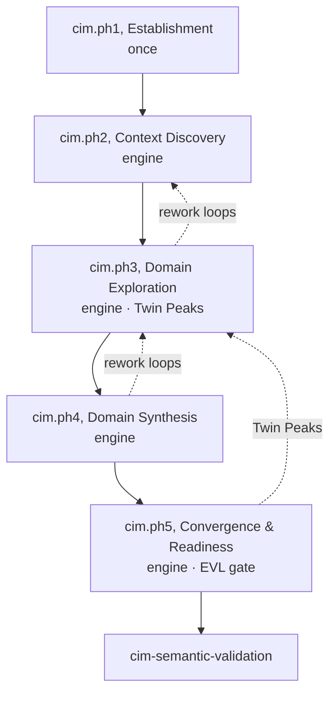
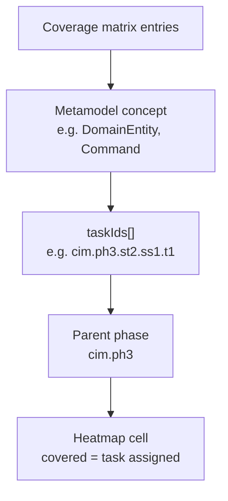

# CIM Modeling Process

Guided CIM modeling follows process `modriss.cim.modeling` (`mde/process/process-definitions/cim.json`). **Five sequential SPEM phases** each contain **stages** (with optional sub-stages) and **atomic tasks** (`cim.ph1`–`cim.ph5`). The **process engine** revolves through in-engine phases per capability slice; **Establishment** runs once before the first cycle.

## Phase Flow

## RACI by Phase

| Phase ID  | Name                    | Responsible          | Accountable      |
| --------- | ----------------------- | -------------------- | ---------------- |
| `cim.ph1` | Establishment           | Business Modeler     | Business Modeler |
| `cim.ph2` | Context Discovery       | Business Modeler     | Business Modeler |
| `cim.ph3` | Domain Exploration      | Business Modeler     | Business Modeler |
| `cim.ph4` | Domain Synthesis        | Business Modeler     | Business Modeler |
| `cim.ph5` | Convergence & Readiness | Req. Eng. / Reviewer | Process Reviewer |

## Coverage Heatmap Concept

The coverage matrix (`mde/process/coverage-matrix/cim-coverage.json`) maps every CIM metamodel concept to one or more **task IDs** (e.g. `cim.ph3.st1.ss1.t1`). Rows group by phase; columns are EClasses and EEnums.

All **122** CIM concepts are covered (`orphanedConcepts: []`). Assignments come from `concept-assignment.mjs` and SPEM task specs in `tools/lib/spem-cim.mjs`.

| Concept                             | Phase     | Example task ID      |
| ----------------------------------- | --------- | -------------------- |
| `CIMModel`                          | `cim.ph1` | `cim.ph1.st1.t1`     |
| `BusinessGoal`, `KPI`               | `cim.ph1` | `cim.ph1.st2.t1`     |
| `InformationItem`                   | `cim.ph3` | `cim.ph3.st1.ss2.t1` |
| `Command`, `Query`, `BusinessEvent` | `cim.ph3` | `cim.ph3.st3.ss1.t1` |
| `TransformationProfile`             | `cim.ph5` | `cim.ph5.st2.t1`     |
| `ProductionReadinessAssessment`     | `cim.ph5` | `cim.ph5.st3.t1`     |

## Dependency Rationale

- **Goals before actors**, strategic intent anchors participation boundaries.
- **Capabilities before glossary**, ownership before ubiquitous language (DDD).
- **InformationItem before DomainEntity**, `CIM-ENTITY-001`.
- **Structure before CQRS**, entities exist before commands/events.
- **Behavior before aggregates**, command/event ownership drives boundaries.
- **Twin Peaks in convergence**, requirements backfill after domain structure (`cim.ph5`).

Exit from `cim.ph5` with `cim-semantic-validation` passes is the handoff to `e2e.p2.cim-to-pim`.
