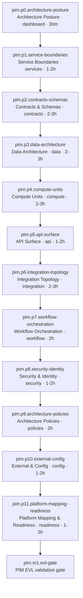
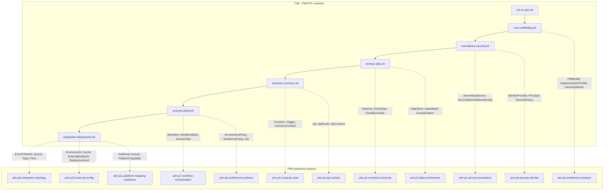
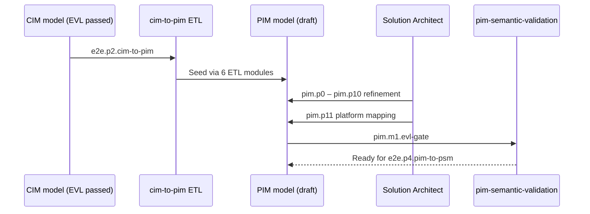

# PIM Modeling Methodology

Platform-independent modeling follows process `modless.pim.modeling` (`mde/methodology/process-definitions/pim.json`). Twelve phases (`pim.p0`–`pim.p11`) refine a PIM produced by CIM→PIM ETL or created greenfield. The PIM EVL gate (`pim.m1.evl-gate`) closes at `pim.p11.platform-mapping-readiness`.

## Phase Flow

Entry to `pim.p0` requires CIM transform completion or a greenfield PIM. Phases progress from architecture posture through services, contracts, data, compute, integration, security, and policies to platform mapping readiness.

Primary role throughout modeling is **solution-architect**; **process-reviewer** leads `pim.p11` and EVL sign-off.

## CIM→PIM ETL Module Alignment

After CIM EVL, `e2e.p2.cim-to-pim` runs transformation `cim-to-pim` (`mde/transformations/cim-to-pim/`). ETL modules seed PIM elements that refinement phases then extend and validate. The diagram below shows how each ETL module maps to the PIM phases where architects continue work.

### ETL module responsibilities

| ETL module                   | Primary PIM phases             | Work products seeded                                                           |
| ---------------------------- | ------------------------------ | ------------------------------------------------------------------------------ |
| `root-scaffolding.etl`       | `pim.p0`                       | `PIMModel`, `ImplementationProfile`, environments, trace/readiness scaffolding |
| `boundaries-security.etl`    | `pim.p1`, `pim.p8`             | `ServerlessService`, memberships, identity and security baseline               |
| `domain-data.etl`            | `pim.p2`, `pim.p3`             | Schemas, event contracts, data stores, models, protection policies             |
| `behavior-contracts.etl`     | `pim.p4`, `pim.p5`             | Functions, triggers, APIs, routes mapped from CIM CQRS surface                 |
| `process-policy.etl`         | `pim.p7`, `pim.p9`             | Workflows, decision models, resilience and observability policies              |
| `integration-deployment.etl` | `pim.p6`, `pim.p10`, `pim.p11` | Flows, triggers, deployment units, config, readiness closure                   |

Shared EOL libraries (`lib/mapping.eol`, `lib/pim-builders.eol`, `lib/trace-readiness.eol`) support deterministic naming and trace links across modules—refinement in `pim.p11` validates `PlatformMappingAssessment` and `pim-semantic-validation` before PIM→PSM transform.

## Refinement vs. Transform

Architects treat ETL output as a starting point: service boundaries may split merged contexts, policies may be tightened, and platform mapping in `pim.p11` confirms AWS capability fit before transformation to PSM.
