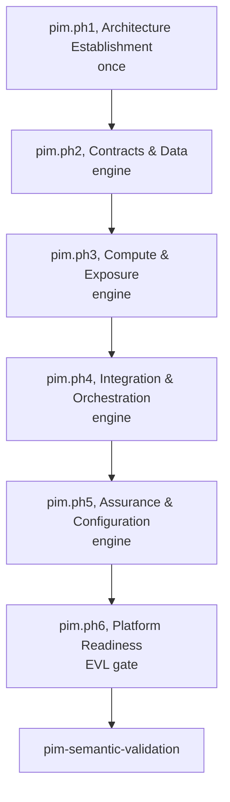
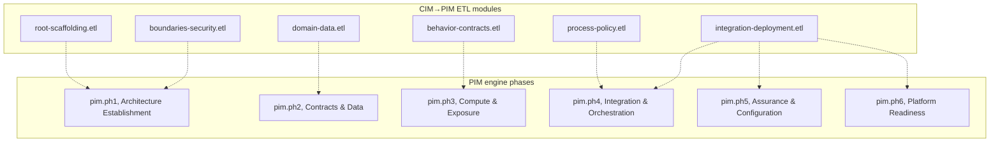
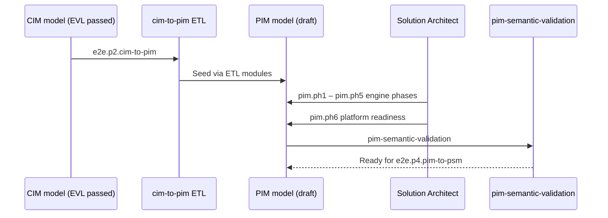

# PIM Modeling Process

Platform-independent modeling follows `modriss.pim.modeling` (`mde/process/process-definitions/pim.json`). **Six SPEM phases** (`pim.ph1`–`pim.ph6`) with nested stages and **29 atomic tasks**. **Architecture Establishment** runs once; engine phases repeat per service slice.

## Phase Flow

Primary role: **solution-architect**; **process-reviewer** owns `pim.ph6` readiness gate.

## CIM→PIM ETL Module Alignment

After CIM EVL, `e2e.p2.cim-to-pim` runs `cim-to-pim` ETL. ETL modules seed PIM elements refined in engine phases:

| ETL module                   | Primary PIM phases   | Work products seeded                       |
| ---------------------------- | -------------------- | ------------------------------------------ |
| `root-scaffolding.etl`       | `pim.ph1`            | `PIMModel`, `ImplementationProfile`, trace |
| `boundaries-security.etl`    | `pim.ph1`, `pim.ph5` | Services, identity, security baseline      |
| `domain-data.etl`            | `pim.ph2`            | Schemas, events, data stores               |
| `behavior-contracts.etl`     | `pim.ph3`            | Functions, APIs, contracts                 |
| `process-policy.etl`         | `pim.ph4`, `pim.ph5` | Workflows, policies, observability         |
| `integration-deployment.etl` | `pim.ph4`–`pim.ph6`  | Flows, config, readiness closure           |

## Refinement vs. Transform

All **179** PIM concepts map to tasks via `spem-pim.mjs` and `concept-assignment.mjs`.
