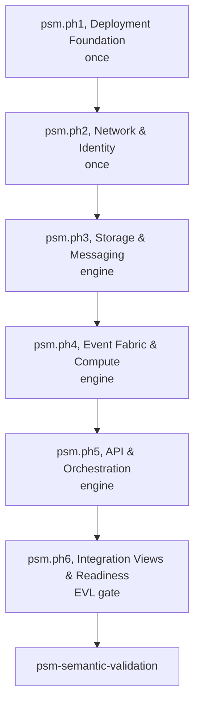
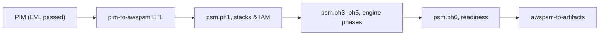

# AWS PSM Modeling Methodology

AWS PSM modeling follows `varka.psm.modeling` (`mde/methodology/process-definitions/psm.json`). **Six SPEM phases** (`psm.ph1`–`psm.ph6`) with **25 atomic tasks**. **Deployment Foundation** and **Network & Identity** run once; data/compute/orchestration phases repeat in the engine cycle.

## Phase Flow

Primary role: **cloud-platform-engineer**; **process-reviewer** signs off `psm.ph6`.

## PIM→PSM ETL Alignment

After PIM EVL, `e2e.p4.pim-to-psm` materializes draft AWS resources. Refinement follows SPEM task order within each phase, not a separate ad-hoc checklist.

| Concept / artifact           | Phase     | Example task ID  |
| ---------------------------- | --------- | ---------------- |
| `AwsPsmModel`                | `psm.ph1` | `psm.ph1.st1.t1` |
| `SamStack`, `IamRole`        | `psm.ph1` | `psm.ph1.st2.t1` |
| `Vpc`, `CognitoUserPool`     | `psm.ph2` | `psm.ph2.st1.t1` |
| `DynamoDbTable`, `SqsQueue`  | `psm.ph3` | `psm.ph3.st1.t1` |
| `LambdaFunction`             | `psm.ph4` | `psm.ph4.st1.t1` |
| `ApiGateway`, `StateMachine` | `psm.ph5` | `psm.ph5.st1.t1` |

All **297** PSM concepts map to tasks via `spem-psm.mjs`.
