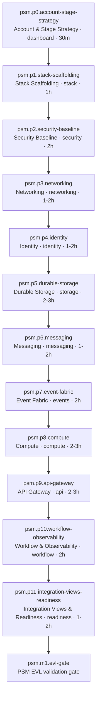
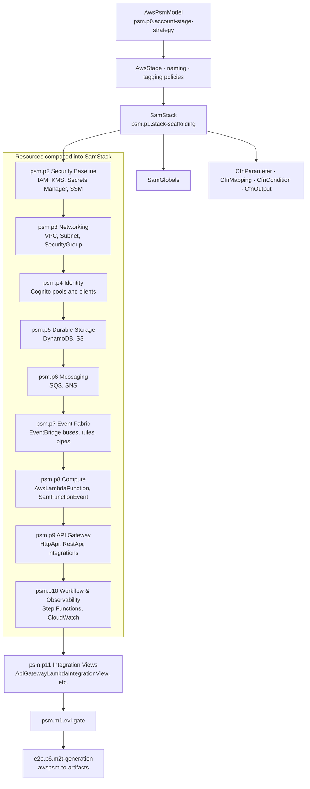
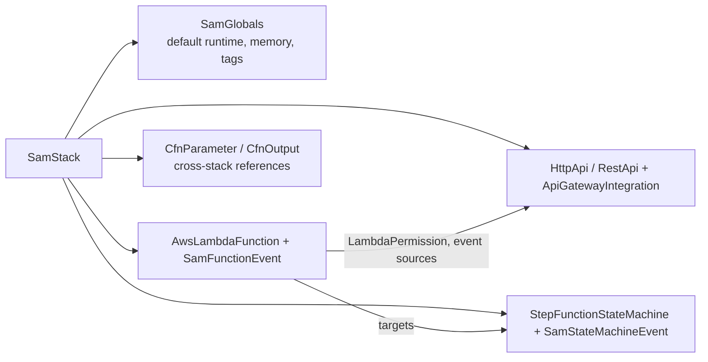

# PSM (AWS) Modeling Methodology

AWS platform-specific modeling follows process `modless.psm.modeling` (`mde/methodology/process-definitions/psm.json`). Eleven phases (`psm.p0`–`psm.p11`) refine an AWS PSM from PIM→PSM ETL or greenfield. The PSM EVL gate (`psm.m1.evl-gate`) must pass before M2T artifact generation.

## Phase Flow

Phases build infrastructure in layers: account strategy and stack scaffolding first, then security and networking foundations, followed by data, messaging, events, compute, API, workflow/observability, and integration views.

Primary role is **cloud-platform-engineer**; **process-reviewer** owns `psm.p11` and EVL approval.

## SamStack Hub

`SamStack` (`psm.p1.stack-scaffolding`) is the structural hub of the AWS PSM. All deployable resources are composed under one or more SAM stacks with shared globals, CloudFormation parameters, and outputs. Later phases attach resources to this hub rather than creating free-floating CFN fragments.

### SamStack composition detail

Key work products in `psm.p1.stack-scaffolding`:

| Element        | Role in hub                                             |
| -------------- | ------------------------------------------------------- |
| `SamStack`     | Root CloudFormation/SAM template container              |
| `SamGlobals`   | Shared defaults for functions, APIs, and state machines |
| `CfnParameter` | Environment-specific inputs (stage, capacity)           |
| `CfnMapping`   | Region/account conditional lookups                      |
| `CfnCondition` | Feature flags and environment branching                 |
| `CfnOutput`    | Exported ARNs and URLs for integration views            |

## PIM Trace-Through

Each PSM phase exit criteria reference PIM alignment (e.g. `psm.p5` — durable stores match PIM data model; `psm.p8` — compute matches PIM functions). Integration relationship views in `psm.p11` (`ApiGatewayLambdaIntegrationView`, `SqsLambdaEventSourceView`, etc.) document wiring inside the SamStack before `psm-semantic-validation` and M2T generation.
