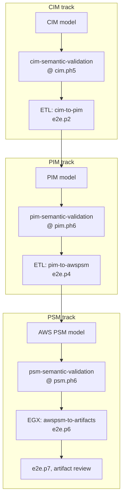

# End-to-End Modeling Methodology

The full MDE lifecycle is `modriss.end-to-end.modeling` (`mde/methodology/process-definitions/end-to-end.json`). It has five SPEM phases: initiation/tailoring, iterative-incremental model-driven delivery, release/transition, operations/evolution, and retirement/closure. The delivery phase (`e2e.ph1`) contains **eight engine stages** that orchestrate child process engines, ETL transforms, artifact readiness, and cross-level rework loops.

## Pipeline Overview

```mermaid
flowchart LR
    p0["e2e.p0.increment-planning"]
    p1["e2e.p1.cim-modeling<br/>modriss.cim.modeling · 5 phases"]
    evl1["CIM gate evidence<br/>increment record"]
    p2["e2e.p2.cim-to-pim"]
    p3["e2e.p3.pim-refinement<br/>modriss.pim.modeling · 6 phases"]
    evl2["PIM gate evidence<br/>increment record"]
    p4["e2e.p4.pim-to-psm"]
    p5["e2e.p5.psm-refinement<br/>modriss.psm.modeling · 6 phases"]
    evl3["PSM gate evidence<br/>increment record"]
    p6["e2e.p6.m2t-generation"]
    p7["e2e.p7.artifact-completion<br/>e2e.m1.increment-accepted"]

    p0 --> p1 --> evl1 --> p2 --> p3 --> evl2 --> p4 --> p5 --> evl3 --> p6 --> p7
```

The vertical **process engine** loops: frame → run child engines → transform → artifact readiness → accept/rework → ↻ while the next increment or release scope remains. Release, operations, and retirement are lifecycle phases around this engine.

## Roles Across the Pipeline

| Role                      | Stages / child process                   | Responsibility                  |
| ------------------------- | ---------------------------------------- | ------------------------------- |
| `business-modeler`        | `e2e.p1` → `cim.ph1`–`cim.ph5`           | CIM modeling                    |
| `requirements-engineer`   | within CIM `cim.ph5`                     | Twin Peaks requirements         |
| `solution-architect`      | `e2e.p2`, `e2e.p3` → `pim.ph1`–`pim.ph6` | CIM→PIM, PIM refinement         |
| `cloud-platform-engineer` | `e2e.p4`–`e2e.p6` → `psm.ph1`–`psm.ph6`  | PIM→PSM, PSM, M2T               |
| `process-reviewer`        | EVL gates, `e2e.p7`                      | Readiness and artifact sign-off |

## EVL and ETL Gates

### Gate semantics

| Milestone                   | Stage / phase           | Gate / action                     | On failure                             |
| --------------------------- | ----------------------- | --------------------------------- | -------------------------------------- |
| `e2e.m0.method-tailored`    | lifecycle initiation    | Method profile and ownership      | Re-tailor and re-plan                  |
| :                           | `e2e.p1.cim-modeling`   | CIM gate evidence                 | Rework in CIM (`cim.ph5`)              |
| :                           | `e2e.p2.cim-to-pim`     | ETL (no EVL)                      | Fix CIM or profile; re-run             |
| :                           | `e2e.p3.pim-refinement` | PIM gate evidence                 | Rework in PIM (`pim.ph6`)              |
| :                           | `e2e.p4.pim-to-psm`     | ETL (no EVL)                      | Fix PIM; re-run                        |
| :                           | `e2e.p5.psm-refinement` | PSM gate evidence                 | Rework in PSM (`psm.ph6`)              |
| `e2e.m1.increment-accepted` | `e2e.p7`                | Artifact readiness and acceptance | Fix source model; regenerate artifacts |

## Sequence: Full Lifecycle

## Child Process Reference

| E2E stage ID                 | Child / transform      | SPEM phases             |
| ---------------------------- | ---------------------- | ----------------------- |
| `e2e.p1.cim-modeling`        | `modriss.cim.modeling` | 5 (`cim.ph1`–`cim.ph5`) |
| `e2e.p2.cim-to-pim`          | `cim-to-pim` ETL       | :                       |
| `e2e.p3.pim-refinement`      | `modriss.pim.modeling` | 6 (`pim.ph1`–`pim.ph6`) |
| `e2e.p4.pim-to-psm`          | `pim-to-awspsm` ETL    | :                       |
| `e2e.p5.psm-refinement`      | `modriss.psm.modeling` | 6 (`psm.ph1`–`psm.ph6`) |
| `e2e.p6.m2t-generation`      | `awspsm-to-artifacts`  | :                       |
| `e2e.p7.artifact-completion` | Manual review          | :                       |

See [24-cim-methodology.md](24-cim-methodology.md), [25-pim-methodology.md](25-pim-methodology.md), and [26-psm-methodology.md](26-psm-methodology.md).
