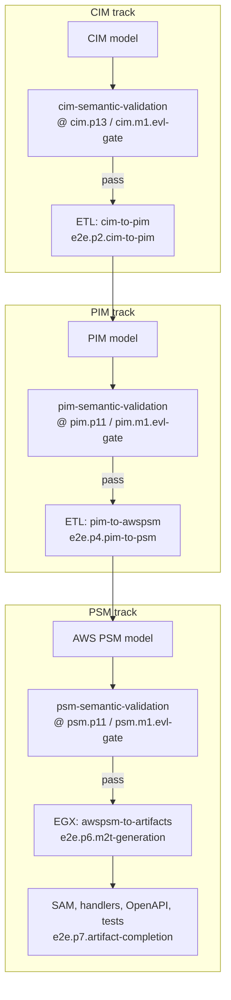
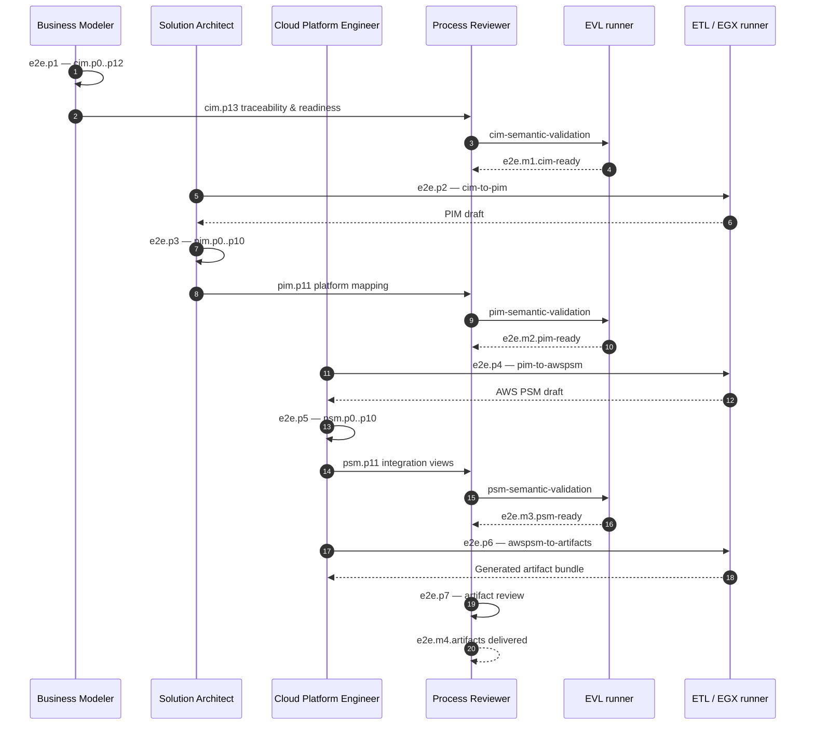

# End-to-End Modeling Methodology

The full MDE lifecycle is defined in `modless.end-to-end.modeling` (`mde/methodology/process-definitions/end-to-end.json`). Seven top-level phases (`e2e.p1`–`e2e.p7`) orchestrate child modeling processes, ETL transforms, EVL validation gates, and M2T artifact generation.

## Pipeline Overview

```mermaid
flowchart LR
    p1["e2e.p1.cim-modeling<br/>modless.cim.modeling<br/>14 phases"]
    evl1["cim-semantic-validation<br/>e2e.m1.cim-ready"]
    p2["e2e.p2.cim-to-pim<br/>transform: cim-to-pim"]
    p3["e2e.p3.pim-refinement<br/>modless.pim.modeling<br/>12 phases"]
    evl2["pim-semantic-validation<br/>e2e.m2.pim-ready"]
    p4["e2e.p4.pim-to-psm<br/>transform: pim-to-awspsm"]
    p5["e2e.p5.psm-refinement<br/>modless.psm.modeling<br/>11 phases"]
    evl3["psm-semantic-validation<br/>e2e.m3.psm-ready"]
    p6["e2e.p6.m2t-generation<br/>transform: awspsm-to-artifacts"]
    p7["e2e.p7.artifact-completion<br/>e2e.m4.artifacts"]

    p1 --> evl1 --> p2 --> p3 --> evl2 --> p4 --> p5 --> evl3 --> p6 --> p7
```

Modeling phases embed child processes; transform phases run ETL/EGX without an inline EVL gate—the preceding refinement phase owns semantic validation.

## Roles Across the Pipeline

| Role                      | End-to-end phases   | Responsibility                         |
| ------------------------- | ------------------- | -------------------------------------- |
| `business-modeler`        | `e2e.p1`            | CIM phases `cim.p0`–`cim.p12`          |
| `requirements-engineer`   | (within `e2e.p1`)   | CIM phase `cim.p11`                    |
| `solution-architect`      | `e2e.p2`, `e2e.p3`  | CIM→PIM transform and PIM refinement   |
| `cloud-platform-engineer` | `e2e.p4`–`e2e.p6`   | PIM→PSM transform, PSM refinement, M2T |
| `process-reviewer`        | EVL gates, `e2e.p7` | Readiness sign-off and artifact review |

## EVL and ETL Gates

EVL (Eclipse Validation Language) gates block progression when semantic rules fail. ETL gates materialize the next metamodel level. They alternate: model → validate → transform → refine → validate.

### Gate semantics

| Milestone          | Phase                        | Gate / action             | On failure                               |
| ------------------ | ---------------------------- | ------------------------- | ---------------------------------------- |
| `e2e.m1.cim-ready` | `e2e.p1.cim-modeling`        | `cim-semantic-validation` | Remain in CIM refinement (`cim.p13`)     |
| —                  | `e2e.p2.cim-to-pim`          | ETL transform (no EVL)    | Fix CIM or transform profile; re-run ETL |
| `e2e.m2.pim-ready` | `e2e.p3.pim-refinement`      | `pim-semantic-validation` | Remain in PIM refinement (`pim.p11`)     |
| —                  | `e2e.p4.pim-to-psm`          | ETL transform (no EVL)    | Fix PIM or mapping; re-run ETL           |
| `e2e.m3.psm-ready` | `e2e.p5.psm-refinement`      | `psm-semantic-validation` | Remain in PSM refinement (`psm.p11`)     |
| `e2e.m4.artifacts` | `e2e.p7.artifact-completion` | Manual review             | Regenerate or fix PSM; re-run M2T        |

## Sequence: Full Lifecycle

## Child Process Reference

| E2E phase ID                 | Child / transform         | Phase count             |
| ---------------------------- | ------------------------- | ----------------------- |
| `e2e.p1.cim-modeling`        | `modless.cim.modeling`    | 14 (`cim.p0`–`cim.p13`) |
| `e2e.p2.cim-to-pim`          | `cim-to-pim` ETL          | —                       |
| `e2e.p3.pim-refinement`      | `modless.pim.modeling`    | 12 (`pim.p0`–`pim.p11`) |
| `e2e.p4.pim-to-psm`          | `pim-to-awspsm` ETL       | —                       |
| `e2e.p5.psm-refinement`      | `modless.psm.modeling`    | 11 (`psm.p0`–`psm.p11`) |
| `e2e.p6.m2t-generation`      | `awspsm-to-artifacts` EGX | —                       |
| `e2e.p7.artifact-completion` | Manual review             | —                       |

See also [24-cim-methodology.md](24-cim-methodology.md), [25-pim-methodology.md](25-pim-methodology.md), and [26-psm-methodology.md](26-psm-methodology.md) for phase-level detail within each modeling track.
