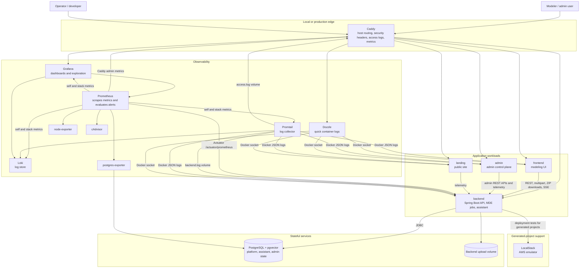
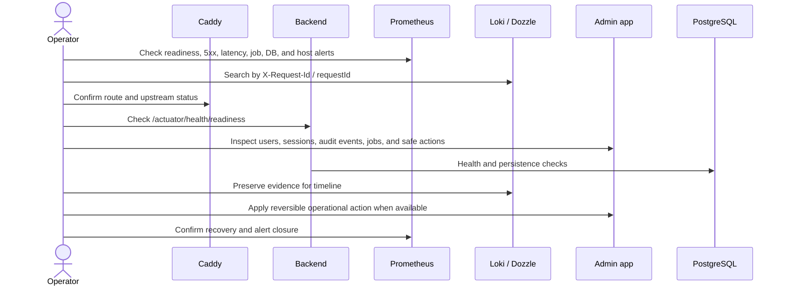

# DevOps and SRE Runtime

## Edge, Workloads, and Observability

```mermaid
flowchart TB
    operator["Operator / developer"]
    user["Modeler / admin user"]

    subgraph public["Local or production edge"]
        caddy["Caddy<br/>host routing, security headers, access logs, metrics"]
    end

    subgraph apps["Application workloads"]
        frontend["frontend<br/>modeling UI"]
        admin["admin<br/>admin control plane"]
        landing["landing<br/>public site"]
        backend["backend<br/>Spring Boot API, MDE jobs, assistant"]
    end

    subgraph data["Stateful services"]
        postgres[("PostgreSQL + pgvector<br/>platform, assistant, admin state")]
        uploads[("Backend upload volume")]
    end

    subgraph generated["Generated-project support"]
        localstack["LocalStack<br/>AWS emulator"]
    end

    subgraph observe["Observability"]
        prometheus["Prometheus<br/>scrapes metrics and evaluates alerts"]
        grafana["Grafana<br/>dashboards and exploration"]
        loki["Loki<br/>log store"]
        promtail["Promtail<br/>log collector"]
        dozzle["Dozzle<br/>quick container logs"]
        pgexp["postgres-exporter"]
        nodeexp["node-exporter"]
        cadvisor["cAdvisor"]
    end

    user --> caddy
    operator --> caddy
    caddy --> frontend
    caddy --> admin
    caddy --> landing
    caddy --> backend
    caddy --> grafana
    caddy --> dozzle

    frontend -->|"REST, multipart, ZIP downloads, SSE"| backend
    admin -->|"admin REST APIs and telemetry"| backend
    landing -->|"telemetry"| backend
    backend -->|"JDBC"| postgres
    backend --> uploads
    backend -->|"deployment tests for generated projects"| localstack

    prometheus -->|"Actuator /actuator/prometheus"| backend
    prometheus -->|"Caddy admin metrics"| caddy
    prometheus --> pgexp
    prometheus --> nodeexp
    prometheus --> cadvisor
    prometheus -->|"self and stack metrics"| loki
    prometheus -->|"self and stack metrics"| promtail
    prometheus -->|"self and stack metrics"| grafana
    pgexp --> postgres

    promtail -->|"backend.log volume"| backend
    promtail -->|"access.log volume"| caddy
    promtail -->|"Docker JSON logs"| frontend
    promtail -->|"Docker JSON logs"| admin
    promtail -->|"Docker JSON logs"| landing
    promtail -->|"Docker JSON logs"| backend
    promtail --> loki
    grafana --> prometheus
    grafana --> loki
    dozzle -->|"Docker socket"| frontend
    dozzle -->|"Docker socket"| admin
    dozzle -->|"Docker socket"| landing
    dozzle -->|"Docker socket"| backend
```

## Incident Triage Loop

```mermaid
sequenceDiagram
    actor Operator
    participant Edge as Caddy
    participant API as Backend
    participant Metrics as Prometheus
    participant Logs as Loki / Dozzle
    participant Admin as Admin app
    participant DB as PostgreSQL

    Operator->>Metrics: Check readiness, 5xx, latency, job, DB, and host alerts
    Operator->>Logs: Search by X-Request-Id / requestId
    Operator->>Edge: Confirm route and upstream status
    Operator->>API: Check /actuator/health/readiness
    Operator->>Admin: Inspect users, sessions, audit events, jobs, and safe actions
    API->>DB: Health and persistence checks
    Operator->>Logs: Preserve evidence for timeline
    Operator->>Admin: Apply reversible operational action when available
    Operator->>Metrics: Confirm recovery and alert closure
```
