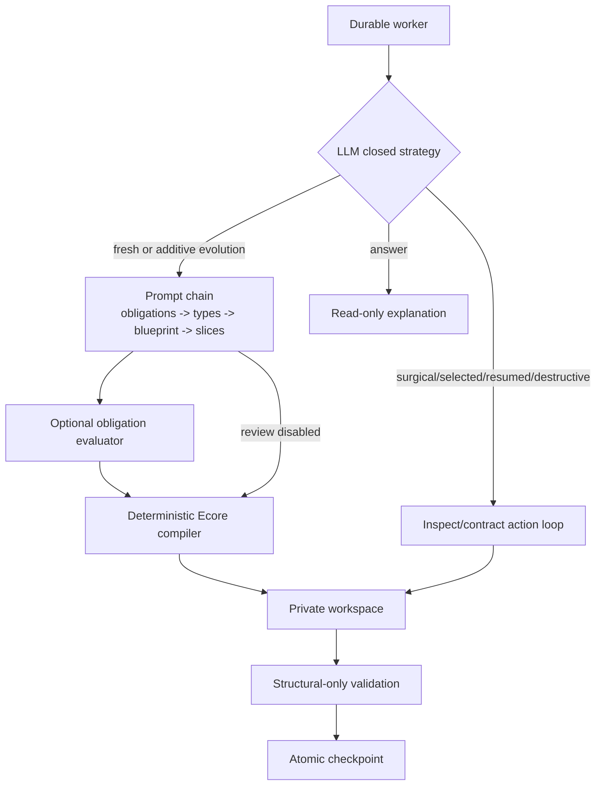

# Assistant agent-pattern assessment

The assistant combines routing, prompt chaining, checked tool use, an independent semantic
evaluator, deterministic structural enforcement, and durable human controls. It remains one
assistant runtime; semantic decisions are LLM-owned and mechanisms are backend-owned.
