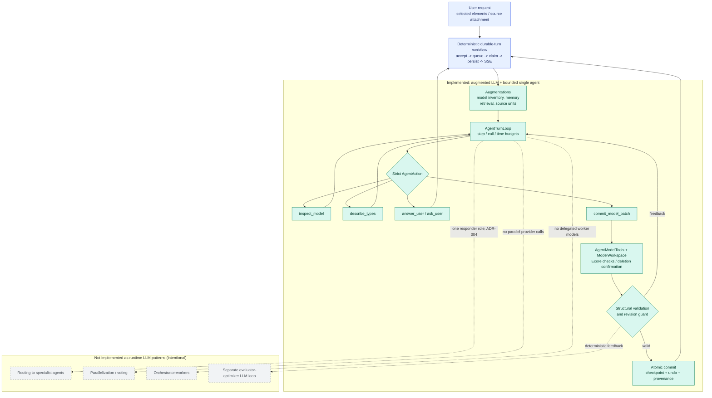

# Varka AI Assistant: Anthropic Pattern Assessment

This diagram classifies the implementation using Anthropic's [Building effective agents](https://www.anthropic.com/engineering/building-effective-agents). The teal path is implemented; grey items are intentional runtime exclusions.

The outer lane is a deterministic workflow. The inner lane is an agent because the LLM chooses an allowed action after seeing tool-produced ground truth. See [the detailed assessment](../internal/ai/anthropic-effective-agents-assessment.md).
