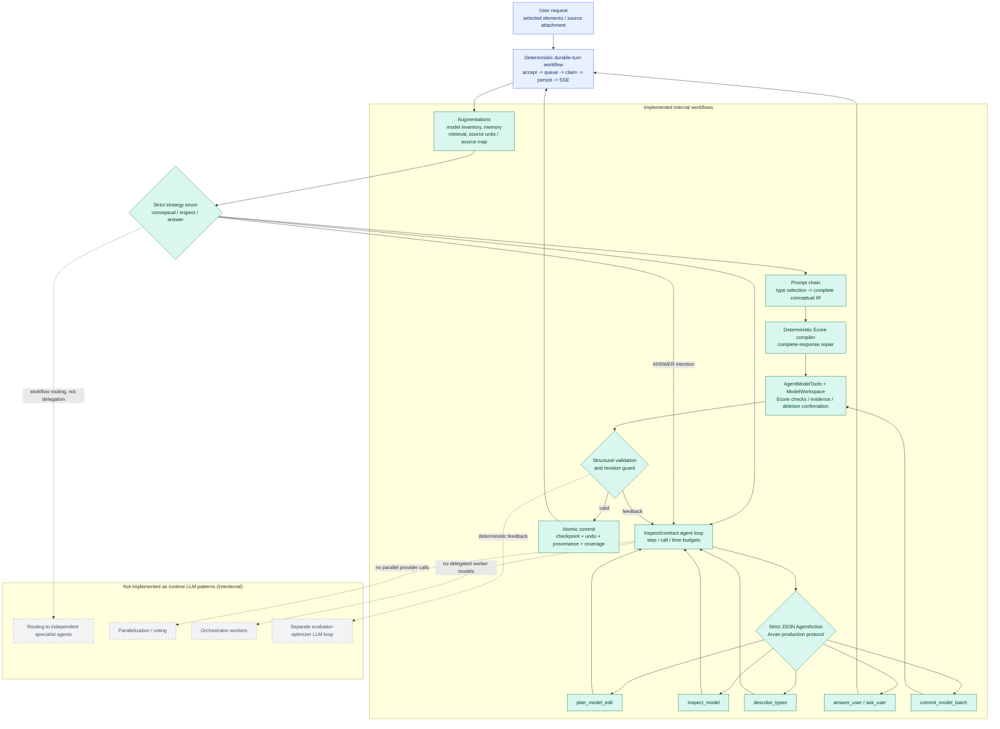

# Varka AI Assistant: Anthropic Pattern Assessment

This diagram classifies the current unified implementation using Anthropic's [Building effective agents](https://www.anthropic.com/engineering/building-effective-agents). The teal paths are implemented; grey items are intentional runtime exclusions.

The outer lane is a deterministic workflow. Its semantic router chooses between a conceptual prompt
chain, an action-selecting agent loop, and an answer. There is one provider model and no delegated
specialist agents. See [the detailed assessment](../internal/ai/agents-pattern-assessment.md) and
[the current workflow status](../internal/ai/current-llm-workflow.md).
