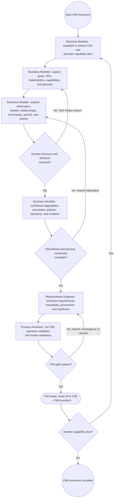

# CIM Methodology Activity Diagram

This activity view shows one capability-slice revolution of `varka.cim.modeling`.

```mermaid
flowchart TD
    start((Start CIM increment)) --> plan["Business Modeler: establish or refresh CIM root<br/>and plan capability slice"]
    plan --> intent["Business Modeler: capture goals, KPIs,<br/>stakeholders, capabilities, and glossary"]
    intent --> explore["Business Modeler: explore information,<br/>entities, relationships, commands, queries, and events"]
    explore --> coherent{"Domain structure and behavior<br/>coherent?"}
    coherent -- "No: Twin Peaks rework" --> intent
    coherent -- "Yes" --> synth["Business Modeler: synthesize aggregates,<br/>processes, policies, decisions, and contexts"]
    synth --> synthesized{"Boundaries and process ownership<br/>complete?"}
    synthesized -- "No: rework exploration" --> explore
    synthesized -- "Yes" --> converge["Requirements Engineer: formalize requirements,<br/>traceability, governance, and readiness"]
    converge --> review["Process Reviewer: run CIM semantic validation<br/>and review readiness"]
    review --> passed{"CIM gate passes?"}
    passed -- "No: rework convergence or domain" --> converge
    passed -- "Yes" --> ready(["CIM-ready: hand off to CIM → PIM transform"])
    ready --> more{"Another capability slice?"}
    more -- "Yes" --> plan
    more -- "No" --> done((CIM increment complete))
```
