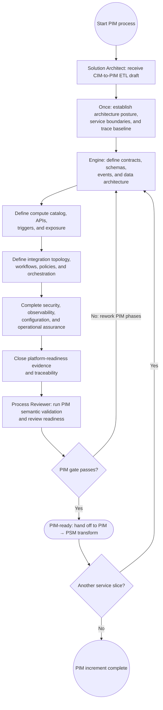

# PIM Methodology Activity Diagram

This activity view shows one service-slice revolution of `modriss.pim.modeling` after CIM-to-PIM ETL.

```mermaid
flowchart TD
    start((Start PIM process)) --> seed["Solution Architect: receive CIM-to-PIM ETL draft"]
    seed --> establish["Once: establish architecture posture,<br/>service boundaries, and trace baseline"]
    establish --> contracts["Engine: define contracts, schemas,<br/>events, and data architecture"]
    contracts --> compute["Define compute catalog, APIs,<br/>triggers, and exposure"]
    compute --> integration["Define integration topology,<br/>workflows, policies, and orchestration"]
    integration --> assure["Complete security, observability,<br/>configuration, and operational assurance"]
    assure --> readyModel["Close platform-readiness evidence<br/>and traceability"]
    readyModel --> review["Process Reviewer: run PIM semantic validation<br/>and review readiness"]
    review --> passed{"PIM gate passes?"}
    passed -- "No: rework PIM phases" --> contracts
    passed -- "Yes" --> ready(["PIM-ready: hand off to PIM → PSM transform"])
    ready --> more{"Another service slice?"}
    more -- "Yes" --> contracts
    more -- "No" --> done((PIM increment complete))
```
